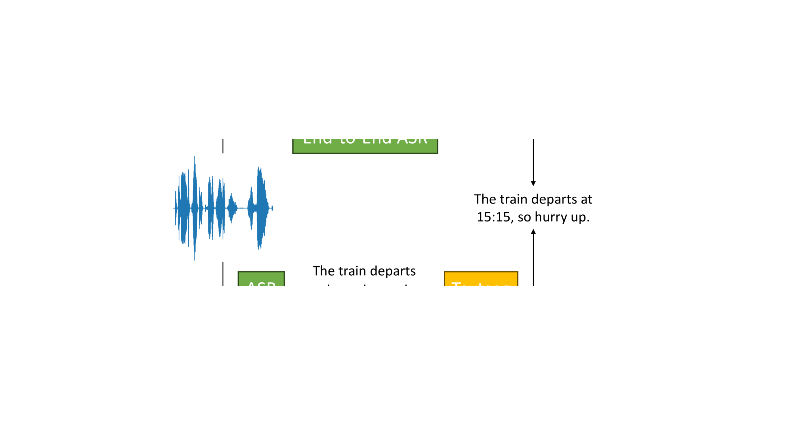
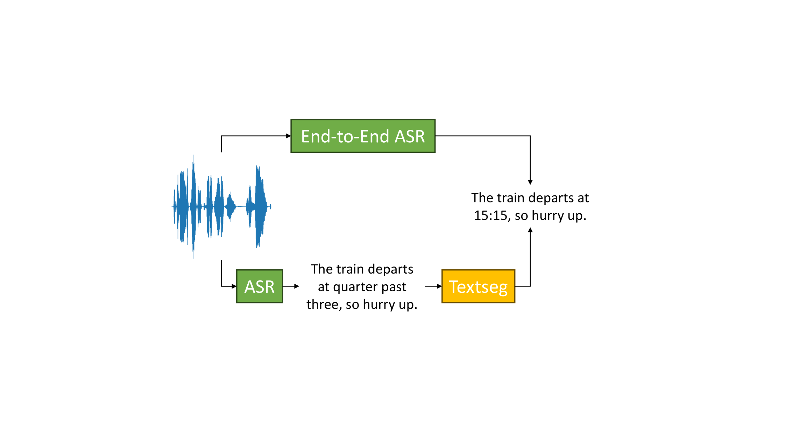

# 自动语音识别中数值表达式的处理

发布时间：2024年07月18日

`LLM应用` `语音识别`

> Handling Numeric Expressions in Automatic Speech Recognition

# 摘要

> 本文探讨了自动语音识别 (ASR) 转录中数字表达式的正确格式化问题，这一挑战源于转录格式需根据上下文而定，如 1945 年与 19:45 时间戳的区别。我们对比了级联与端到端方法，旨在精准识别并格式化各类数字表达，包括年份、时间戳、货币金额及数量。采用端到端方法时，我们结合大型语言模型 (LLM) 与文本到语音 (TTS) 模型，创新性地生成适应数据。测试结果表明，尽管 LLM 方法在识别格式化数字方面表现出色，但适应的端到端模型凭借更低的延迟与推理成本，同样展现出强劲的竞争力。

> This paper addresses the problem of correctly formatting numeric expressions in automatic speech recognition (ASR) transcripts. This is challenging since the expected transcript format depends on the context, e.g., 1945 (year) vs. 19:45 (timestamp). We compare cascaded and end-to-end approaches to recognize and format numeric expression, such as years, timestamps, currency amounts, and quantities. For the end-to-end approach we employed a data generation strategy using a large language model (LLM) together with a text to speech (TTS) model to generate adaptation data. The results on our test dataset show that while approaches based on LLMs perform well on recognizing formatted numeric expressions, adapted end-to-end models offer competitive performance with the advantage of lower latency and inference cost.

[Arxiv](https://arxiv.org/abs/2408.00004)