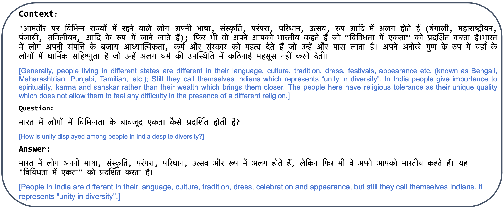
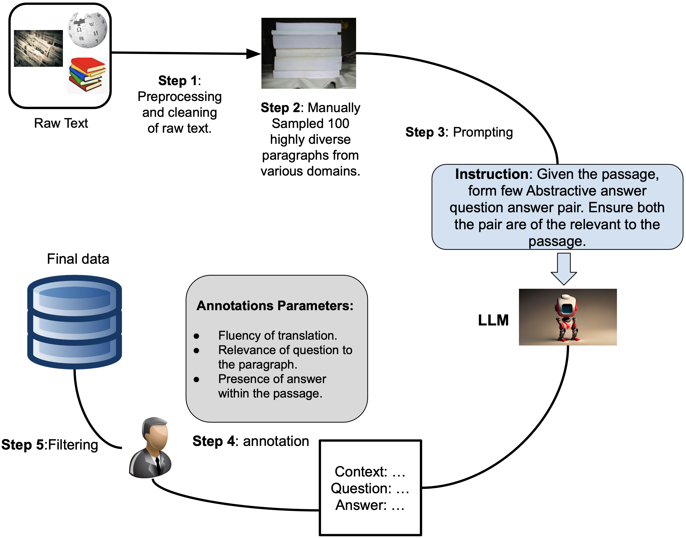
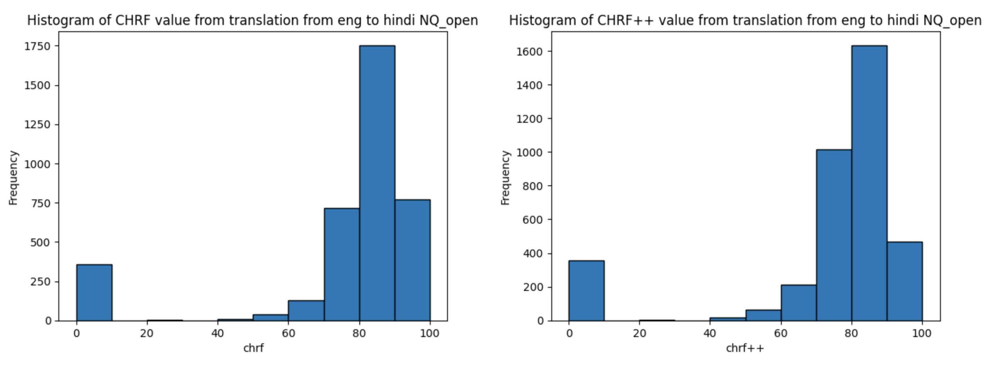
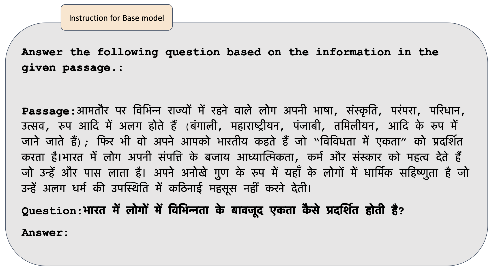
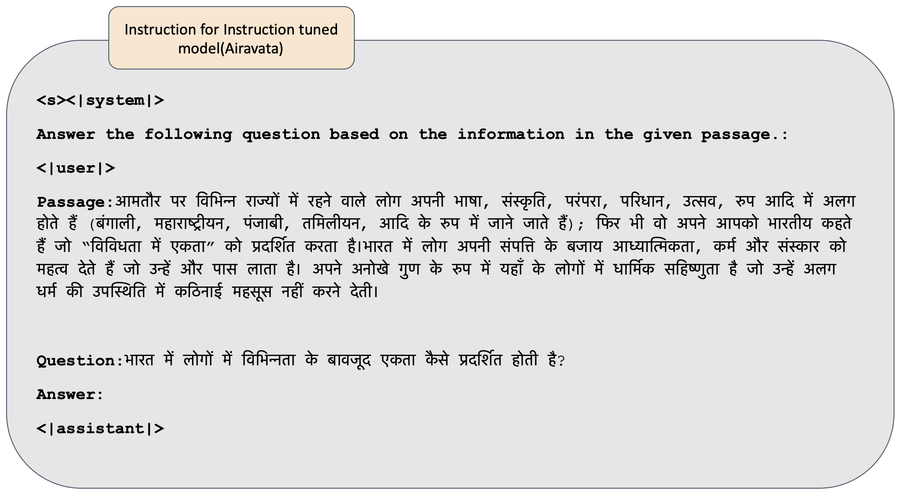
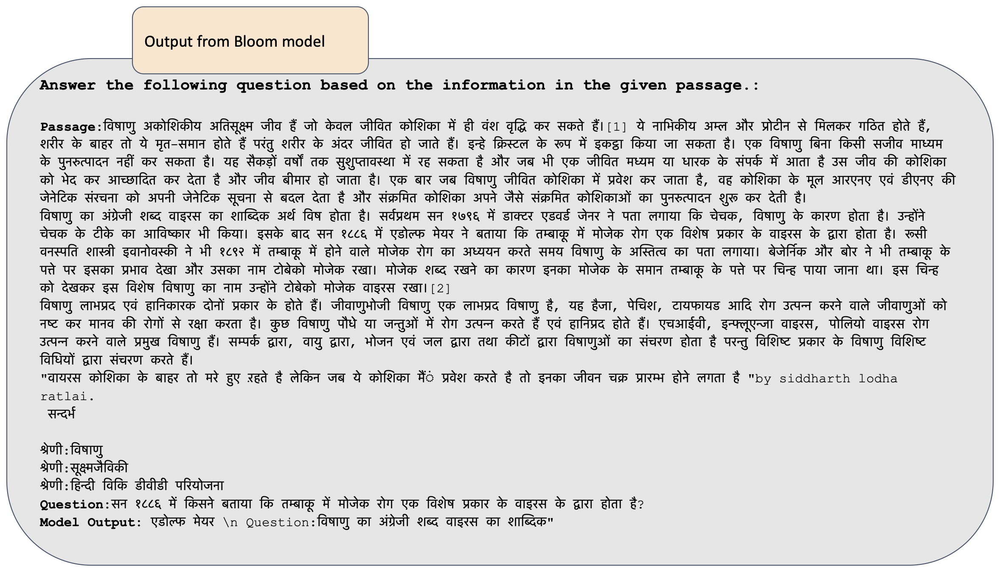
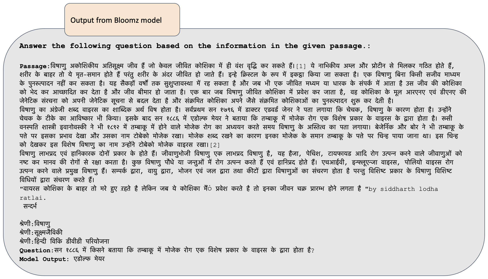
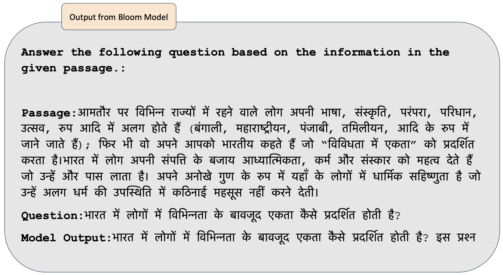
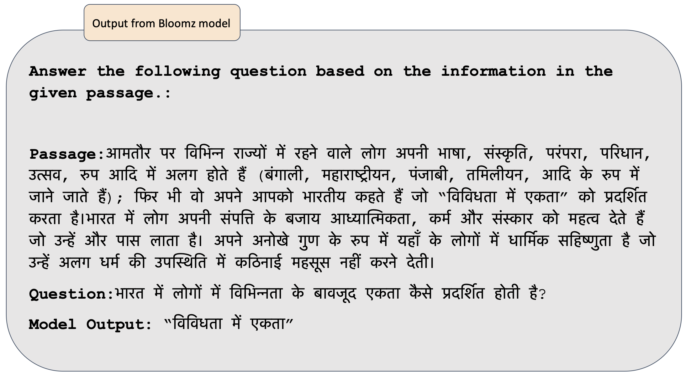
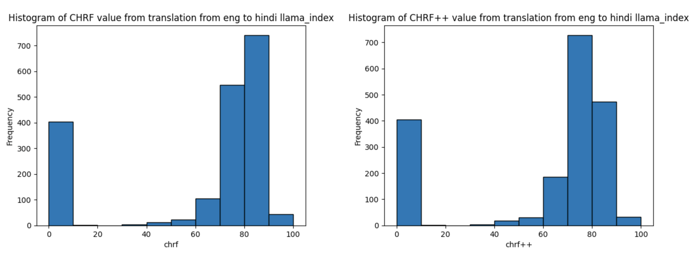

# INDIC QA 基准：一个多语言评估工具，旨在检验大型语言模型在印度语言问答任务中的表现。

发布时间：2024年07月18日

`LLM应用` `语言技术`

> INDIC QA BENCHMARK: A Multilingual Benchmark to Evaluate Question Answering capability of LLMs for Indic Languages

# 摘要

> 大型语言模型 (LLM) 在未见任务中展现了出色的零-shot 和少-shot 能力，尤其是在英语的基于上下文的问答 (QA) 方面。然而，由于非英语语言中缺乏基准，LLM 在非英语语言的基于上下文 QA 能力评估上存在局限。为此，我们推出了 Indic-QA，这是涵盖 11 种主要印度语言的最大公开可用基于上下文问答数据集。该数据集融合了抽取式和抽象式问答任务，并纳入了现有数据集及翻译成印度语言的英语 QA 数据集。我们还利用 Gemini 模型生成了合成数据集，通过给定段落创建问题-答案对，并进行人工验证以确保质量。在基准测试中，我们评估了多语言 LLM 及其指令微调变体，发现其性能不尽如人意，特别是在低资源语言中。我们期待该数据集的发布能激发对 LLM 在低资源语言问答能力的深入研究。

> Large Language Models (LLMs) have demonstrated remarkable zero-shot and few-shot capabilities in unseen tasks, including context-grounded question answering (QA) in English. However, the evaluation of LLMs' capabilities in non-English languages for context-based QA is limited by the scarcity of benchmarks in non-English languages. To address this gap, we introduce Indic-QA, the largest publicly available context-grounded question-answering dataset for 11 major Indian languages from two language families. The dataset comprises both extractive and abstractive question-answering tasks and includes existing datasets as well as English QA datasets translated into Indian languages. Additionally, we generate a synthetic dataset using the Gemini model to create question-answer pairs given a passage, which is then manually verified for quality assurance. We evaluate various multilingual Large Language Models and their instruction-fine-tuned variants on the benchmark and observe that their performance is subpar, particularly for low-resource languages. We hope that the release of this dataset will stimulate further research on the question-answering abilities of LLMs for low-resource languages.

[Arxiv](https://arxiv.org/abs/2407.13522)