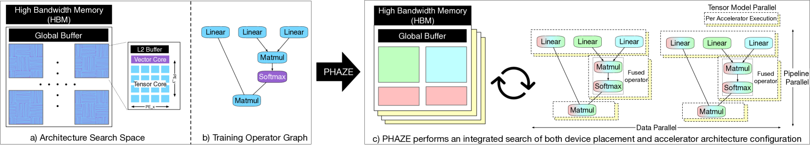
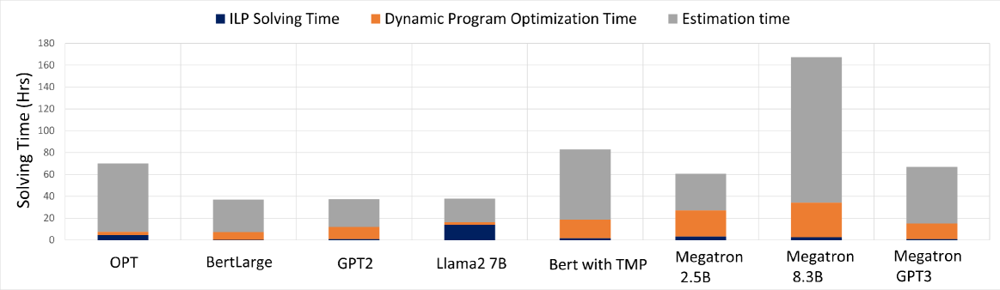

# 硬件架构与设备布局的集成搜索

发布时间：2024年07月18日

`LLM应用` `半导体` `人工智能`

> Integrated Hardware Architecture and Device Placement Search

# 摘要

> 深度学习训练的分布式执行，关键在于硬件加速器架构与设备放置策略的动态协同。我们首次通过创新算法，实现了架构与策略的协同优化，提升了计算资源、内存使用和数据分布的均衡。我们的架构搜索涵盖了张量与向量单元的数量与维度，以及内存配置，同时优化了微批量大小和激活存储策略，以平衡内存占用。通过整数线性规划（ILP），我们为每个架构配置找到了加速器上操作符的最佳执行调度，并结合动态规划，确定了跨多个加速器的最优设备放置策略。相较于顶尖的TPUv4和Spotlight框架，我们的方法在大语言模型上实现了更高吞吐量。PHAZE的完整源代码已公开在GitHub上。

> Distributed execution of deep learning training involves a dynamic interplay between hardware accelerator architecture and device placement strategy. This is the first work to explore the co-optimization of determining the optimal architecture and device placement strategy through novel algorithms, improving the balance of computational resources, memory usage, and data distribution. Our architecture search leverages tensor and vector units, determining their quantity and dimensionality, and on-chip and off-chip memory configurations. It also determines the microbatch size and decides whether to recompute or stash activations, balancing the memory footprint of training and storage size. For each explored architecture configuration, we use an Integer Linear Program (ILP) to find the optimal schedule for executing operators on the accelerator. The ILP results then integrate with a dynamic programming solution to identify the most effective device placement strategy, combining data, pipeline, and tensor model parallelism across multiple accelerators. Our approach achieves higher throughput on large language models compared to the state-of-the-art TPUv4 and the Spotlight accelerator search framework. The entire source code of PHAZE is available at https://github.com/msr-fiddle/phaze.

[Arxiv](https://arxiv.org/abs/2407.13143)