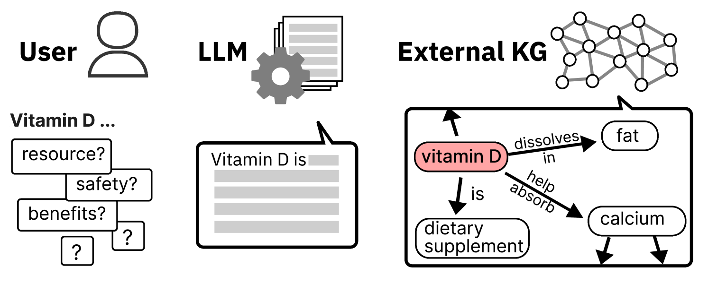
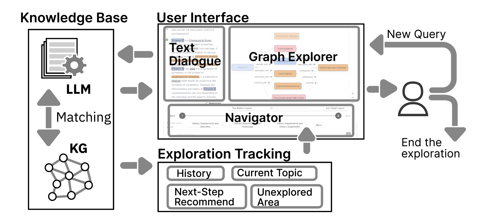
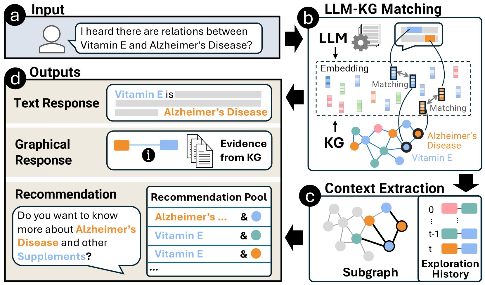
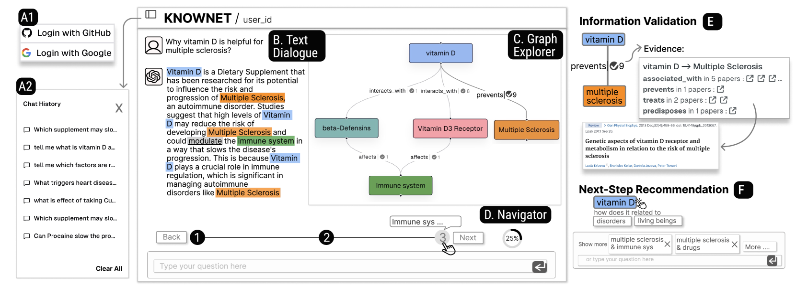
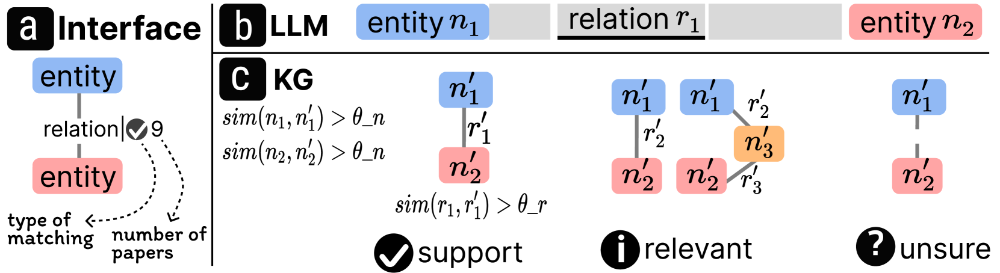
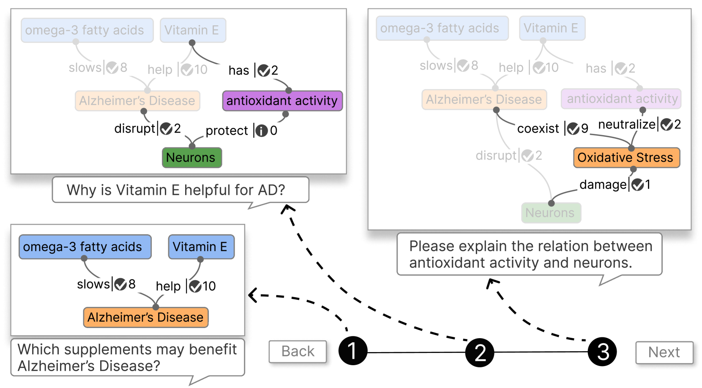
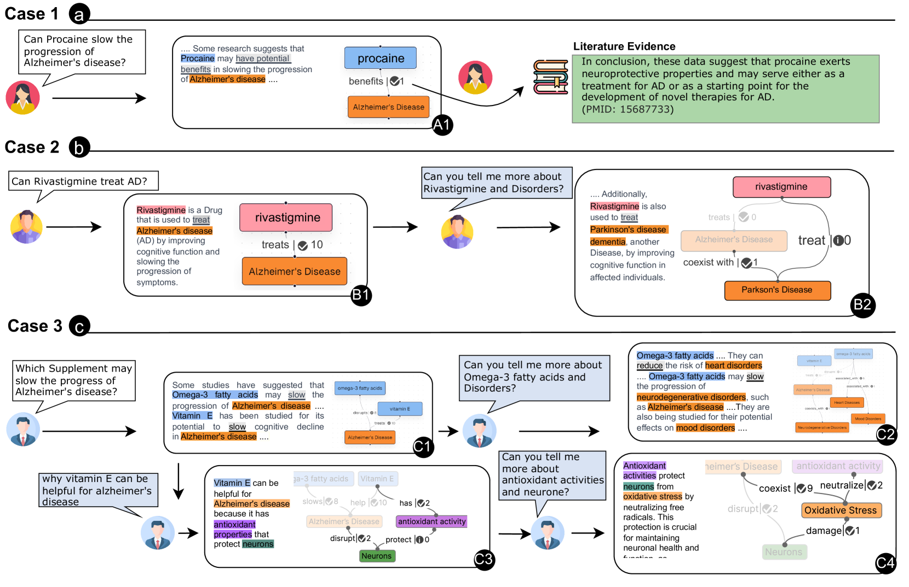
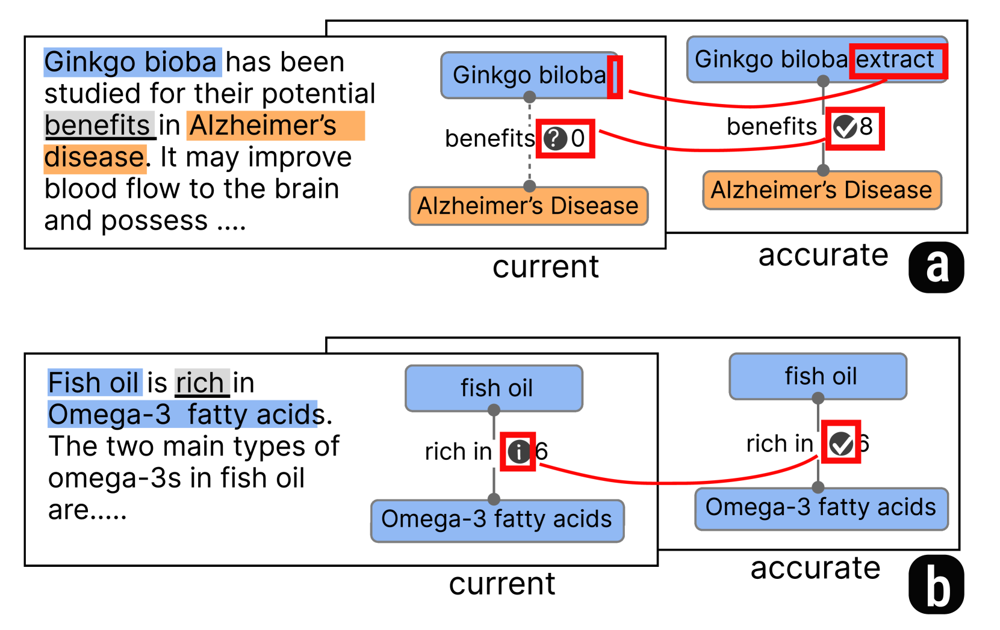

# KNOWNET：借助知识图谱集成，引导 LLMs 进行健康信息搜索

发布时间：2024年07月18日

`LLM应用` `知识图谱`

> KNOWNET: Guided Health Information Seeking from LLMs via Knowledge Graph Integration

# 摘要

> 随着对大型语言模型 (LLM) 在健康信息查询中的依赖日益增加，错误信息和主题复杂性可能带来严重风险。KNOWNET 系统应运而生，它巧妙结合 LLM 与知识图谱 (KG)，旨在提升准确性与结构化探索。KNOWNET 从 LLM 输出中提取关键信息，精准映射至 KG 中的验证数据，确保信息准确无误。同时，它根据 KG 中实体的关联，智能推荐下一步探索方向，助力用户全面而不遗漏地理解主题。KNOWNET 将主题理解过程可视化为逐步构建的图谱，通过渐进式图谱可视化，用户可回溯查询历史，无缝衔接当前与未来探索。通过实际用例与专家访谈，KNOWNET 的有效性得到了充分验证。

> The increasing reliance on Large Language Models (LLMs) for health information seeking can pose severe risks due to the potential for misinformation and the complexity of these topics. This paper introduces KNOWNET a visualization system that integrates LLMs with Knowledge Graphs (KG) to provide enhanced accuracy and structured exploration. Specifically, for enhanced accuracy, KNOWNET extracts triples (e.g., entities and their relations) from LLM outputs and maps them into the validated information and supported evidence in external KGs. For structured exploration, KNOWNET provides next-step recommendations based on the neighborhood of the currently explored entities in KGs, aiming to guide a comprehensive understanding without overlooking critical aspects. To enable reasoning with both the structured data in KGs and the unstructured outputs from LLMs, KNOWNET conceptualizes the understanding of a subject as the gradual construction of graph visualization. A progressive graph visualization is introduced to monitor past inquiries, and bridge the current query with the exploration history and next-step recommendations. We demonstrate the effectiveness of our system via use cases and expert interviews.

[Arxiv](https://arxiv.org/abs/2407.13598)