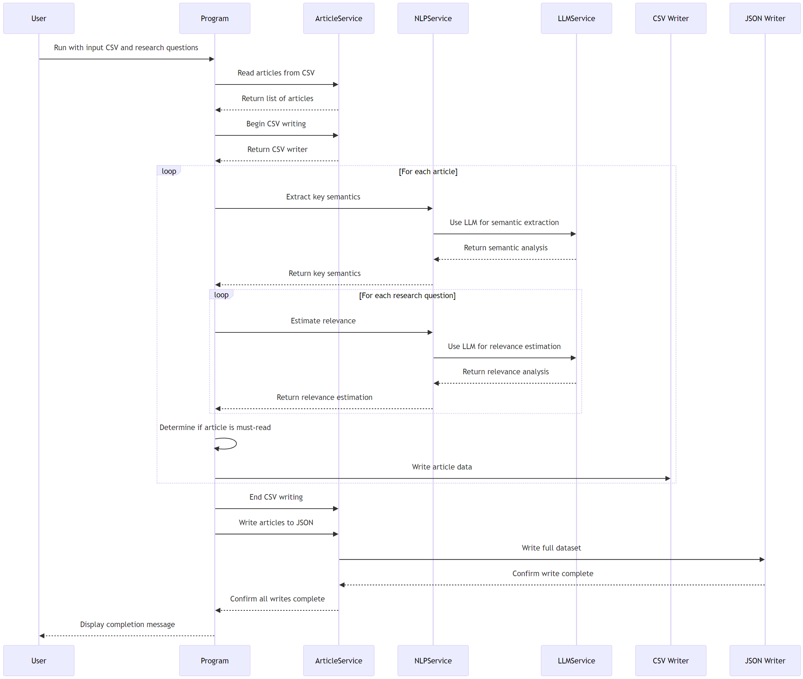
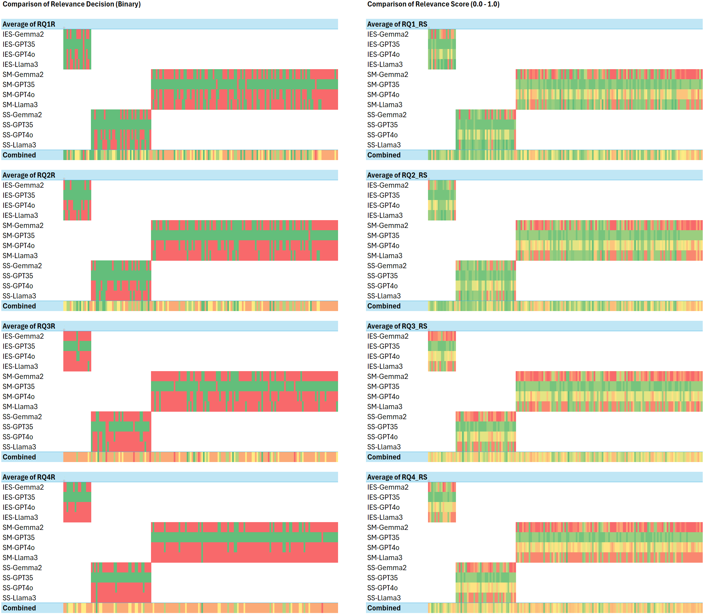
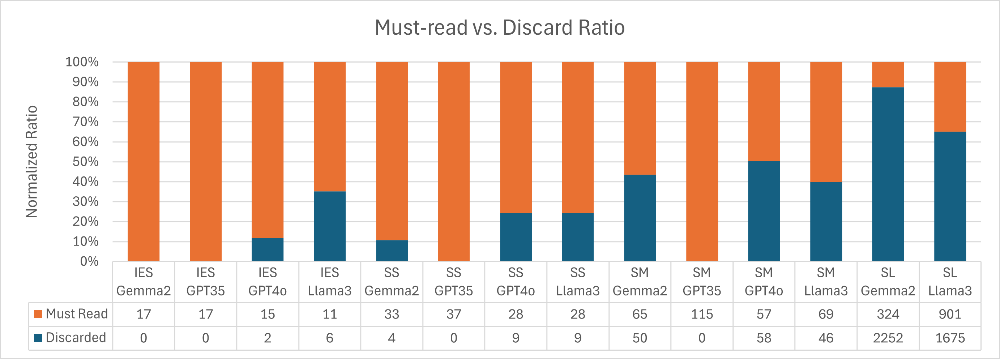

# LLAssist：借助大型语言模型，轻松实现文献综述自动化

发布时间：2024年07月18日

`LLM应用` `学术研究` `出版业`

> LLAssist: Simple Tools for Automating Literature Review Using Large Language Models

# 摘要

> 本文推出 LLAssist，一款开源工具，旨在简化学术文献综述流程。面对科学出版物的激增，研究人员在处理海量文献时面临巨大挑战。LLAssist 利用 LLM 和 NLP 技术，自动提取关键信息并评估文献与研究问题的相关性，从而大幅减轻综述负担，让研究者能更专注于信息分析与整合。通过自动化文献综述的部分环节，LLAssist 助力研究者更高效地应对学术出版物的增长。

> This paper introduces LLAssist, an open-source tool designed to streamline literature reviews in academic research. In an era of exponential growth in scientific publications, researchers face mounting challenges in efficiently processing vast volumes of literature. LLAssist addresses this issue by leveraging Large Language Models (LLMs) and Natural Language Processing (NLP) techniques to automate key aspects of the review process. Specifically, it extracts important information from research articles and evaluates their relevance to user-defined research questions. The goal of LLAssist is to significantly reduce the time and effort required for comprehensive literature reviews, allowing researchers to focus more on analyzing and synthesizing information rather than on initial screening tasks. By automating parts of the literature review workflow, LLAssist aims to help researchers manage the growing volume of academic publications more efficiently.

[Arxiv](https://arxiv.org/abs/2407.13993)