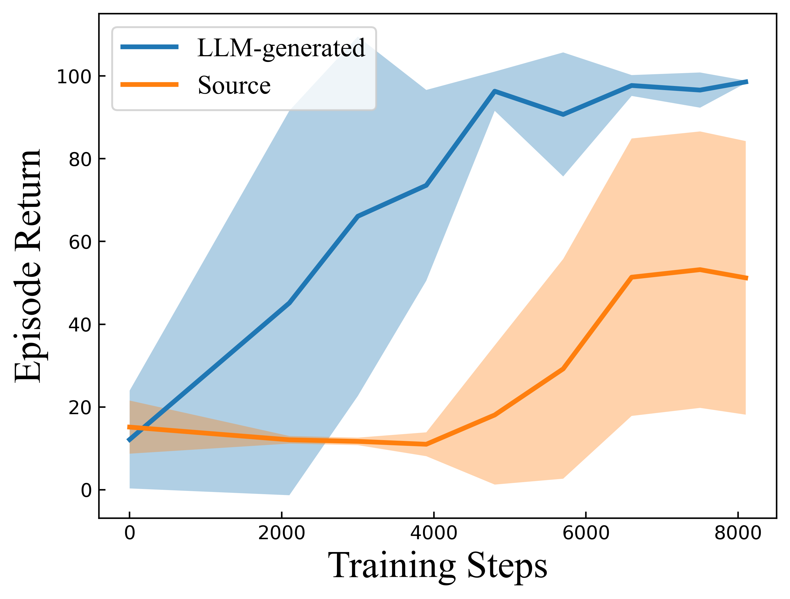
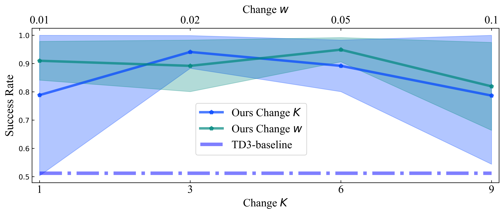
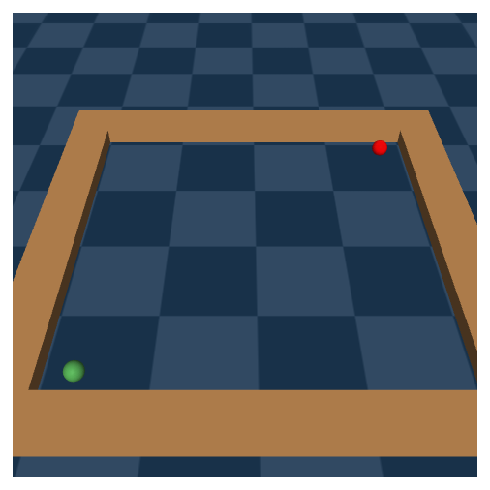

# 强化学习中的 LLM 赋能状态表示

发布时间：2024年07月18日

`LLM应用` `机器人` `人工智能`

> LLM-Empowered State Representation for Reinforcement Learning

# 摘要

> 强化学习中的传统状态表示常遗漏关键任务细节，给价值网络的准确映射带来挑战。传统方法依赖大量样本学习来丰富状态信息，效率低下且耗时。近期，知识丰富的大型语言模型（LLM）为先验知识注入提供了新途径，仅需极少人工干预。基于此，我们提出LLM赋能的状态表示（LESR），利用LLM自主生成任务相关代码，提升网络映射连续性，加速训练。实验表明，LESR在样本效率上显著提升，Mujoco任务中累积奖励和Gym-Robotics任务成功率分别超越最先进基线29%和30%。

> Conventional state representations in reinforcement learning often omit critical task-related details, presenting a significant challenge for value networks in establishing accurate mappings from states to task rewards. Traditional methods typically depend on extensive sample learning to enrich state representations with task-specific information, which leads to low sample efficiency and high time costs. Recently, surging knowledgeable large language models (LLM) have provided promising substitutes for prior injection with minimal human intervention. Motivated by this, we propose LLM-Empowered State Representation (LESR), a novel approach that utilizes LLM to autonomously generate task-related state representation codes which help to enhance the continuity of network mappings and facilitate efficient training. Experimental results demonstrate LESR exhibits high sample efficiency and outperforms state-of-the-art baselines by an average of 29% in accumulated reward in Mujoco tasks and 30% in success rates in Gym-Robotics tasks.

[Arxiv](https://arxiv.org/abs/2407.13237)