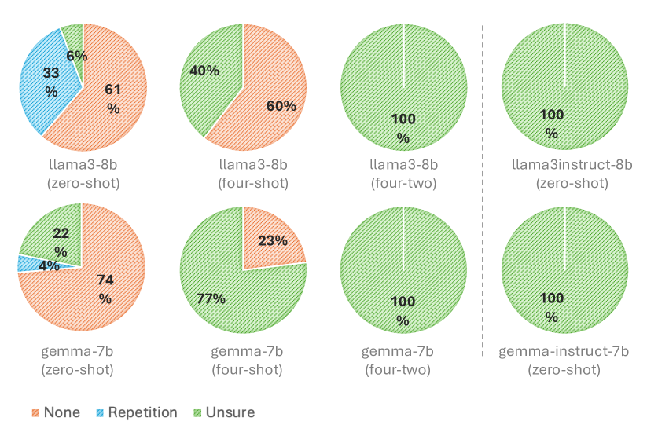

# 大型语言模型能否成为可靠的知识库？

发布时间：2024年07月18日

`LLM理论` `人工智能`

> Large Language Models as Reliable Knowledge Bases?

# 摘要

> NLP 社区对利用 LLM 进行知识密集型任务的兴趣日益浓厚，将其视为潜在的知识库。然而，LLM 作为知识库的可靠性和适用范围仍待深入探讨。虽然有研究指出 LLM 能在参数中编码知识，但这并不足以全面评估其作为知识库的效能。本研究设定了 LLM 作为可靠知识库的标准，聚焦于事实性和一致性，并涵盖已知与未知知识。我们据此开发了评估指标，对 26 个流行 LLM 进行了全面评估，并分析了模型大小、指令调优及上下文学习等因素的影响。结果显示，即便如 GPT-3.5-turbo 这样的高性能模型，在事实性和一致性上也存在不足，而上下文学习和微调等策略也未能显著提升 LLM 作为知识库的表现。

> The NLP community has recently shown a growing interest in leveraging Large Language Models (LLMs) for knowledge-intensive tasks, viewing LLMs as potential knowledge bases (KBs). However, the reliability and extent to which LLMs can function as KBs remain underexplored. While previous studies suggest LLMs can encode knowledge within their parameters, the amount of parametric knowledge alone is not sufficient to evaluate their effectiveness as KBs. This study defines criteria that a reliable LLM-as-KB should meet, focusing on factuality and consistency, and covering both seen and unseen knowledge. We develop several metrics based on these criteria and use them to evaluate 26 popular LLMs, while providing a comprehensive analysis of the effects of model size, instruction tuning, and in-context learning (ICL). Our results paint a worrying picture. Even a high-performant model like GPT-3.5-turbo is not factual or consistent, and strategies like ICL and fine-tuning are unsuccessful at making LLMs better KBs.

[Arxiv](https://arxiv.org/abs/2407.13578)