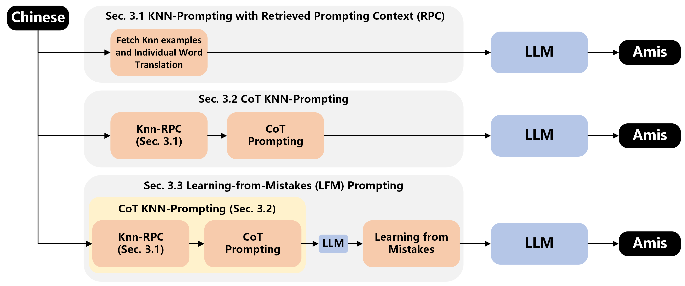
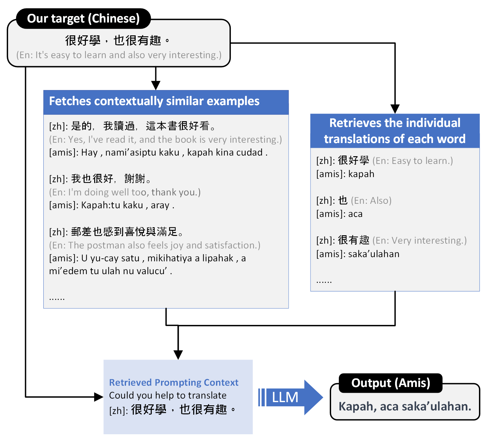
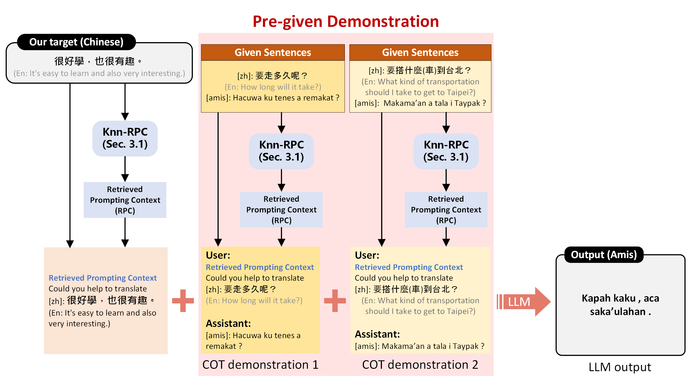
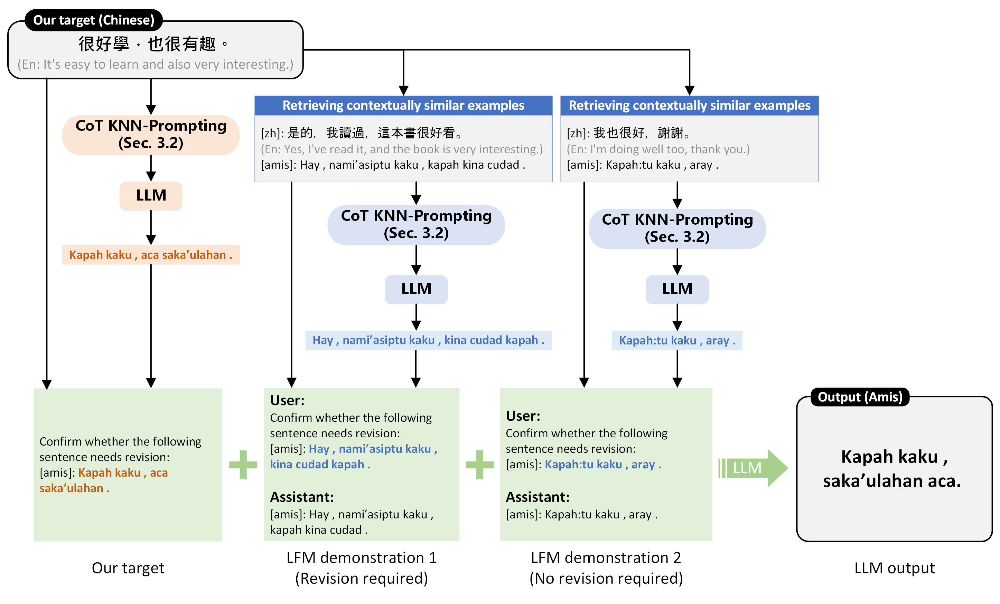

# 土著语言翻译中的“从错误中学习”提示法

发布时间：2024年07月18日

`LLM应用` `语言学`

> Learning-From-Mistakes Prompting for Indigenous Language Translation

# 摘要

> 本文利用大型语言模型，提出了一系列技术来提升极低资源原住民语言的翻译质量。我们的策略依托于：(1) 有限平行翻译示例的数据存储，(2) GPT-3.5 等 LLM 的内在能力，以及 (3) 词级翻译词典。我们探索了 LLM 在特定环境下的潜力，将其作为极低资源语言的通用翻译工具。核心方法是将 LLM 视为特定语言对的语言编译器，设想其能吸收句法结构以实现精准翻译。我们创新了三种技术：结合检索提示的 KNNPrompting、思维链提示以及从错误中学习的提示方法，后者专门针对以往的翻译错误。评估显示，即便在数据稀缺的情况下，搭配恰当的提示技术，LLM 也能高效完成极低资源语言的翻译任务。

> Using large language models, this paper presents techniques to improve extremely low-resourced indigenous language translations. Our approaches are grounded in the use of (1) the presence of a datastore consisting of a limited number of parallel translation examples, (2) the inherent capabilities of LLMs like GPT-3.5, and (3) a word-level translation dictionary. We harness the potential of LLMs and in-context learning techniques in such a setting for using LLMs as universal translators for extremely low-resourced languages. Our methodology hinges on utilizing LLMs as language compilers for selected language pairs, hypothesizing that they could internalize syntactic structures to facilitate accurate translation. We introduce three techniques: KNNPrompting with Retrieved Prompting Context, Chain-of-Thought Prompting and Learningfrom-Mistakes Prompting, with the last method addressing past errors. The evaluation results suggest that, even with limited corpora, LLMs can effectively translate extremely low-resource languages when paired with proper prompting.

[Arxiv](https://arxiv.org/abs/2407.13343)