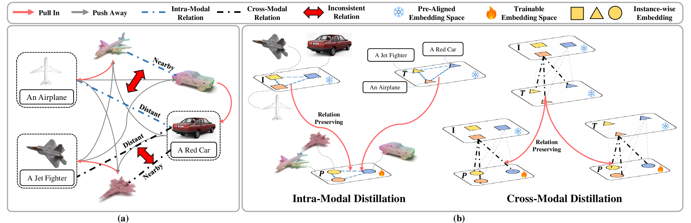
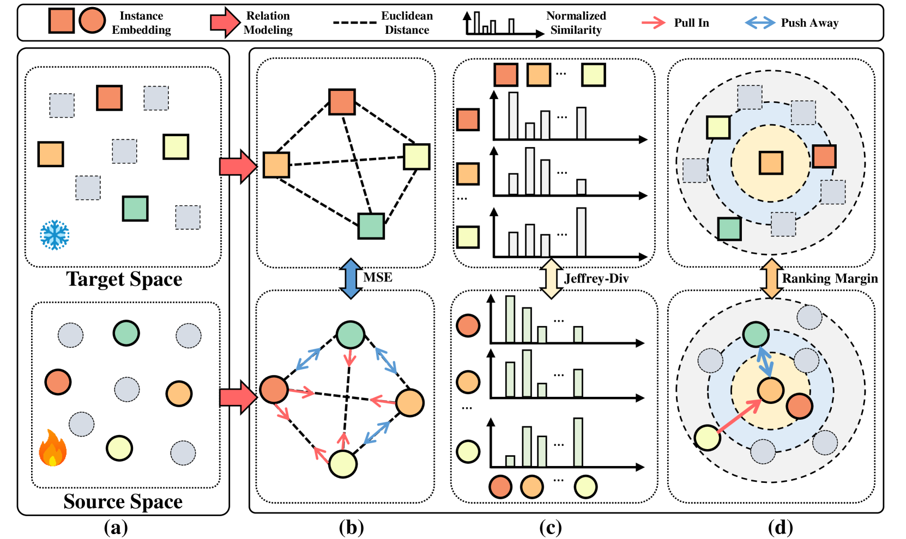
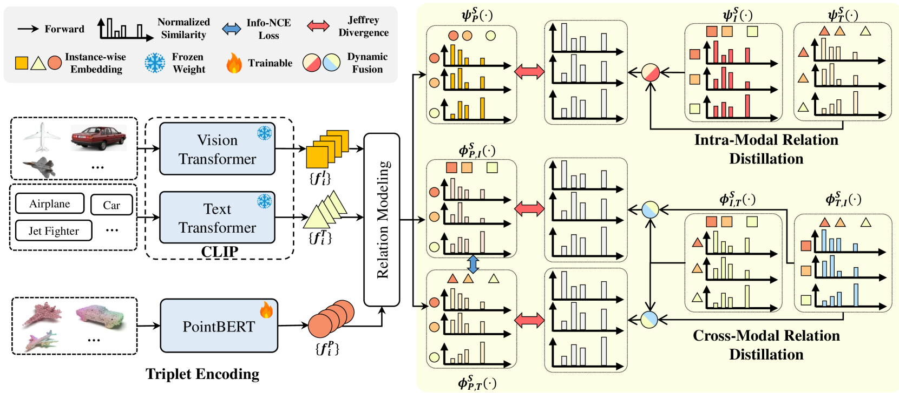
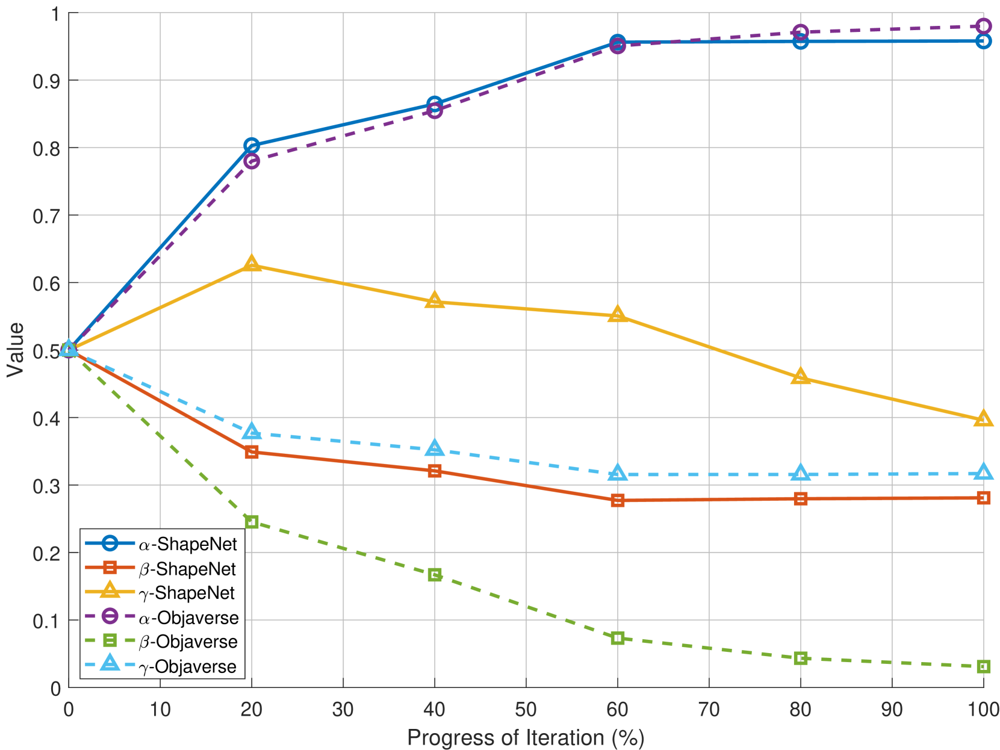
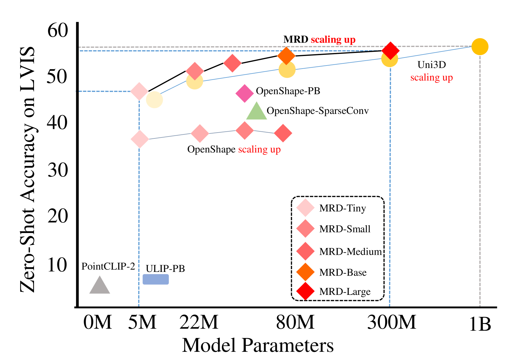
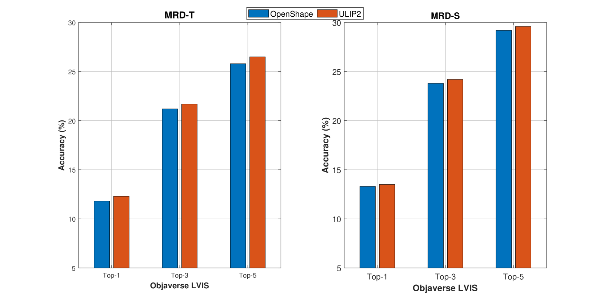
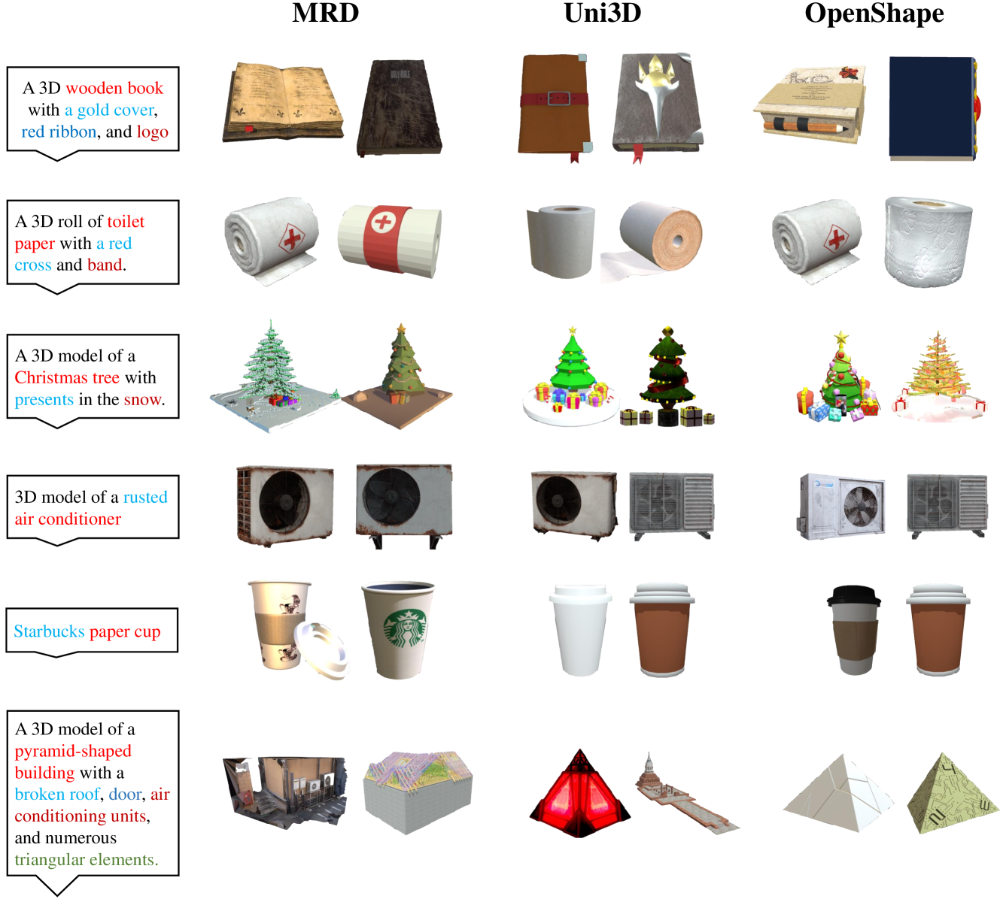

# 通过多模态关系蒸馏，实现三维表示的统一学习

发布时间：2024年07月18日

`LLM应用

解释：这篇论文主要讨论了多模态关系蒸馏（MRD）框架，该框架通过整合3D形状与2D图像及语言描述的特征，优化3D形状的识别性表示。这涉及到将大型视觉-语言模型精炼至3D结构中，同时捕捉模态内外的关系。虽然论文中提到了“大型视觉-语言模型”，但主要关注点在于应用这些模型来改进3D点云的多模态预训练技术，因此更适合归类为LLM应用。` `计算机视觉` `人工智能`

> Multi-modal Relation Distillation for Unified 3D Representation Learning

# 摘要

> 近期，3D点云的多模态预训练技术通过整合3D形状与2D图像及语言描述的特征，展现出潜力。然而，现有方法常忽略样本间的复杂结构联系，限制了多模态学习的潜能。为此，我们提出多模态关系蒸馏（MRD）框架，该框架能将大型视觉-语言模型精炼至3D结构中，同时捕捉模态内外的关系，优化3D形状的识别性表示。MRD在零-shot分类及跨模态检索任务中表现卓越，刷新了性能纪录。

> Recent advancements in multi-modal pre-training for 3D point clouds have demonstrated promising results by aligning heterogeneous features across 3D shapes and their corresponding 2D images and language descriptions. However, current straightforward solutions often overlook intricate structural relations among samples, potentially limiting the full capabilities of multi-modal learning. To address this issue, we introduce Multi-modal Relation Distillation (MRD), a tri-modal pre-training framework, which is designed to effectively distill reputable large Vision-Language Models (VLM) into 3D backbones. MRD aims to capture both intra-relations within each modality as well as cross-relations between different modalities and produce more discriminative 3D shape representations. Notably, MRD achieves significant improvements in downstream zero-shot classification tasks and cross-modality retrieval tasks, delivering new state-of-the-art performance.

[Arxiv](https://arxiv.org/abs/2407.14007)