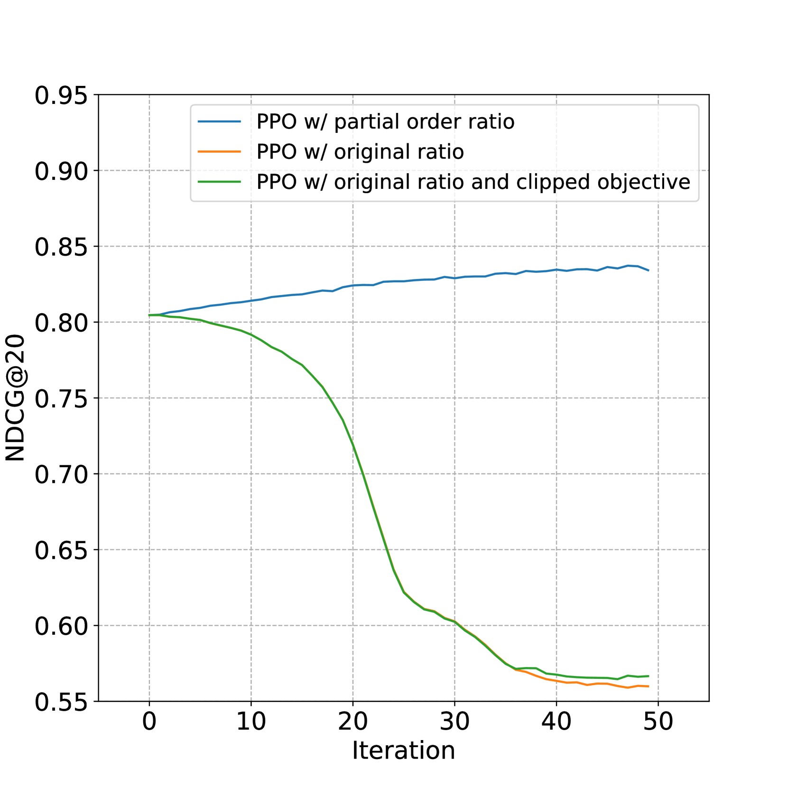
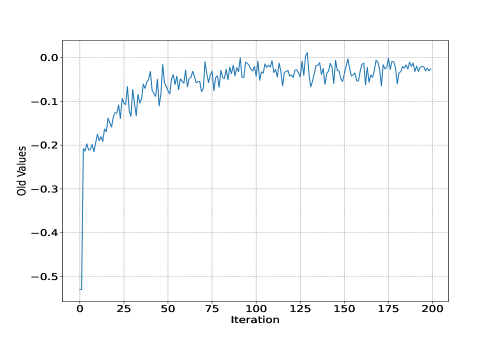

# 利用强化学习进行多模态标签相关性排序

发布时间：2024年07月18日

`Agent` `多媒体` `数据分析`

> Multimodal Label Relevance Ranking via Reinforcement Learning

# 摘要

> 传统多标签识别方法往往忽视了与人类偏好相符的部分顺序关系的重要性。为此，我们提出了一种名为LR²PPO的新方法，该方法通过识别标签间的部分顺序关系，有效提升了多模态标签相关性排序的性能。LR²PPO通过训练奖励模型来捕捉特定场景中的人类偏好，并精心设计了适用于排序任务的状态表示和策略损失，从而减少了新场景中对部分顺序标注的依赖。我们还推出了包含多模态标签及其部分顺序数据的LRMovieNet基准数据集，以支持方法评估。实验结果显示，LR²PPO在多模态标签相关性排序问题上表现卓越。相关代码和数据集已公开在GitHub上。

> Conventional multi-label recognition methods often focus on label confidence, frequently overlooking the pivotal role of partial order relations consistent with human preference. To resolve these issues, we introduce a novel method for multimodal label relevance ranking, named Label Relevance Ranking with Proximal Policy Optimization (LR\textsuperscript{2}PPO), which effectively discerns partial order relations among labels. LR\textsuperscript{2}PPO first utilizes partial order pairs in the target domain to train a reward model, which aims to capture human preference intrinsic to the specific scenario. Furthermore, we meticulously design state representation and a policy loss tailored for ranking tasks, enabling LR\textsuperscript{2}PPO to boost the performance of label relevance ranking model and largely reduce the requirement of partial order annotation for transferring to new scenes. To assist in the evaluation of our approach and similar methods, we further propose a novel benchmark dataset, LRMovieNet, featuring multimodal labels and their corresponding partial order data. Extensive experiments demonstrate that our LR\textsuperscript{2}PPO algorithm achieves state-of-the-art performance, proving its effectiveness in addressing the multimodal label relevance ranking problem. Codes and the proposed LRMovieNet dataset are publicly available at \url{https://github.com/ChazzyGordon/LR2PPO}.

[Arxiv](https://arxiv.org/abs/2407.13221)