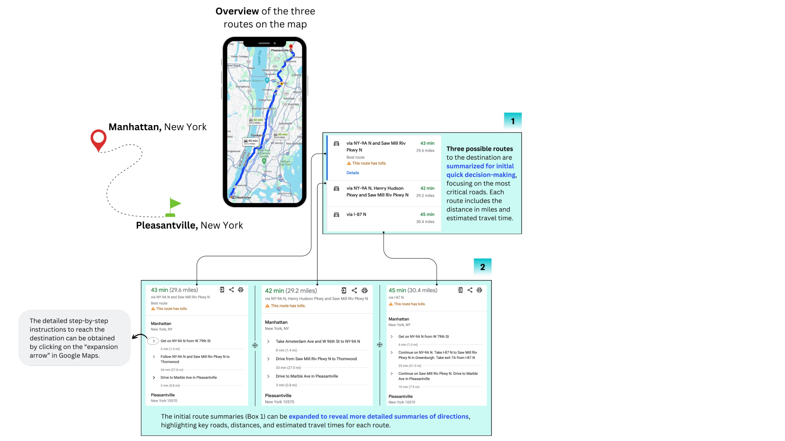
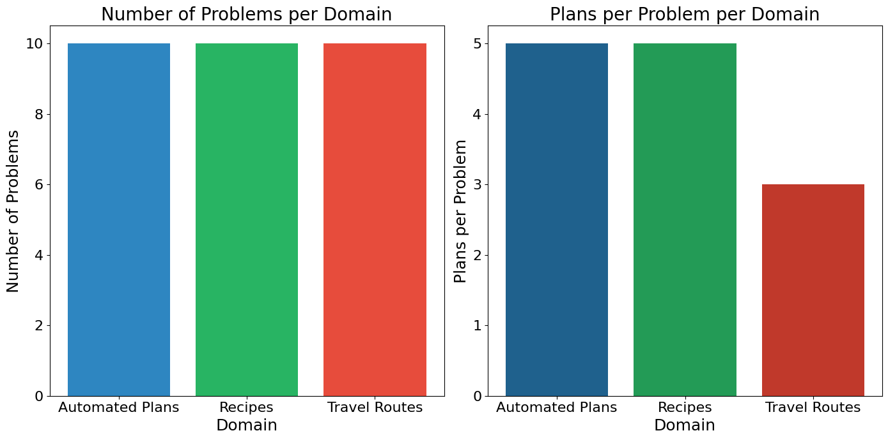
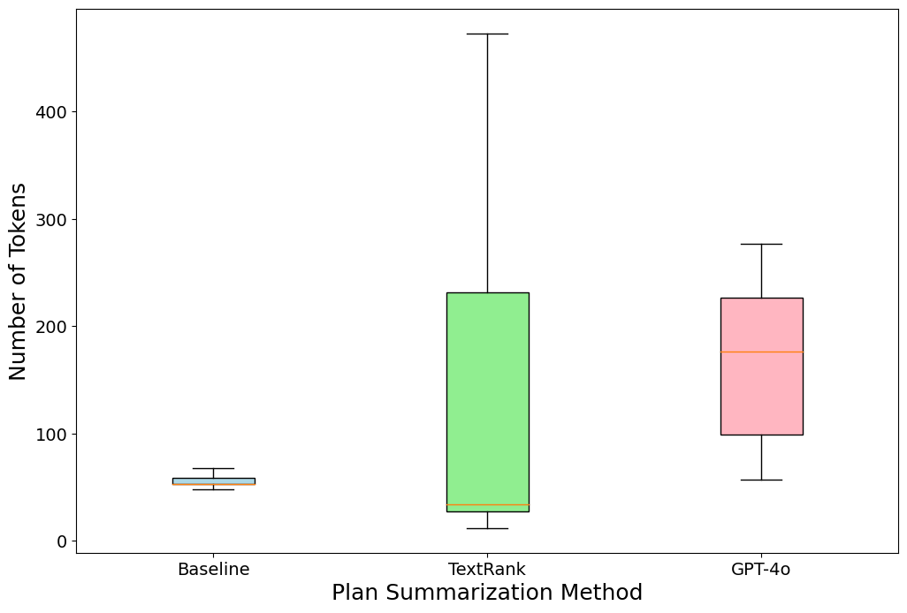
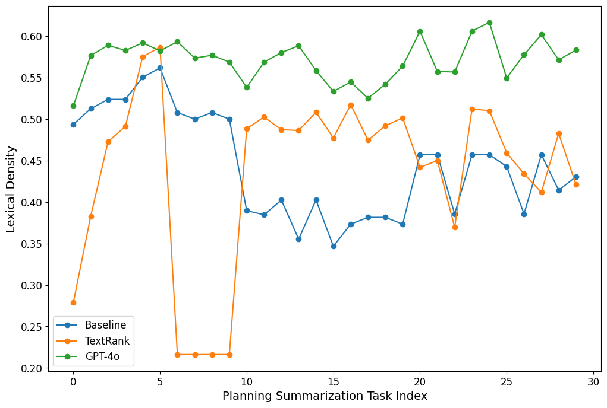

# PLANTS：专为规划类任务摘要设计的新颖问题与数据集

发布时间：2024年07月18日

`LLM应用` `工作流程`

> PLANTS: A Novel Problem and Dataset for Summarization of Planning-Like (PL) Tasks

# 摘要

> 文本摘要虽已广泛研究并应用于商业，但现实中许多任务如工作流程、食谱等，需生成行动序列以达成目标。我们称这类任务为“规划类”，因其共享控制流信息特性，有助于创建实用摘要，助用户快速决策。为此，我们提出新的“规划摘要”问题，并提供数据集与基线方法。通过定量与定性评估，我们探索了此新领域，期待能重燃对摘要技术的研究热情。

> Text summarization is a well-studied problem that deals with deriving insights from unstructured text consumed by humans, and it has found extensive business applications. However, many real-life tasks involve generating a series of actions to achieve specific goals, such as workflows, recipes, dialogs, and travel plans. We refer to them as planning-like (PL) tasks noting that the main commonality they share is control flow information. which may be partially specified. Their structure presents an opportunity to create more practical summaries to help users make quick decisions. We investigate this observation by introducing a novel plan summarization problem, presenting a dataset, and providing a baseline method for generating PL summaries. Using quantitative metrics and qualitative user studies to establish baselines, we evaluate the plan summaries from our method and large language models. We believe the novel problem and dataset can reinvigorate research in summarization, which some consider as a solved problem.

[Arxiv](https://arxiv.org/abs/2407.13597)