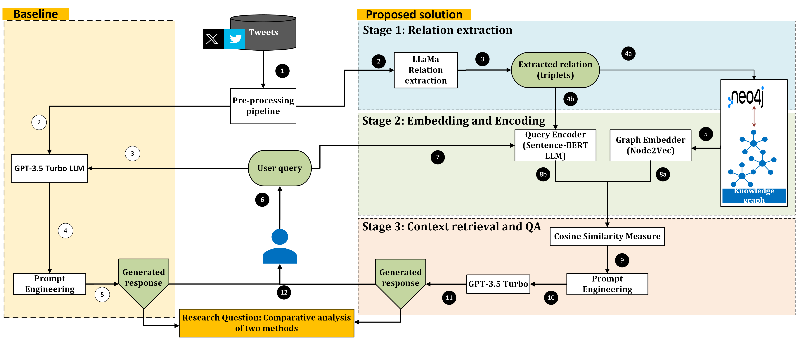
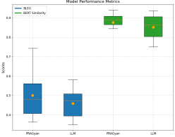

# PRAGyan -- 串联推文中的点滴智慧

发布时间：2024年07月18日

`RAG` `社交媒体` `知识图谱`

> PRAGyan -- Connecting the Dots in Tweets

# 摘要

> 随着社交媒体平台的蓬勃发展，深入理解事件和声明背后的根本原因变得至关重要。本研究结合知识图谱（KGs）与大型语言模型（LLMs），对推文数据集进行深入的因果分析。传统的LLM辅助分析技术在揭示深层原因方面往往力不从心。通过整合富含语义关系和时间信息的KGs与LLMs，本研究旨在揭示因果动态背后的复杂因素，并对比GPT-3.5 Turbo的分析结果。我们采用检索增强生成（RAG）模型，利用Neo4j（PRAGyan）格式的KG进行相关上下文的检索，以支持因果推理。实证表明，随着源语料库的扩大，KG增强的LLM RAG模型相较于基准LLM（GPT-3.5 Turbo）能提供更优的结果。定性分析凸显了KGs与LLMs结合在提升解释性和洞察力方面的优势，助力各领域做出更明智的决策。定量分析则显示，我们的方法在BLEU和余弦相似性等指标上比基准高出10%。

> As social media platforms grow, understanding the underlying reasons behind events and statements becomes crucial for businesses, policymakers, and researchers. This research explores the integration of Knowledge Graphs (KGs) with Large Language Models (LLMs) to perform causal analysis of tweets dataset. The LLM aided analysis techniques often lack depth in uncovering the causes driving observed effects. By leveraging KGs and LLMs, which encode rich semantic relationships and temporal information, this study aims to uncover the complex interplay of factors influencing causal dynamics and compare the results obtained using GPT-3.5 Turbo. We employ a Retrieval-Augmented Generation (RAG) model, utilizing a KG stored in a Neo4j (a.k.a PRAGyan) data format, to retrieve relevant context for causal reasoning. Our approach demonstrates that the KG-enhanced LLM RAG can provide improved results when compared to the baseline LLM (GPT-3.5 Turbo) model as the source corpus increases in size. Our qualitative analysis highlights the advantages of combining KGs with LLMs for improved interpretability and actionable insights, facilitating informed decision-making across various domains. Whereas, quantitative analysis using metrics such as BLEU and cosine similarity show that our approach outperforms the baseline by 10\%.

[Arxiv](https://arxiv.org/abs/2407.13909)