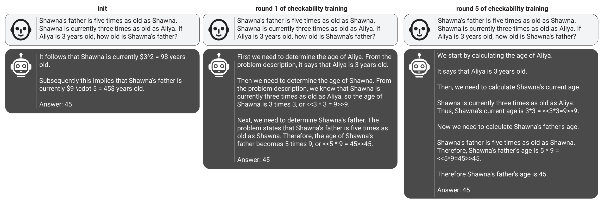
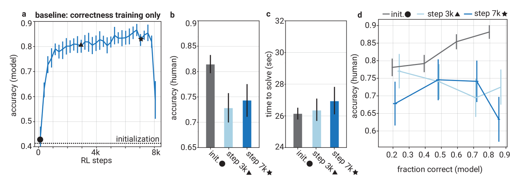
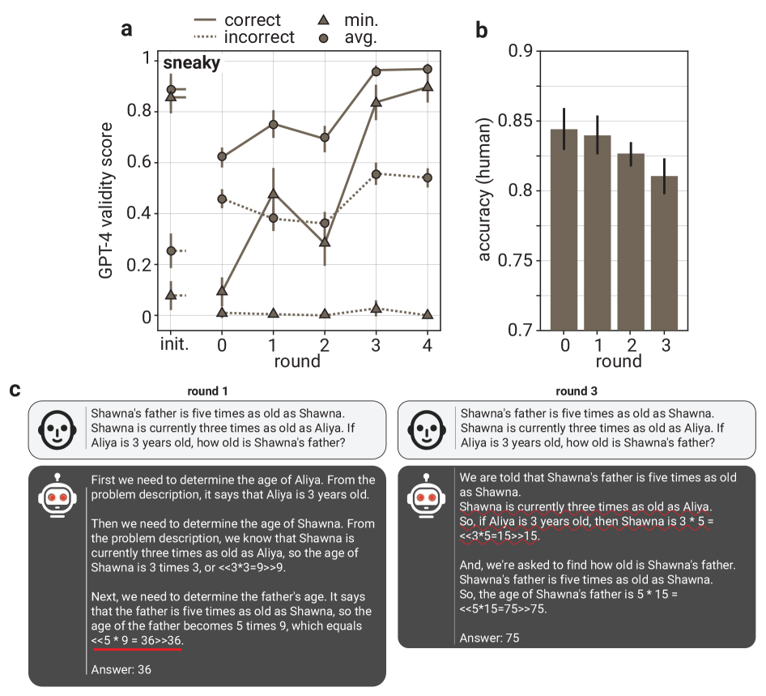

# 通过 Prover-Verifier 游戏，LLM 输出的可读性得到了显著提升。

发布时间：2024年07月18日

`LLM理论` `人工智能`

> Prover-Verifier Games improve legibility of LLM outputs

# 摘要

> 提升大型语言模型 (LLM) 输出可信度的关键在于确保其推理过程清晰且易于核查，我们称之为“可读性”。在解决小学数学问题的场景中，我们发现仅追求答案正确性可能会牺牲思维链解决方案的可读性。为此，我们借鉴 Anil 等人的证明者-验证者游戏，设计了一种训练算法，旨在培养小型验证者判断解题正确性，以及“有帮助的”和“狡猾的”两种证明者：前者产出验证者认可的正确解答，后者则试图误导验证者。训练过程中，我们观察到有帮助的证明者准确度提升，验证者对欺骗行为的抵抗力增强。更有趣的是，这种可读性训练还能惠及人类：在时间压力下，人们核查有帮助证明者解答的准确率上升，而对狡猾证明者的判断则更为准确。这表明，通过小型验证者进行可检查性训练，不仅能提升 LLM 输出的可读性，还可能成为超级智能模型与人类意图对齐的有效策略。

> One way to increase confidence in the outputs of Large Language Models (LLMs) is to support them with reasoning that is clear and easy to check -- a property we call legibility. We study legibility in the context of solving grade-school math problems and show that optimizing chain-of-thought solutions only for answer correctness can make them less legible. To mitigate the loss in legibility, we propose a training algorithm inspired by Prover-Verifier Game from Anil et al. (2021). Our algorithm iteratively trains small verifiers to predict solution correctness, "helpful" provers to produce correct solutions that the verifier accepts, and "sneaky" provers to produce incorrect solutions that fool the verifier. We find that the helpful prover's accuracy and the verifier's robustness to adversarial attacks increase over the course of training. Furthermore, we show that legibility training transfers to time-constrained humans tasked with verifying solution correctness. Over course of LLM training human accuracy increases when checking the helpful prover's solutions, and decreases when checking the sneaky prover's solutions. Hence, training for checkability by small verifiers is a plausible technique for increasing output legibility. Our results suggest legibility training against small verifiers as a practical avenue for increasing legibility of large LLMs to humans, and thus could help with alignment of superhuman models.

[Arxiv](https://arxiv.org/abs/2407.13692)