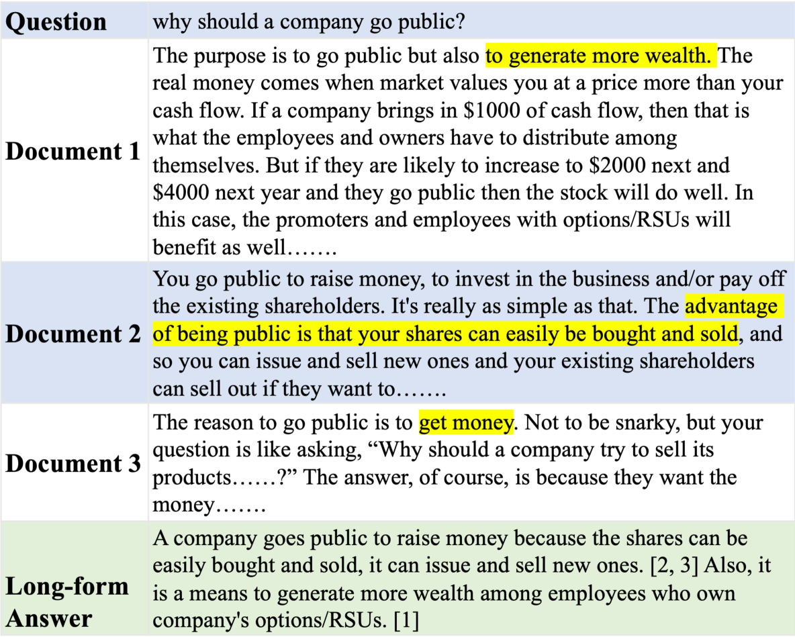

# RAG-QA 竞技场：探索长篇检索增强问答的领域稳健性

发布时间：2024年07月18日

`RAG` `问答系统`

> RAG-QA Arena: Evaluating Domain Robustness for Long-form Retrieval Augmented Question Answering

# 摘要

> RAG-QA，一种基于检索增强生成的问答技术，在NLP领域占据重要地位，应用广泛。然而，现有数据集多依赖单一语料源或仅包含简短抽取答案，难以全面评估大型语言模型（LLM）在跨领域泛化中的RAG-QA系统。为此，我们推出了Long-form RobustQA（LFRQA），一个包含人工撰写长篇答案的新数据集，这些答案融合了多文档的短抽取答案，形成连贯叙事，覆盖26K查询及七大领域的大量语料。我们还设计了RAG-QA Arena，利用LLM直接对比模型生成答案与LFRQA答案。实验表明，RAG-QA Arena与人类判断高度一致，且仅41.3%的顶尖LLM答案优于LFRQA，凸显其作为未来研究挑战性评估平台的潜力。

> Question answering based on retrieval augmented generation (RAG-QA) is an important research topic in NLP and has a wide range of real-world applications. However, most existing datasets for this task are either constructed using a single source corpus or consist of short extractive answers, which fall short of evaluating large language model (LLM) based RAG-QA systems on cross-domain generalization. To address these limitations, we create Long-form RobustQA (LFRQA), a new dataset comprising human-written long-form answers that integrate short extractive answers from multiple documents into a single, coherent narrative, covering 26K queries and large corpora across seven different domains. We further propose RAG-QA Arena by directly comparing model-generated answers against LFRQA's answers using LLMs as evaluators. We show via extensive experiments that RAG-QA Arena and human judgments on answer quality are highly correlated. Moreover, only 41.3% of the most competitive LLM's answers are preferred to LFRQA's answers, demonstrating RAG-QA Arena as a challenging evaluation platform for future research.

[Arxiv](https://arxiv.org/abs/2407.13998)