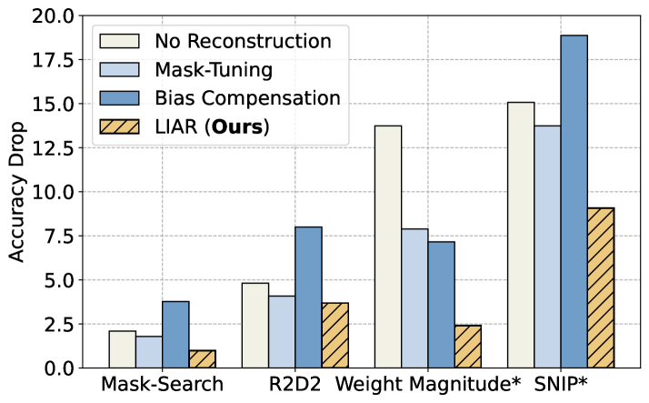
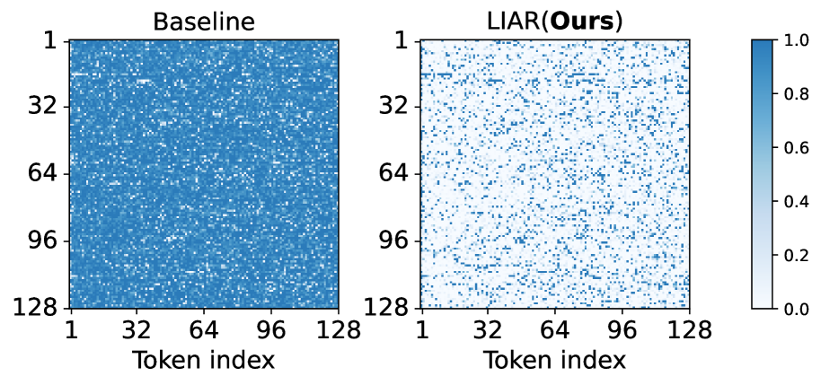
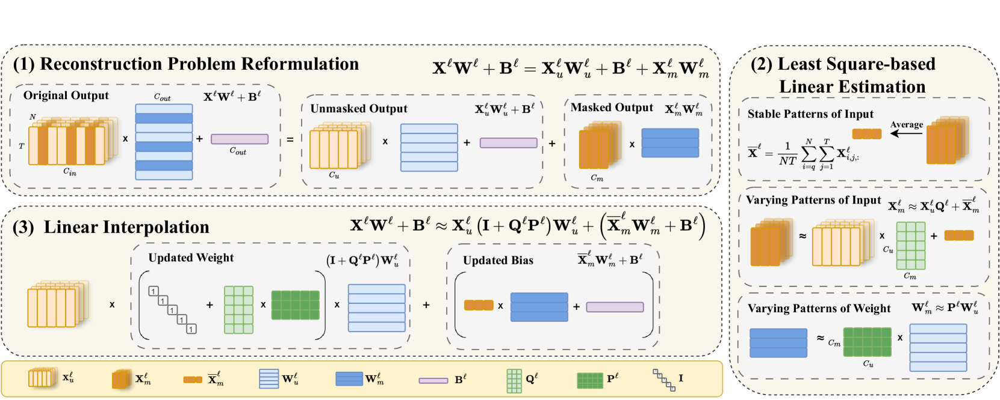
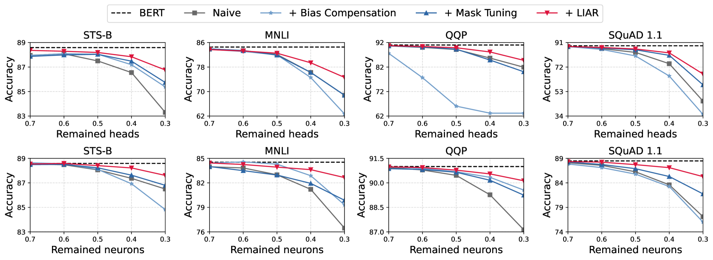
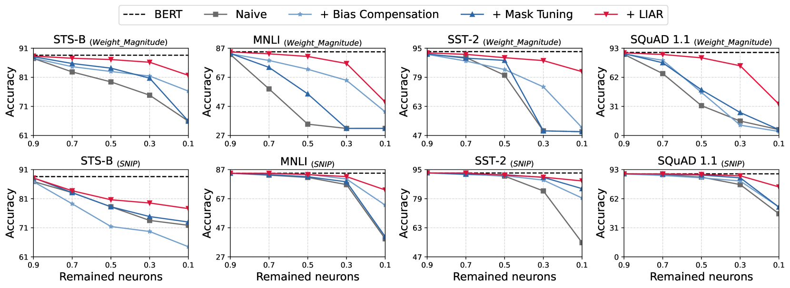
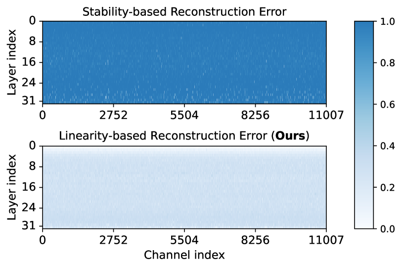
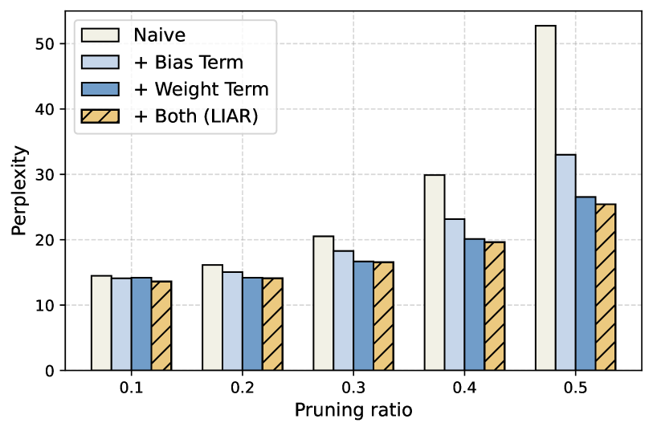
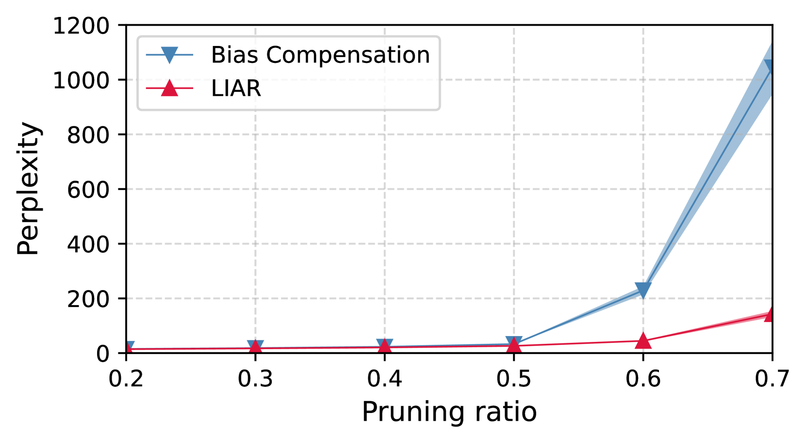
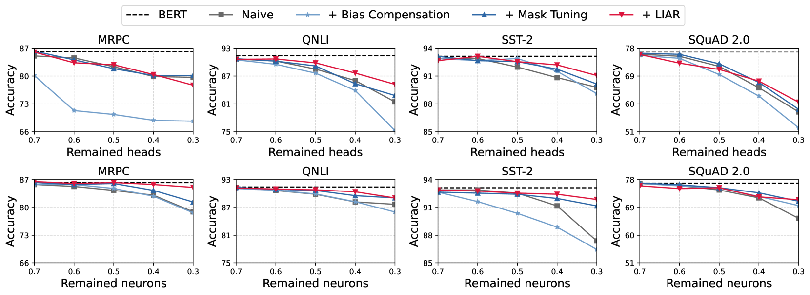
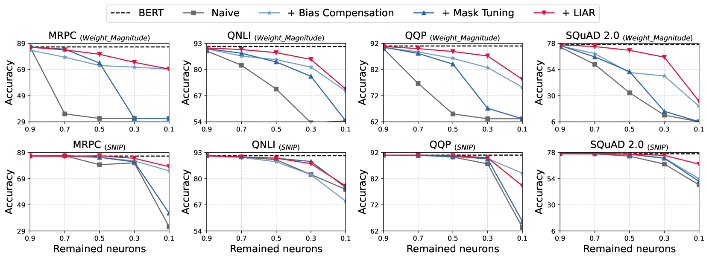

# 无需再训练，重建修剪模型

发布时间：2024年07月18日

`LLM理论` `人工智能` `计算机硬件`

> Reconstruct the Pruned Model without Any Retraining

# 摘要

> 结构化剪枝技术为大型语言模型（LLM）提供了一种硬件友好的压缩方案，无需重新训练即可避免高昂的成本。该技术包括定义剪枝架构和恢复性能的重建步骤。尽管现有方法侧重于剪枝标准，但重建技术的通用性受限于特定模块或标准。为此，我们提出了高效的LIAR框架，无需反向传播或重新训练，适用于多种剪枝标准和模块。通过线性插值优化保留权重，LIAR显著降低了重建误差。在GLUE、SQuAD等基准测试中，LIAR使BERT模型在参数减少50%后仍保持98%的准确率，并在短时间内为LLaMA带来顶级性能。

> Structured pruning is a promising hardware-friendly compression technique for large language models (LLMs), which is expected to be retraining-free to avoid the enormous retraining cost. This retraining-free paradigm involves (1) pruning criteria to define the architecture and (2) distortion reconstruction to restore performance. However, existing methods often emphasize pruning criteria while using reconstruction techniques that are specific to certain modules or criteria, resulting in limited generalizability. To address this, we introduce the Linear Interpolation-based Adaptive Reconstruction (LIAR) framework, which is both efficient and effective. LIAR does not require back-propagation or retraining and is compatible with various pruning criteria and modules. By applying linear interpolation to the preserved weights, LIAR minimizes reconstruction error and effectively reconstructs the pruned output. Our evaluations on benchmarks such as GLUE, SQuAD, WikiText, and common sense reasoning show that LIAR enables a BERT model to maintain 98% accuracy even after removing 50% of its parameters and achieves top performance for LLaMA in just a few minutes.

[Arxiv](https://arxiv.org/abs/2407.13331)