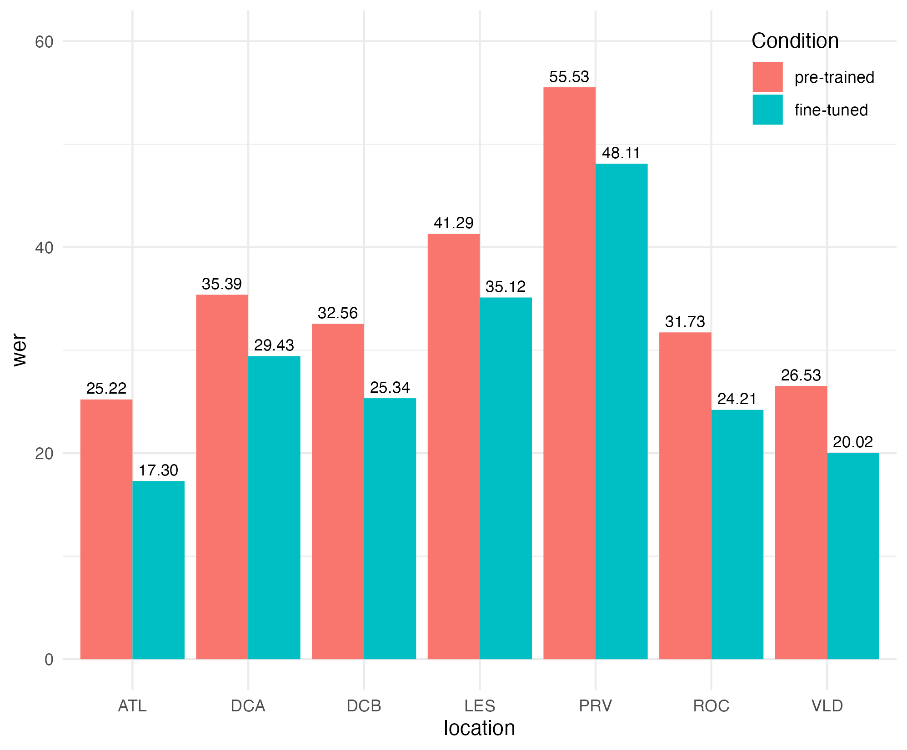
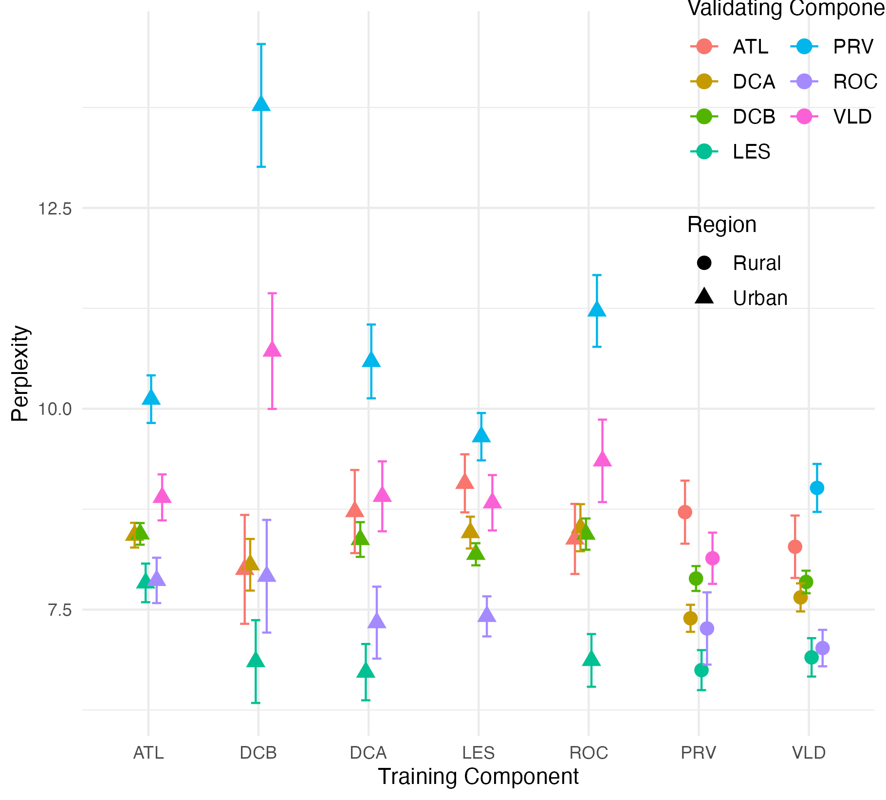

# 探讨自动语音识别中种族差异的根源：揭秘来源混杂因素的影响

发布时间：2024年07月18日

`LLM应用` `语音识别`

> Reexamining Racial Disparities in Automatic Speech Recognition Performance: The Role of Confounding by Provenance

# 摘要

> 自动语音识别（ASR）模型，经过海量音频数据训练，如今广泛应用于语音转文字，涵盖视频字幕至医疗助手等多领域。确保ASR模型公平使用，至关重要。过往研究显示，商业ASR系统在非裔美国人英语（AAE）表现不佳。本研究利用最新神经网络ASR系统（Whisper，OpenAI），探索AAE识别差异根源。研究发现：一，方言差异显著，AAE识别可通过模型微调改善；二，录音实践差异影响识别准确，引发“来源混淆”，语言与录音质量因地而异。这些发现呼吁深入研究，以厘清录音与语言多样性对ASR公平性的影响，确保ASR技术在各领域的公正应用。

> Automatic speech recognition (ASR) models trained on large amounts of audio data are now widely used to convert speech to written text in a variety of applications from video captioning to automated assistants used in healthcare and other domains. As such, it is important that ASR models and their use is fair and equitable. Prior work examining the performance of commercial ASR systems on the Corpus of Regional African American Language (CORAAL) demonstrated significantly worse ASR performance on African American English (AAE). The current study seeks to understand the factors underlying this disparity by examining the performance of the current state-of-the-art neural network based ASR system (Whisper, OpenAI) on the CORAAL dataset. Two key findings have been identified as a result of the current study. The first confirms prior findings of significant dialectal variation even across neighboring communities, and worse ASR performance on AAE that can be improved to some extent with fine-tuning of ASR models. The second is a novel finding not discussed in prior work on CORAAL: differences in audio recording practices within the dataset have a significant impact on ASR accuracy resulting in a ``confounding by provenance'' effect in which both language use and recording quality differ by study location. These findings highlight the need for further systematic investigation to disentangle the effects of recording quality and inherent linguistic diversity when examining the fairness and bias present in neural ASR models, as any bias in ASR accuracy may have negative downstream effects on disparities in various domains of life in which ASR technology is used.

[Arxiv](https://arxiv.org/abs/2407.13982)