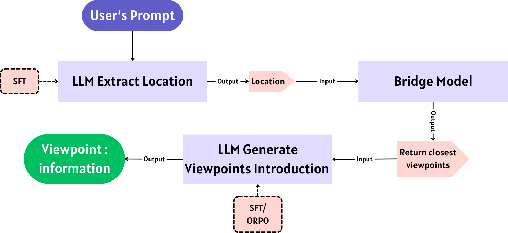
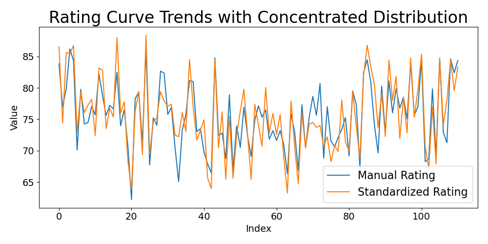
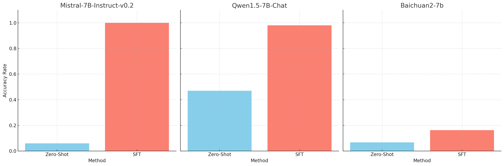
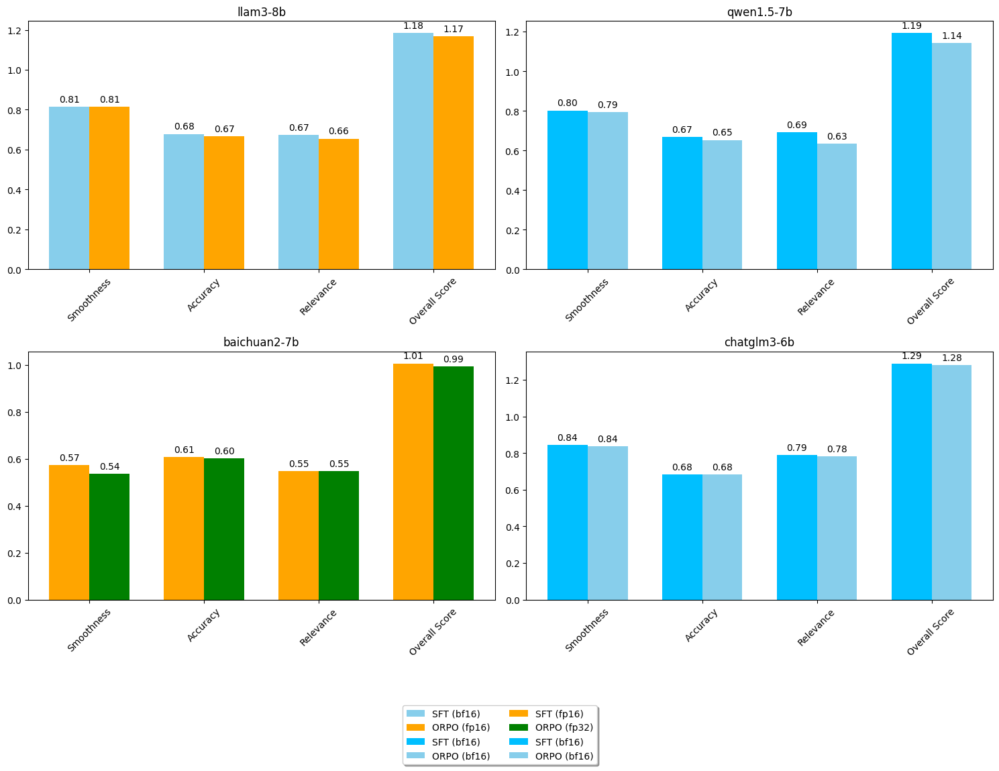

# 本研究探讨了基于大型语言模型的藏族旅游观点信息生成系统。

发布时间：2024年07月18日

`LLM应用` `智能服务`

> Research on Tibetan Tourism Viewpoints information generation system based on LLM

# 摘要

> 西藏，这片蕴藏着深厚历史与独特宗教文化的土地，其复杂多变的地形虽美，却也限制了旅游服务的发展。现有的智能旅游服务在满足游客需求上显得力不从心。本研究不仅剖析了信息差异对西藏旅游业的影响，还挑战了建立大型语言模型（LLM）评估标准的难题。我们创新性地提出了DualGen Bridge AI系统，通过监督微调技术强化模型，优化其性能，并首创多结构生成结果评估框架，经实证验证其有效。此外，我们还探索了在DualGen Bridge AI中运用监督微调方法，以提升旅游信息的生成质量。研究成果不仅为系统优化提供了新思路，更为LLM技术在西藏乃至更广泛旅游服务领域的应用注入了活力，预示着智能旅游产业将迎来一场由先进定制信息生成技术引领的革命。

> Tibet, ensconced within China's territorial expanse, is distinguished by its labyrinthine and heterogeneous topography, a testament to its profound historical heritage, and the cradle of a unique religious ethos. The very essence of these attributes, however, has impeded the advancement of Tibet's tourism service infrastructure, rendering existing smart tourism services inadequate for the region's visitors. This study delves into the ramifications of informational disparities at tourist sites on Tibetan tourism and addresses the challenge of establishing the Large Language Model (LLM) evaluation criteria. It introduces an innovative approach, the DualGen Bridge AI system, employing supervised fine-tuning techniques to bolster model functionality and enhance optimization processes. Furthermore, it pioneers a multi-structured generative results assessment framework. Empirical validation confirms the efficacy of this framework. The study also explores the application of the supervised fine-tuning method within the proprietary DualGen Bridge AI, aimed at refining the generation of tourist site information. The study's findings offer valuable insights for optimizing system performance and provide support and inspiration for the application of LLM technology in Tibet's tourism services and beyond, potentially revolutionizing the smart tourism industry with advanced, tailored information generation capabilities.

[Arxiv](https://arxiv.org/abs/2407.13561)