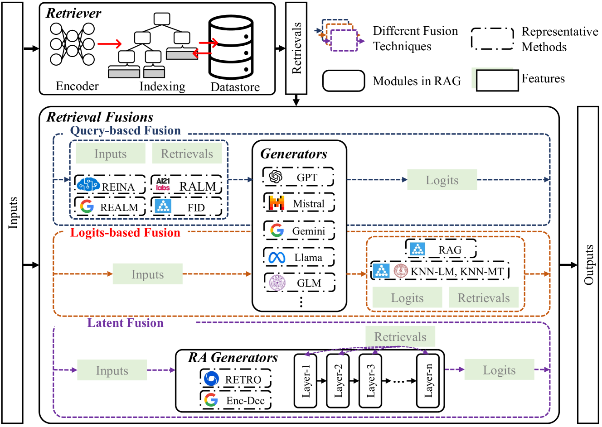
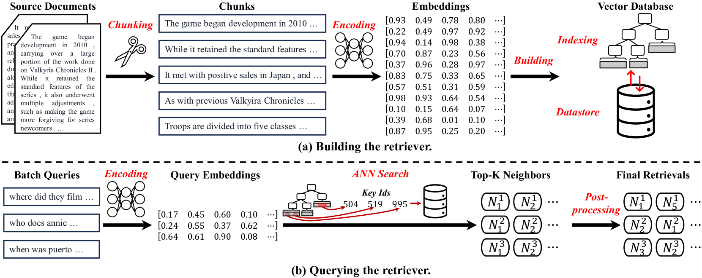
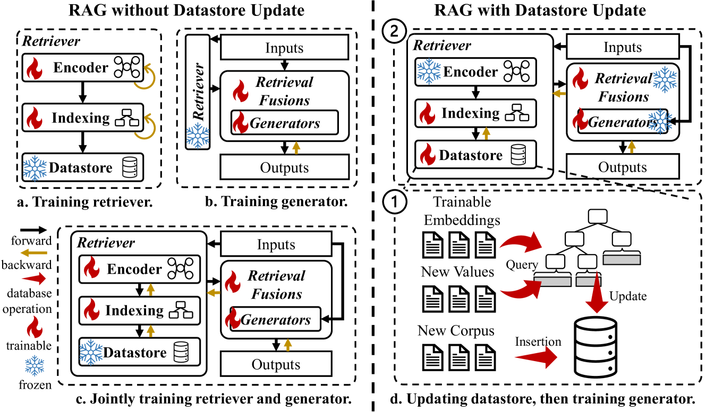

# 自然语言处理中的检索增强生成技术：综述

发布时间：2024年07月18日

`RAG` `工业应用`

> Retrieval-Augmented Generation for Natural Language Processing: A Survey

# 摘要

> 大型语言模型（LLM）凭借其庞大的参数存储知识，在多领域取得了显著成就。然而，它们仍面临幻觉、知识更新滞后及缺乏专业领域知识等挑战。检索增强生成（RAG）通过整合外部知识库，有效弥补了这些不足。本文深入探讨了RAG的关键技术，特别是检索器与融合策略，并提供了实现这些技术的教程代码。此外，我们还详细阐述了RAG的训练方法，包括数据存储更新与否的差异。随后，展示了RAG在自然语言处理任务和工业应用中的实际效能。最后，本文展望了RAG的未来发展方向及其面临的挑战，旨在推动其进一步进步。

> Large language models (LLMs) have demonstrated great success in various fields, benefiting from their huge amount of parameters that store knowledge. However, LLMs still suffer from several key issues, such as hallucination problems, knowledge update issues, and lacking domain-specific expertise. The appearance of retrieval-augmented generation (RAG), which leverages an external knowledge database to augment LLMs, makes up those drawbacks of LLMs. This paper reviews all significant techniques of RAG, especially in the retriever and the retrieval fusions. Besides, tutorial codes are provided for implementing the representative techniques in RAG. This paper further discusses the RAG training, including RAG with/without datastore update. Then, we introduce the application of RAG in representative natural language processing tasks and industrial scenarios. Finally, this paper discusses the future directions and challenges of RAG for promoting its development.

[Arxiv](https://arxiv.org/abs/2407.13193)