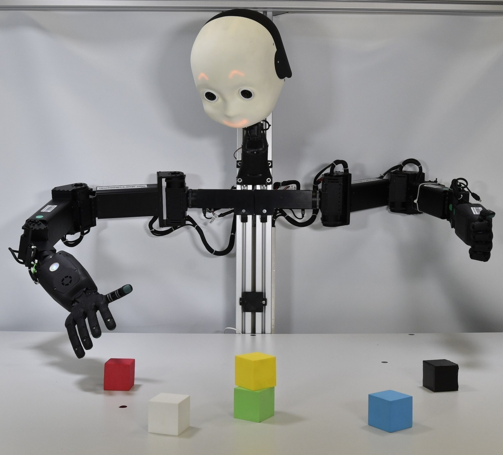
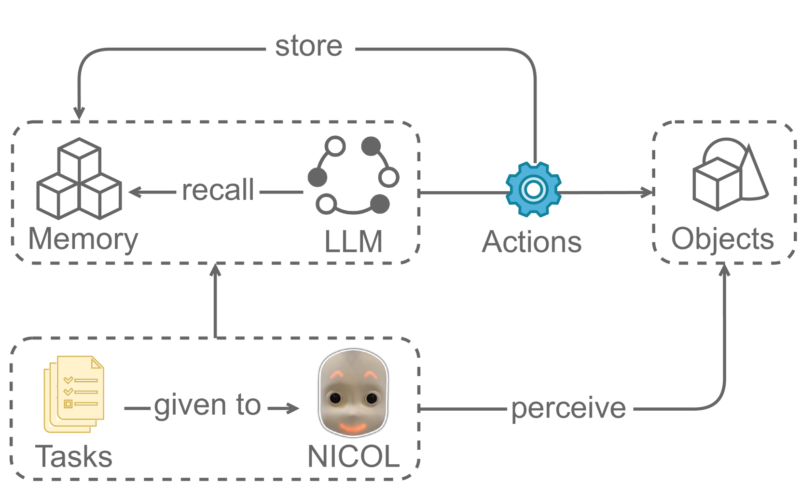
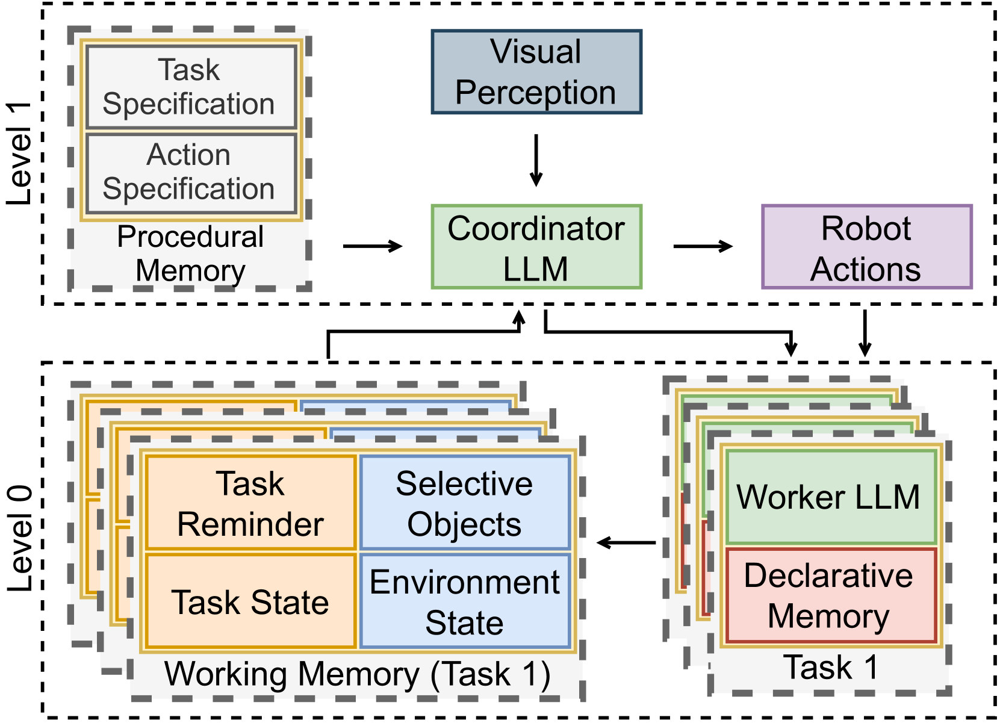
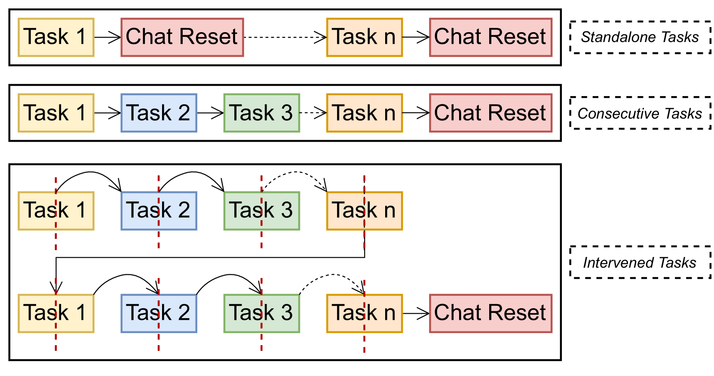
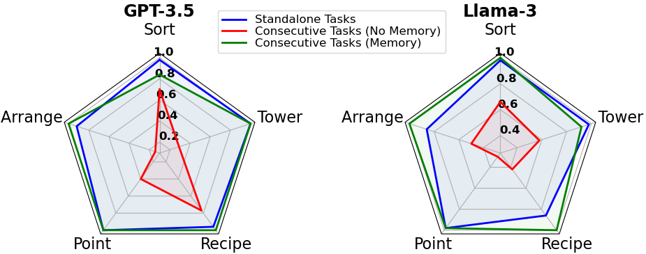
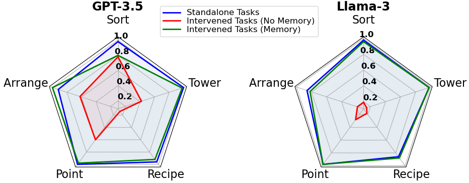

# 机器人也能胜任多任务，通过整合记忆架构与大型语言模型，提升跨任务动作生成的效率。

发布时间：2024年07月18日

`Agent` `机器人` `人工智能`

> Robots Can Multitask Too: Integrating a Memory Architecture and LLMs for Enhanced Cross-Task Robot Action Generation

# 摘要

> 最近，大型语言模型（LLM）被应用于机器人领域，旨在将LLM的常识推理能力与机器人的感知和物理能力相结合。在人形机器人中，记忆功能对于实现其在现实世界中的实体化以及增强其长期交互能力尤为关键，尤其是在多任务环境中，机器人需要记忆过往的任务状态、环境变化及已执行的动作。本文探讨了如何将记忆机制与LLM相结合，以支持机器人进行跨任务的动作生成，并实现任务间的流畅切换。我们设计了一种双层架构，包含两个LLM，它们分别擅长推理和指令执行，并辅以受人类认知启发的记忆模型。实验结果表明，相较于五个机器人任务的基准，我们的方法显著提升了性能，展现了将记忆与LLM融合以优化机器人动作和感知，从而实现更灵活任务执行的广阔前景。

> Large Language Models (LLMs) have been recently used in robot applications for grounding LLM common-sense reasoning with the robot's perception and physical abilities. In humanoid robots, memory also plays a critical role in fostering real-world embodiment and facilitating long-term interactive capabilities, especially in multi-task setups where the robot must remember previous task states, environment states, and executed actions. In this paper, we address incorporating memory processes with LLMs for generating cross-task robot actions, while the robot effectively switches between tasks. Our proposed dual-layered architecture features two LLMs, utilizing their complementary skills of reasoning and following instructions, combined with a memory model inspired by human cognition. Our results show a significant improvement in performance over a baseline of five robotic tasks, demonstrating the potential of integrating memory with LLMs for combining the robot's action and perception for adaptive task execution.

[Arxiv](https://arxiv.org/abs/2407.13505)