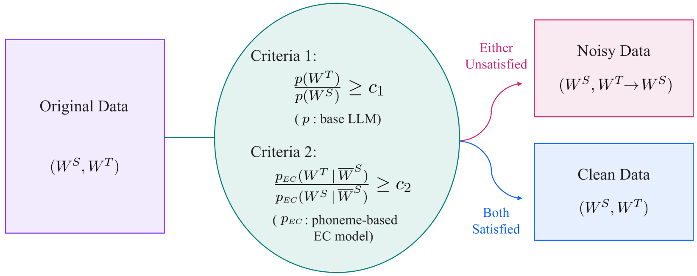
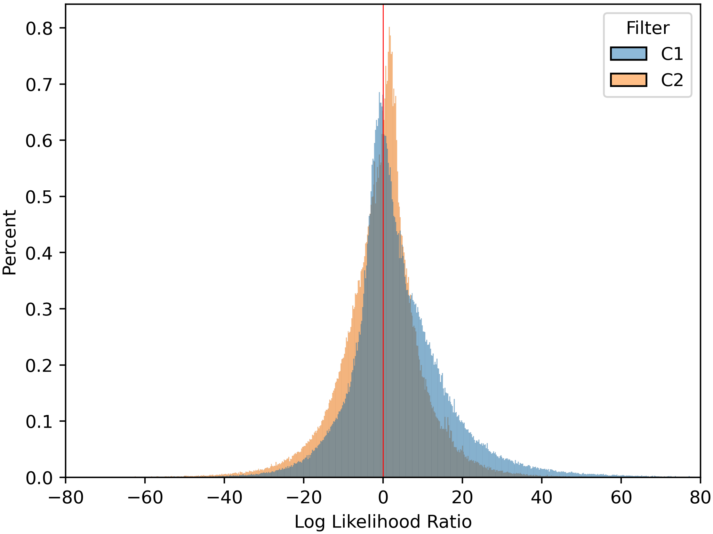

# 通过保守数据过滤实现 ASR 错误纠正的鲁棒性

发布时间：2024年07月18日

`LLM应用` `自动语音识别` `语言处理`

> Robust ASR Error Correction with Conservative Data Filtering

# 摘要

> 基于大型语言模型的错误纠正技术，正逐渐成为提升自动语音识别系统性能的关键。然而，当前EC训练数据的自动配对方式存在质量问题，可能导致模型在处理域外数据时过度纠正。为此，我们提出了两个基本标准：EC目标需在语言接受度上超越源文本，并能从上下文中推断。通过这些标准，我们实施了保守数据过滤，确保模型在低质量数据面前保持克制。实验表明，我们的方法在日语ASR系统中显著减少了过度纠正现象，提升了在复杂域外环境下的识别准确性和整体质量。

> Error correction (EC) based on large language models is an emerging technology to enhance the performance of automatic speech recognition (ASR) systems. Generally, training data for EC are collected by automatically pairing a large set of ASR hypotheses (as sources) and their gold references (as targets). However, the quality of such pairs is not guaranteed, and we observed various types of noise which can make the EC models brittle, e.g. inducing overcorrection in out-of-domain (OOD) settings. In this work, we propose two fundamental criteria that EC training data should satisfy: namely, EC targets should (1) improve linguistic acceptability over sources and (2) be inferable from the available context (e.g. source phonemes). Through these criteria, we identify low-quality EC pairs and train the models not to make any correction in such cases, the process we refer to as conservative data filtering. In our experiments, we focus on Japanese ASR using a strong Conformer-CTC as the baseline and finetune Japanese LLMs for EC. Through our evaluation on a suite of 21 internal benchmarks, we demonstrate that our approach can significantly reduce overcorrection and improve both the accuracy and quality of ASR results in the challenging OOD settings.

[Arxiv](https://arxiv.org/abs/2407.13300)