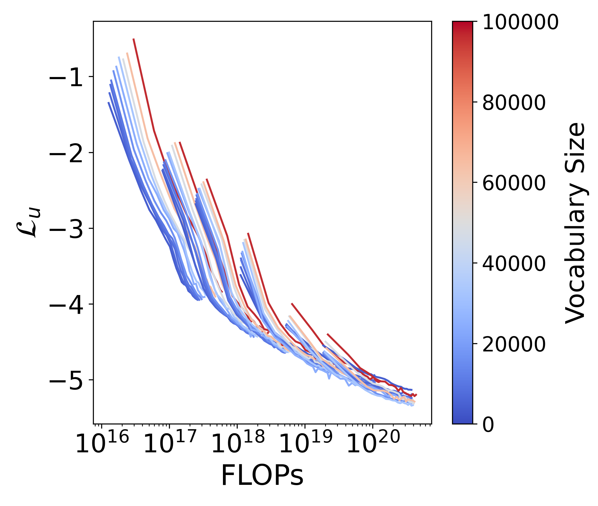
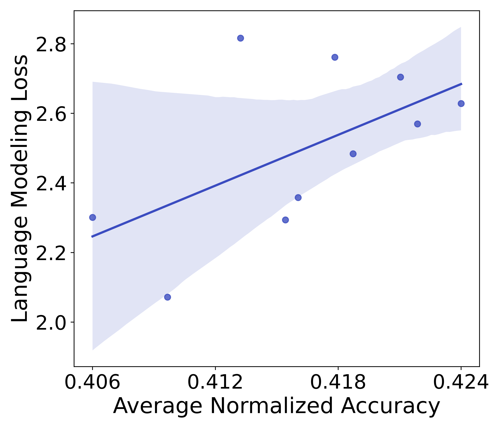

# 模型越大，所需的词汇量也应越大，这是词汇规模的法则。

发布时间：2024年07月18日

`LLM理论` `人工智能`

> Scaling Laws with Vocabulary: Larger Models Deserve Larger Vocabularies

# 摘要

> 在扩展大型语言模型 (LLM) 的研究中，我们发现词汇大小的重要性常被忽视。通过实验，我们揭示了词汇大小对模型扩展的影响，并提出了三种方法来确定计算最优的词汇大小。我们的研究表明，最优词汇大小与计算预算紧密相关，且大型模型应配备更大的词汇表。然而，当前大多数 LLM 的词汇大小设置过小。例如，我们预测 Llama2-70B 的最优词汇应为 216K，远超其当前的 32K。实证验证显示，采用我们预测的最优词汇大小能显著提升下游任务性能。通过将词汇大小从 32K 提升至 43K，我们在 ARC-Challenge 任务中实现了性能的显著提升。这一发现强调了在模型扩展时，必须同时考虑模型参数和词汇大小，以实现更高效的表现。

> Research on scaling large language models (LLMs) has primarily focused on model parameters and training data size, overlooking the role of vocabulary size. % Intuitively, larger vocabularies enable more efficient tokenization by representing sentences with fewer tokens, but they also increase the risk of under-fitting representations for rare tokens. We investigate how vocabulary size impacts LLM scaling laws by training models ranging from 33M to 3B parameters on up to 500B characters with various vocabulary configurations. We propose three complementary approaches for predicting the compute-optimal vocabulary size: IsoFLOPs analysis, derivative estimation, and parametric fit of the loss function. Our approaches converge on the same result that the optimal vocabulary size depends on the available compute budget and that larger models deserve larger vocabularies. However, most LLMs use too small vocabulary sizes. For example, we predict that the optimal vocabulary size of Llama2-70B should have been at least 216K, 7 times larger than its vocabulary of 32K. We validate our predictions empirically by training models with 3B parameters across different FLOPs budgets. Adopting our predicted optimal vocabulary size consistently improves downstream performance over commonly used vocabulary sizes. By increasing the vocabulary size from the conventional 32K to 43K, we improve performance on ARC-Challenge from 29.1 to 32.0 with the same 2.3e21 FLOPs. Our work emphasizes the necessity of jointly considering model parameters and vocabulary size for efficient scaling.

[Arxiv](https://arxiv.org/abs/2407.13623)