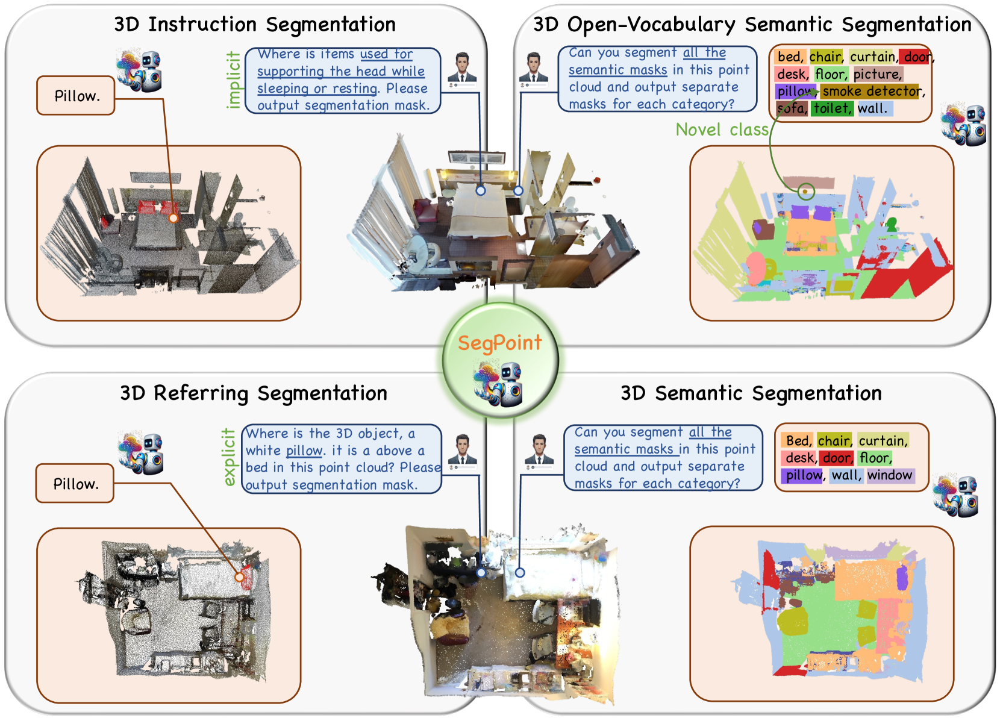
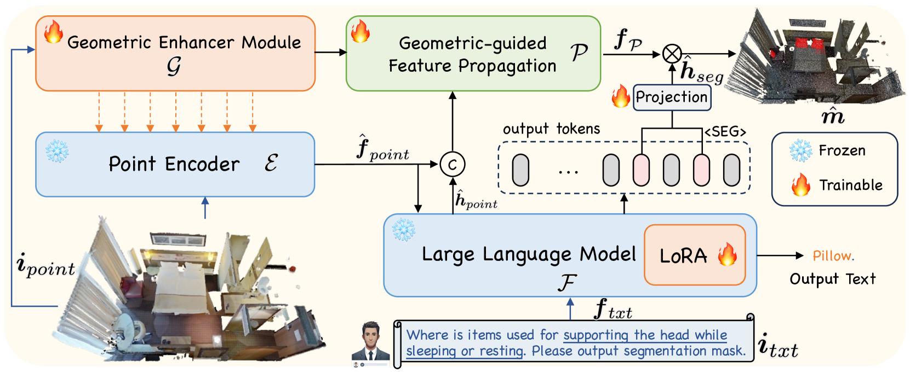
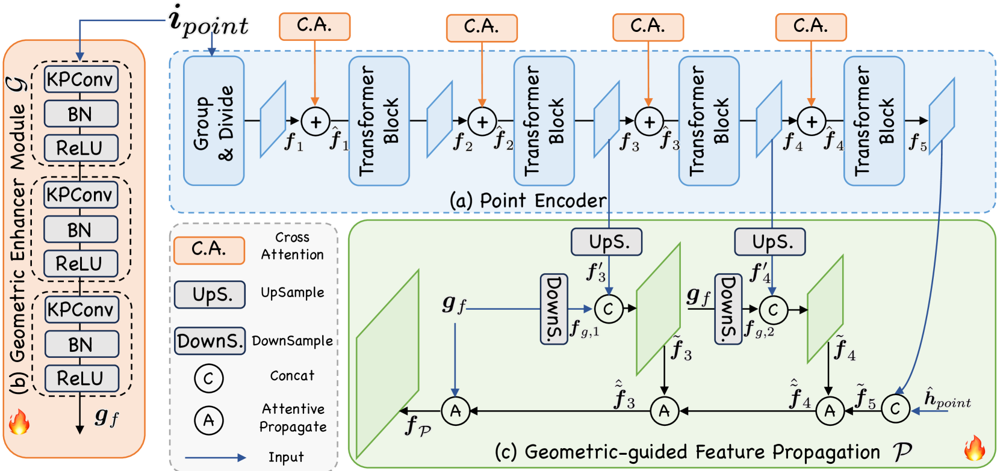
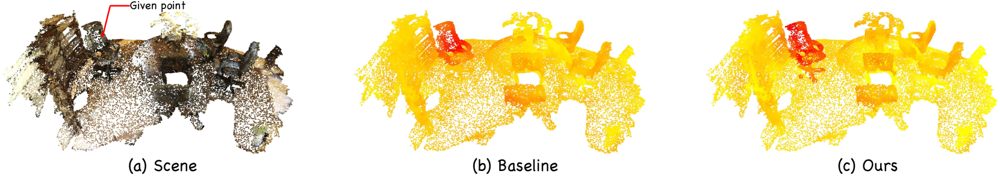
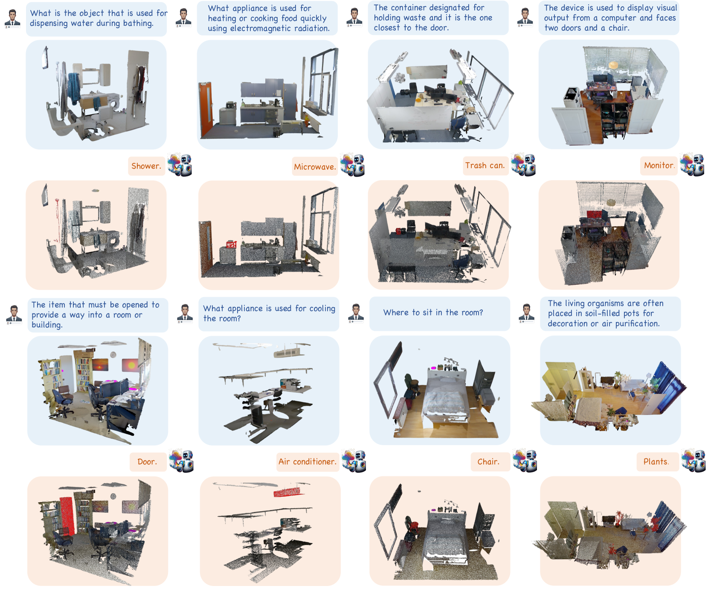

# SegPoint：借助大型语言模型，轻松分割任意点云

发布时间：2024年07月18日

`LLM应用` `计算机视觉` `机器人技术`

> SegPoint: Segment Any Point Cloud via Large Language Model

# 摘要

> 尽管3D点云分割技术已取得显著进步，但现有方法往往局限于特定任务，并依赖明确指令来识别目标，未能在一个统一框架内理解用户的隐含意图。为此，我们提出了SegPoint模型，该模型借助多模态大型语言模型的推理能力，为多种3D分割任务提供逐点分割掩码。此外，我们引入了Instruct3D基准，用于评估从复杂隐含文本中提取的分割性能，包含2,565个点云-指令对。实验显示，SegPoint在ScanRefer和ScanNet等基准上表现优异，并在Instruct3D数据集上取得了突出成果。SegPoint是首个在一个框架内成功应对多样化3D分割任务的模型，表现令人满意。

> Despite significant progress in 3D point cloud segmentation, existing methods primarily address specific tasks and depend on explicit instructions to identify targets, lacking the capability to infer and understand implicit user intentions in a unified framework. In this work, we propose a model, called SegPoint, that leverages the reasoning capabilities of a multi-modal Large Language Model (LLM) to produce point-wise segmentation masks across a diverse range of tasks: 1) 3D instruction segmentation, 2) 3D referring segmentation, 3) 3D semantic segmentation, and 4) 3D open-vocabulary semantic segmentation. To advance 3D instruction research, we introduce a new benchmark, Instruct3D, designed to evaluate segmentation performance from complex and implicit instructional texts, featuring 2,565 point cloud-instruction pairs. Our experimental results demonstrate that SegPoint achieves competitive performance on established benchmarks such as ScanRefer for referring segmentation and ScanNet for semantic segmentation, while delivering outstanding outcomes on the Instruct3D dataset. To our knowledge, SegPoint is the first model to address these varied segmentation tasks within a single framework, achieving satisfactory performance.

[Arxiv](https://arxiv.org/abs/2407.13761)