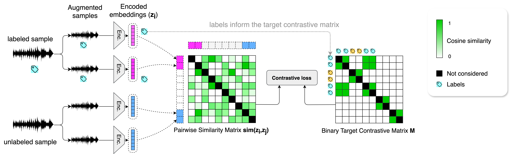
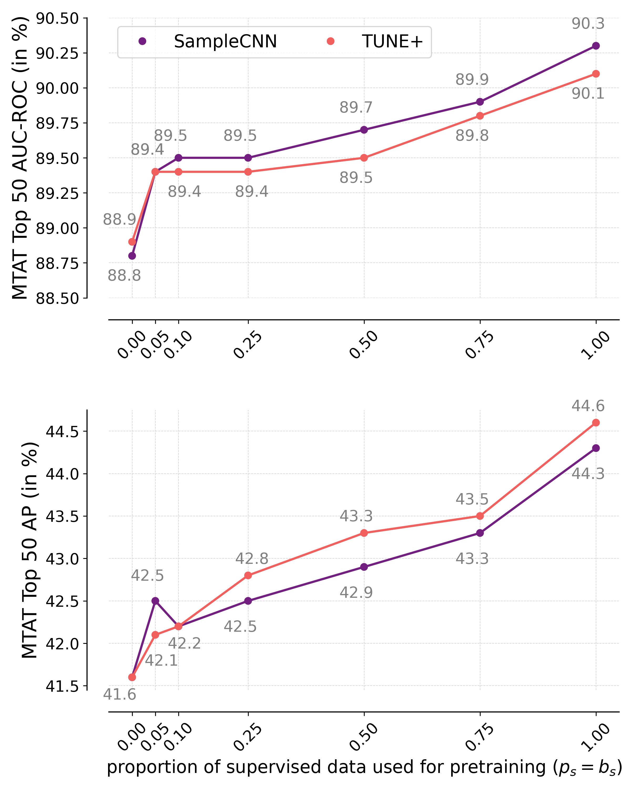
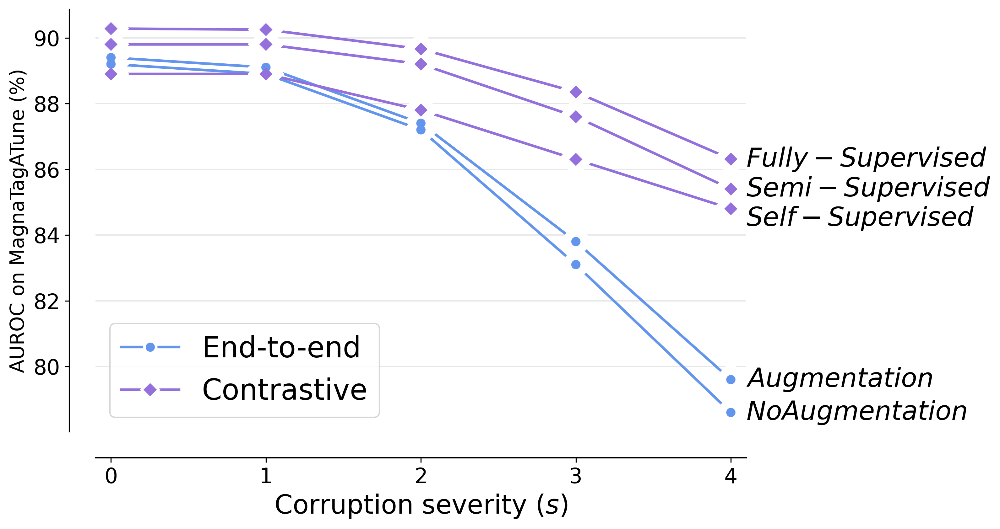
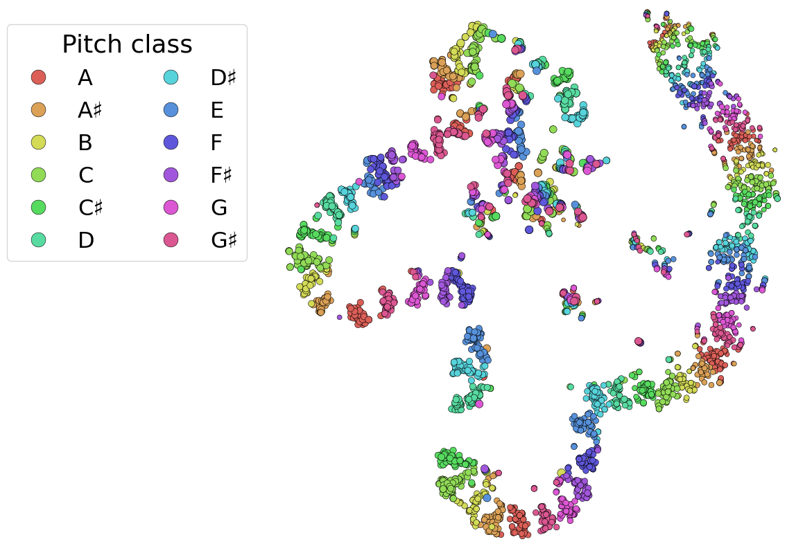
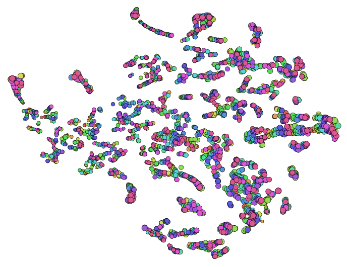
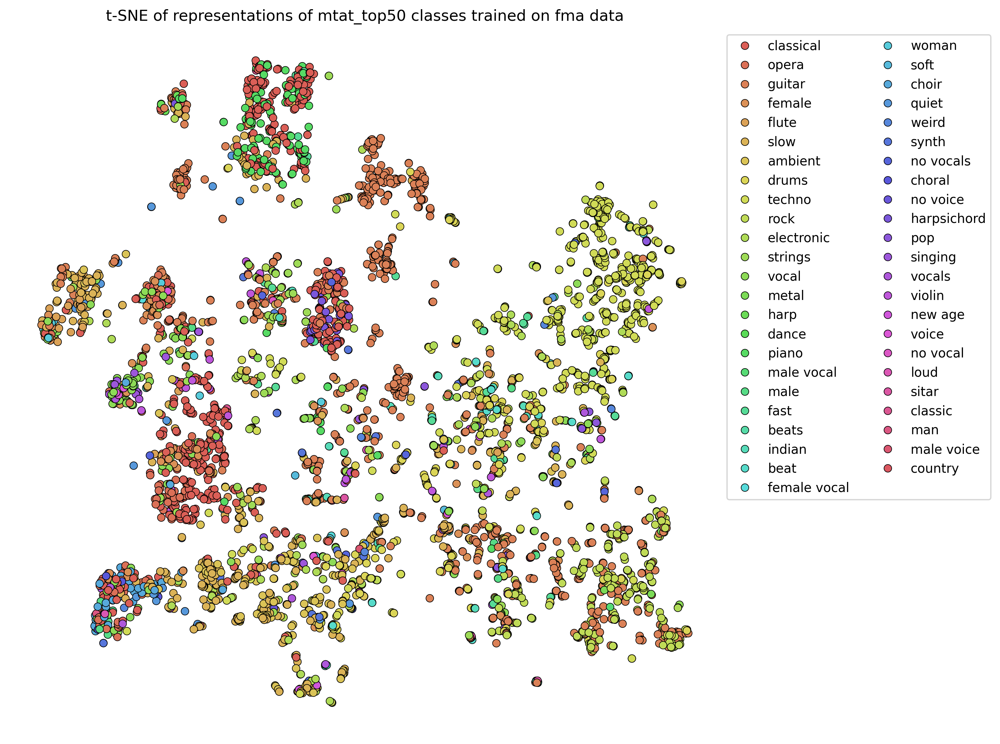
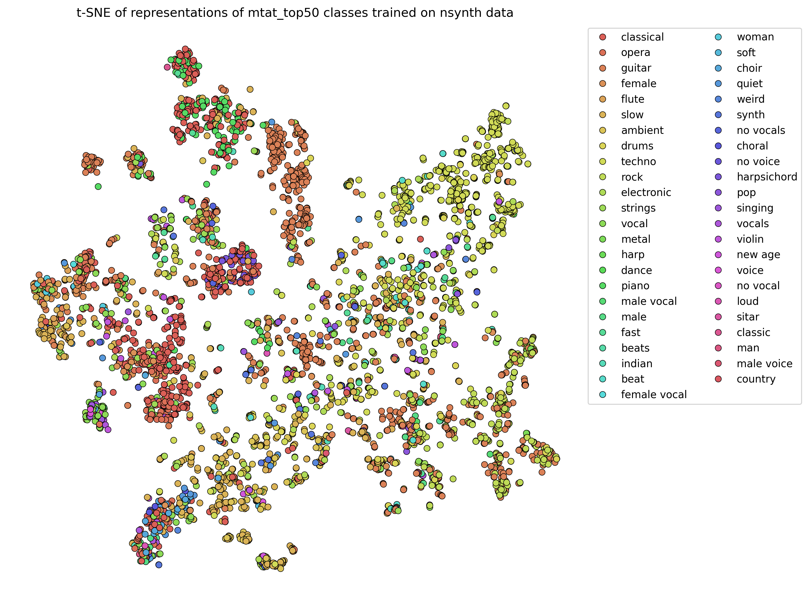
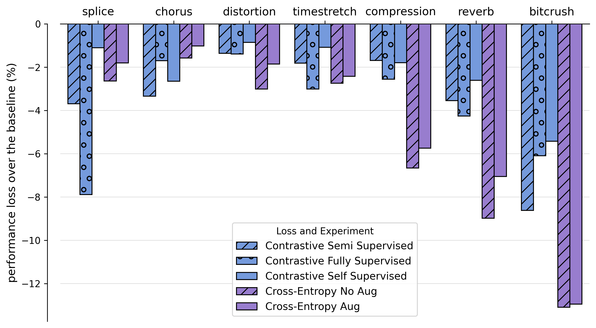

# 音乐表示的半监督对比学习

发布时间：2024年07月18日

`LLM应用` `信息检索`

> Semi-Supervised Contrastive Learning of Musical Representations

# 摘要

> 尽管对比学习在音乐信息检索领域取得了显著成果，但其自监督机制的内在模糊性仍是一大挑战。单纯依赖数据增强和自监督正样本策略可能导致预训练无法有效捕捉下游任务所需的关键音乐信息。为此，我们提出了半监督对比学习（SemiSupCon），一种简便方法，旨在对比学习音乐表示时融入音乐知识标注数据。通过在一个更简洁的框架内融合监督与自监督对比目标，我们的方法成功将音乐相关监督信号引入自监督学习，显著提升了下游任务性能及对音频损坏的鲁棒性，尤其是在拥有适量标注数据的情况下。此外，通过精心选择标注数据，我们的方法不仅丰富了学习表示中的音乐领域知识，还在保持下游性能稳定的同时，增强了跨领域任务的表现。实验证明，在音高和调性估计等音乐相关但非直接相似的任务上，我们的方法展现了卓越的迁移学习能力。同时，在自动标签任务中，即便仅利用5%的可用标签进行预训练，我们的方法也显著超越了传统的自监督学习方法。

> Despite the success of contrastive learning in Music Information Retrieval, the inherent ambiguity of contrastive self-supervision presents a challenge. Relying solely on augmentation chains and self-supervised positive sampling strategies can lead to a pretraining objective that does not capture key musical information for downstream tasks. We introduce semi-supervised contrastive learning (SemiSupCon), a simple method for leveraging musically informed labeled data (supervision signals) in the contrastive learning of musical representations. Our approach introduces musically relevant supervision signals into self-supervised contrastive learning by combining supervised and self-supervised contrastive objectives in a simpler framework than previous approaches. This framework improves downstream performance and robustness to audio corruptions on a range of downstream MIR tasks with moderate amounts of labeled data. Our approach enables shaping the learned similarity metric through the choice of labeled data that (1) infuses the representations with musical domain knowledge and (2) improves out-of-domain performance with minimal general downstream performance loss. We show strong transfer learning performance on musically related yet not trivially similar tasks - such as pitch and key estimation. Additionally, our approach shows performance improvement on automatic tagging over self-supervised approaches with only 5\% of available labels included in pretraining.

[Arxiv](https://arxiv.org/abs/2407.13840)