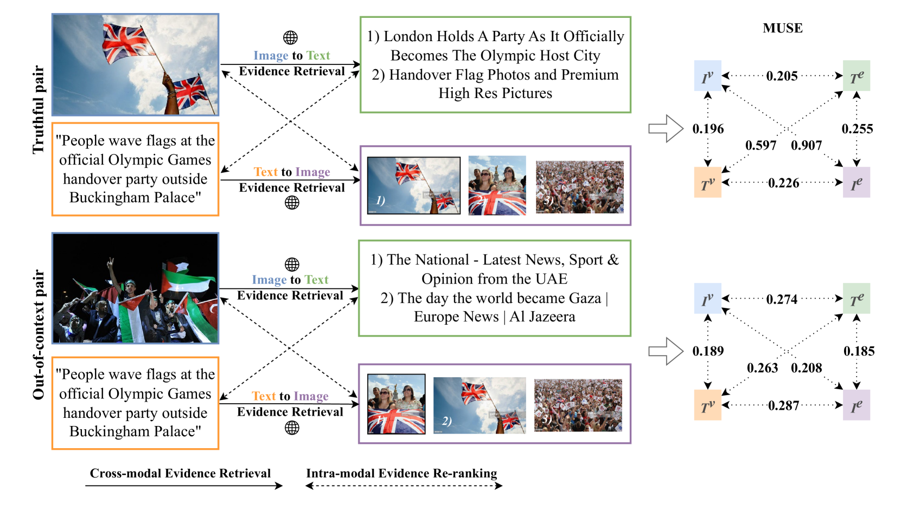
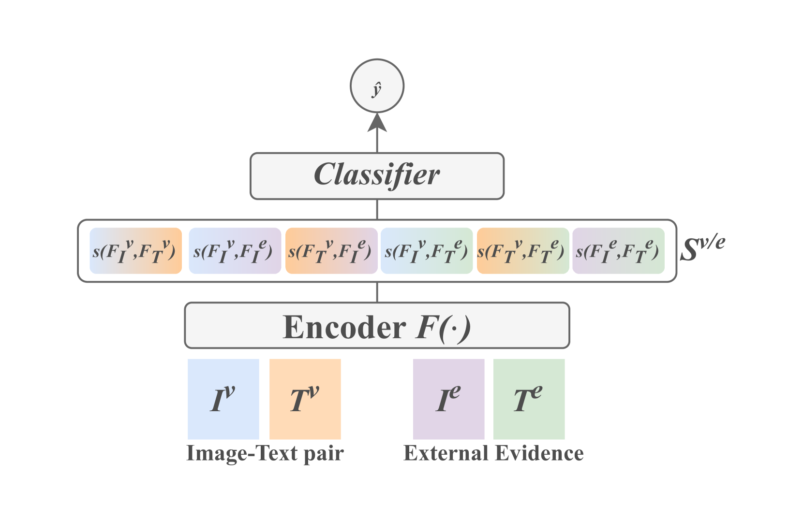
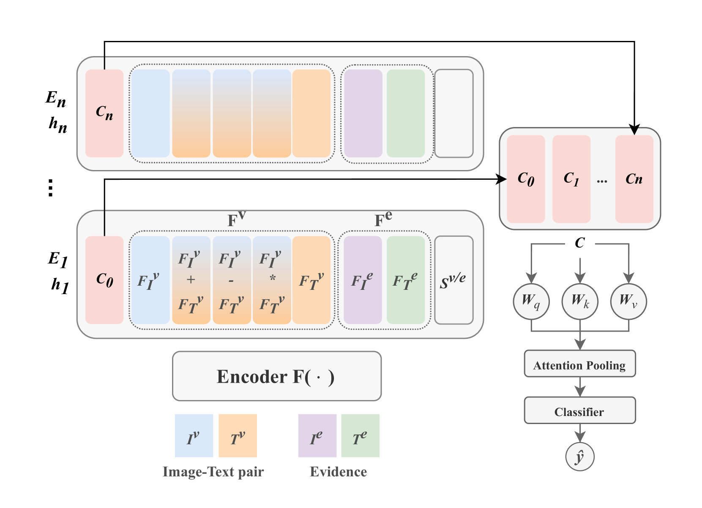
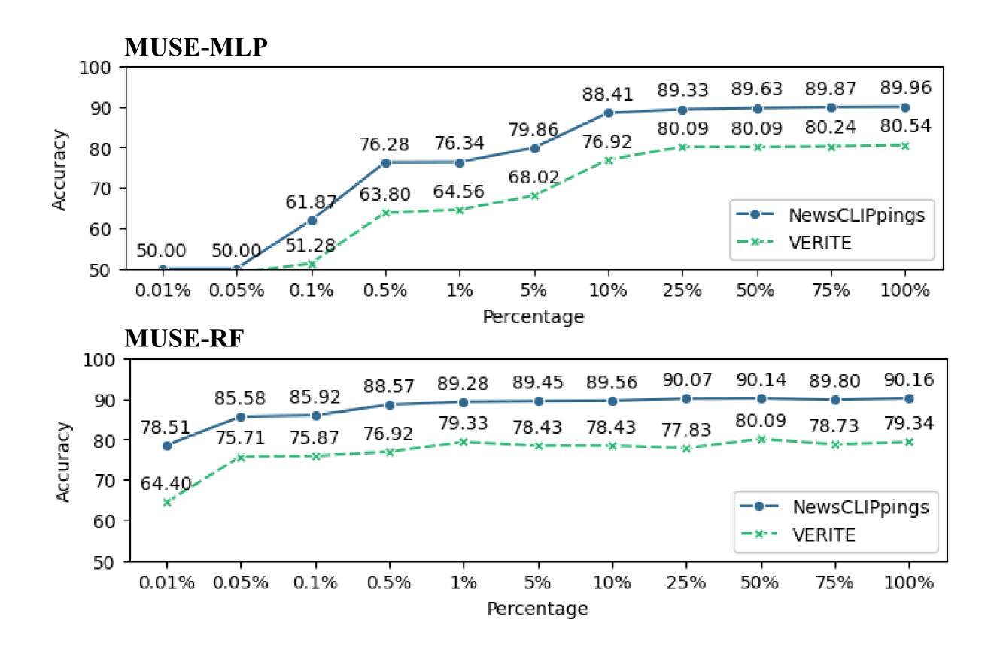
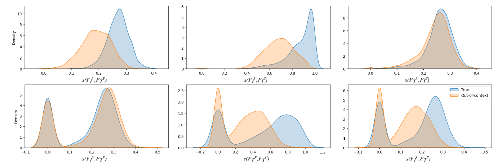
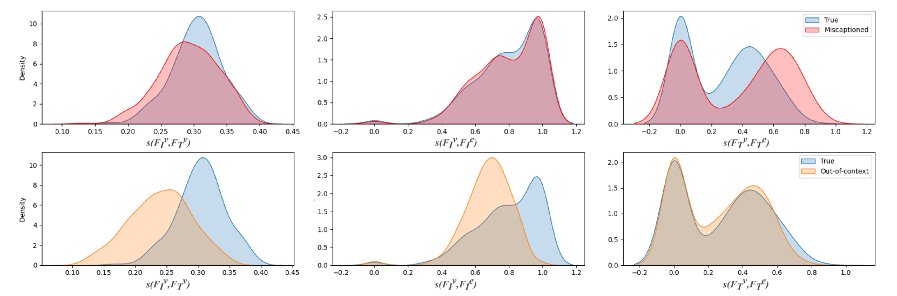

# 我们是否在多模态的脱离上下文虚假信息检测上取得了进展，尽管相似性似乎比事实性更受重视？

发布时间：2024年07月18日

`LLM应用` `信息安全`

> Similarity over Factuality: Are we making progress on multimodal out-of-context misinformation detection?

# 摘要

> 在多模态事实核查中，Out-of-context (OOC) 错误信息是一个重大挑战，它通过将图像与歪曲其原始上下文的文本配对来支持虚假叙事。近期研究趋向于采用更复杂的架构，如 Transformer 和大型语言模型。我们提出了一种简单而强大的基线方法 MUSE，专注于图像-文本对与外部证据的相似性。实验表明，结合传统分类器，MUSE 在 NewsCLIPpings 和 VERITE 数据集上表现优异。进一步整合到 AITR 中，性能分别提升了 3.3% 和 7.5%。然而，MUSE 依赖表面模式，未深入事实与逻辑，引发了对任务定义和评估方法的深刻反思。代码已公开发布于：https://github.com/stevejpapad/outcontext-misinfo-progress

> Out-of-context (OOC) misinformation poses a significant challenge in multimodal fact-checking, where images are paired with texts that misrepresent their original context to support false narratives. Recent research in evidence-based OOC detection has seen a trend towards increasingly complex architectures, incorporating Transformers, foundation models, and large language models. In this study, we introduce a simple yet robust baseline, which assesses MUltimodal SimilaritiEs (MUSE), specifically the similarity between image-text pairs and external image and text evidence. Our results demonstrate that MUSE, when used with conventional classifiers like Decision Tree, Random Forest, and Multilayer Perceptron, can compete with and even surpass the state-of-the-art on the NewsCLIPpings and VERITE datasets. Furthermore, integrating MUSE in our proposed "Attentive Intermediate Transformer Representations" (AITR) significantly improved performance, by 3.3% and 7.5% on NewsCLIPpings and VERITE, respectively. Nevertheless, the success of MUSE, relying on surface-level patterns and shortcuts, without examining factuality and logical inconsistencies, raises critical questions about how we define the task, construct datasets, collect external evidence and overall, how we assess progress in the field. We release our code at: https://github.com/stevejpapad/outcontext-misinfo-progress

[Arxiv](https://arxiv.org/abs/2407.13488)