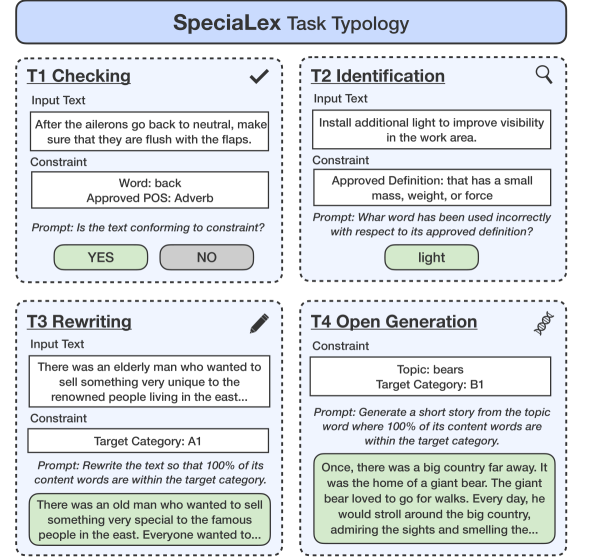
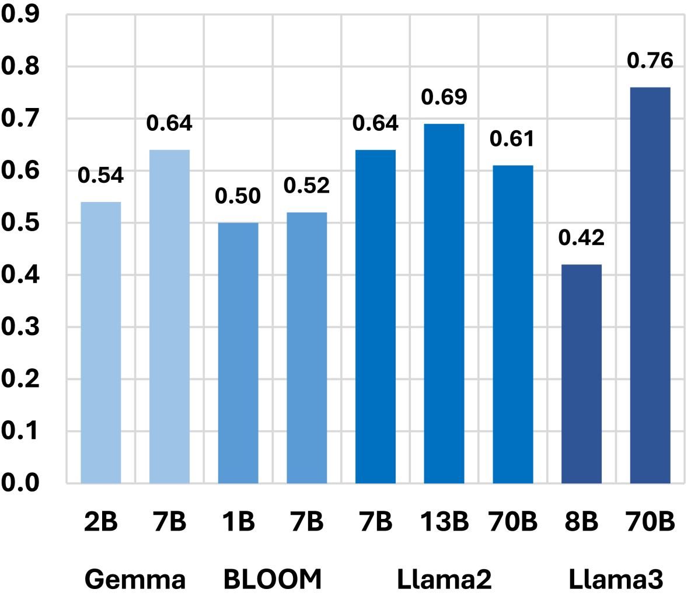
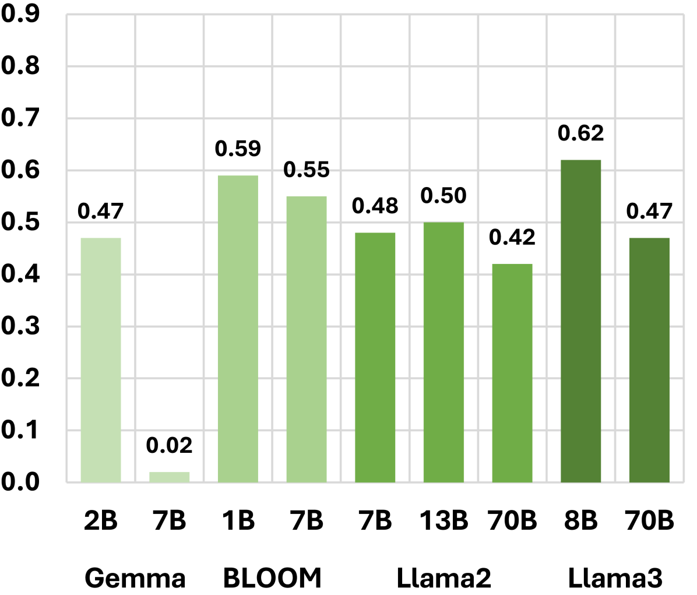
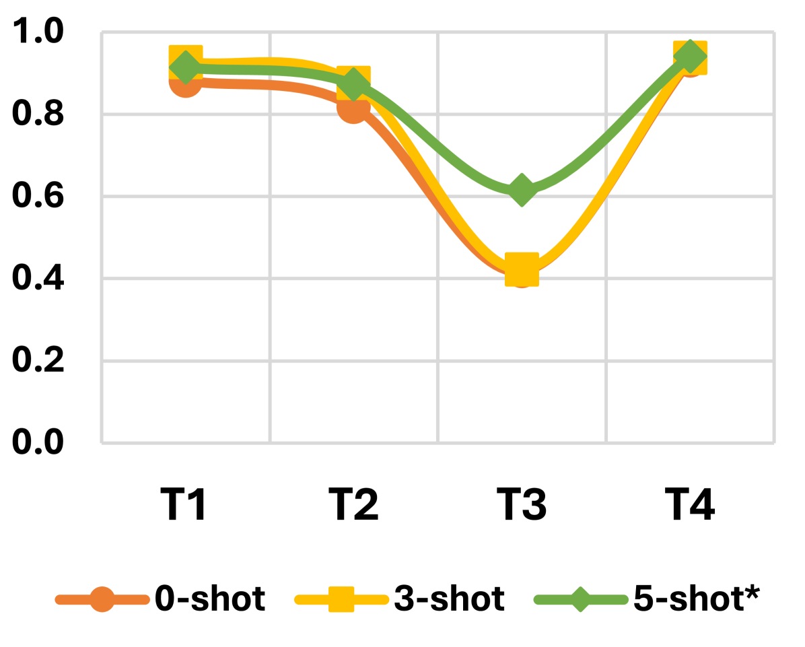
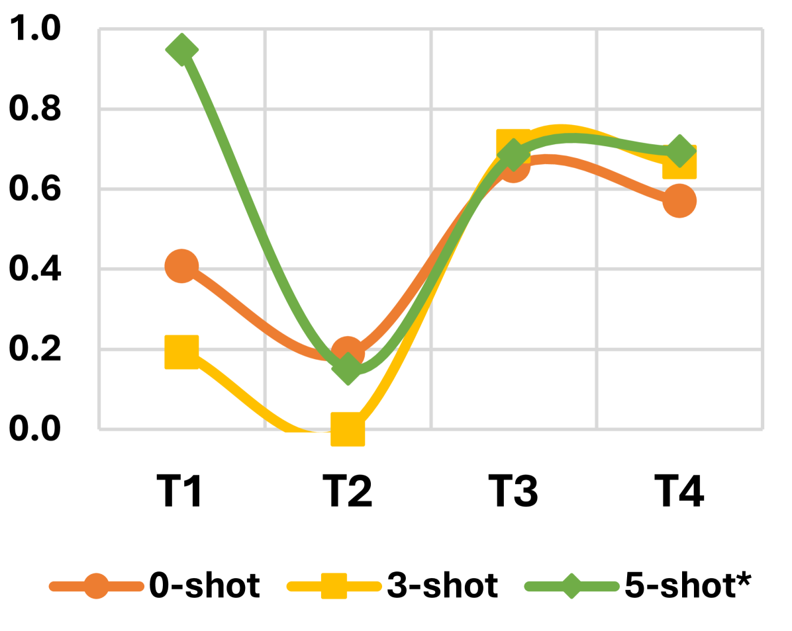

# SpeciaLex：专为上下文特定词汇学习设计的基准

发布时间：2024年07月18日

`LLM应用` `出版业`

> SpeciaLex: A Benchmark for In-Context Specialized Lexicon Learning

# 摘要

> 专业词典汇集了受特殊定义、角色和受众限制的词汇，这些限制对撰写技术手册或儿童书籍等任务至关重要，旨在减少歧义、提升特定群体的可读性。我们推出的SpeciaLex基准，通过18个多样子任务和1,285个测试实例，评估语言模型遵循这些专业约束的能力，涵盖检查、识别、重写和开放生成等核心任务。通过评估15种开源与闭源的大型语言模型，我们探讨了模型规模、开放性、设置及时效等因素对性能的影响，旨在助力构建更广泛应用的高效工具，超越自然语言处理领域。

> Specialized lexicons are collections of words with associated constraints such as special definitions, specific roles, and intended target audiences. These constraints are necessary for content generation and documentation tasks (e.g., writing technical manuals or children's books), where the goal is to reduce the ambiguity of text content and increase its overall readability for a specific group of audience. Understanding how large language models can capture these constraints can help researchers build better, more impactful tools for wider use beyond the NLP community. Towards this end, we introduce SpeciaLex, a benchmark for evaluating a language model's ability to follow specialized lexicon-based constraints across 18 diverse subtasks with 1,285 test instances covering core tasks of Checking, Identification, Rewriting, and Open Generation. We present an empirical evaluation of 15 open and closed-source LLMs and discuss insights on how factors such as model scale, openness, setup, and recency affect performance upon evaluating with the benchmark.

[Arxiv](https://arxiv.org/abs/2407.13297)