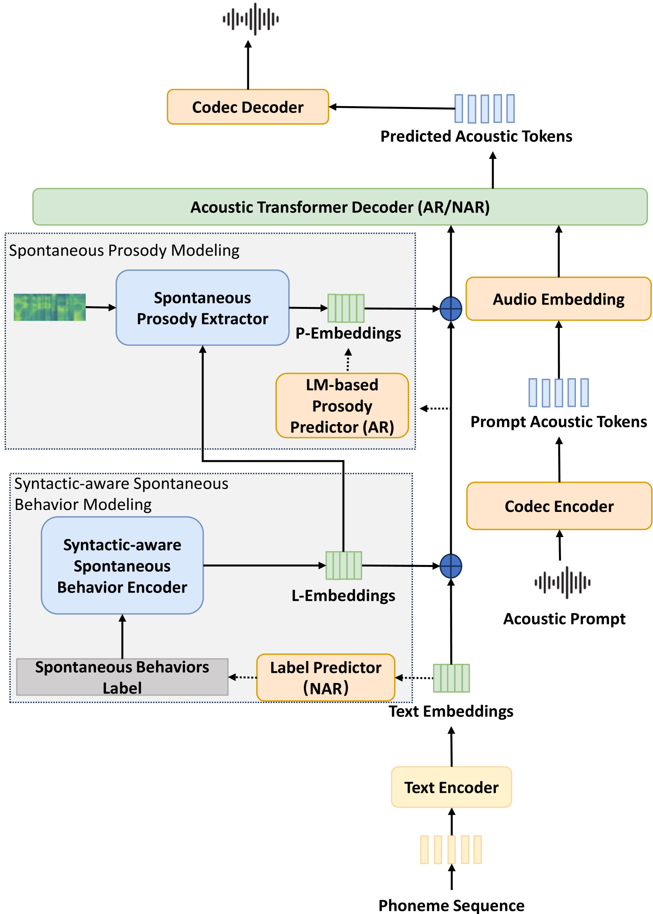
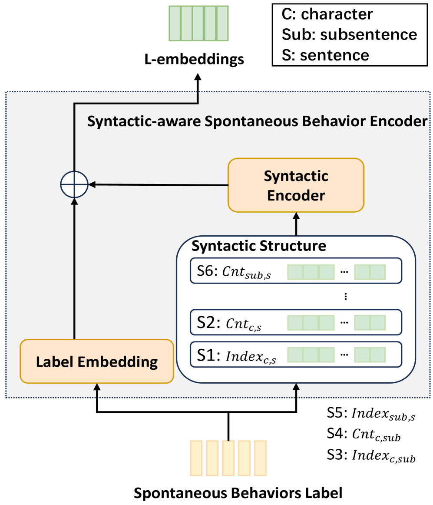
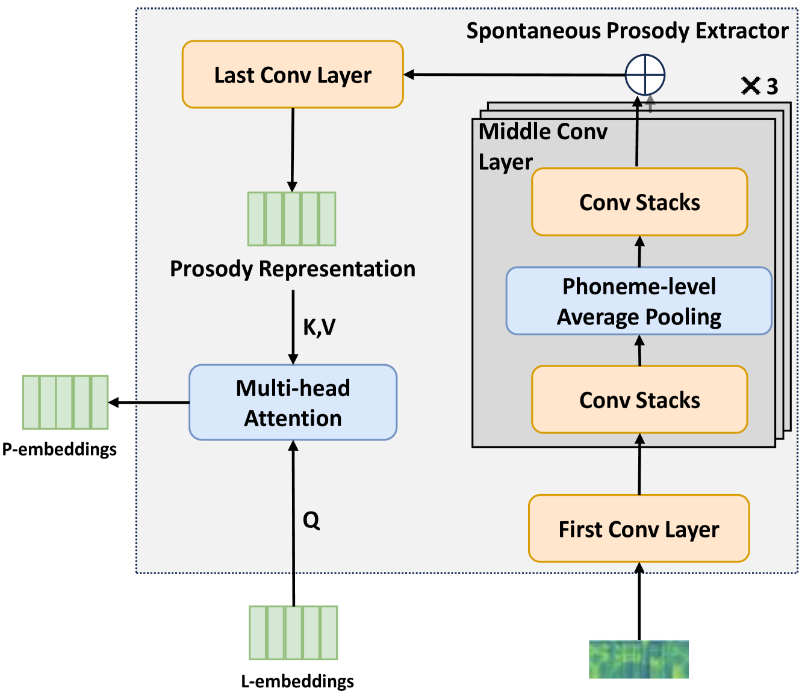
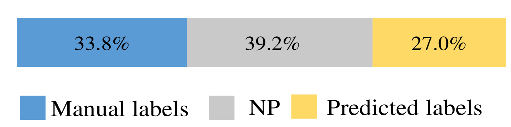
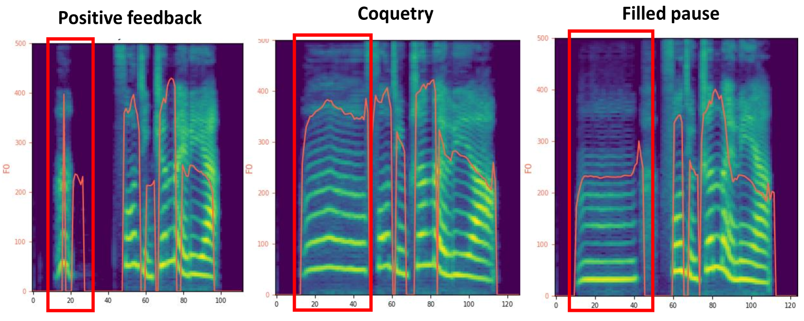

# 基于语言模型，实现可控自发行为的自发风格文本转语音合成

发布时间：2024年07月18日

`LLM应用` `语音合成` `人工智能`

> Spontaneous Style Text-to-Speech Synthesis with Controllable Spontaneous Behaviors Based on Language Models

# 摘要

> 自发风格语音合成旨在模仿人类语音，但常因高质量数据稀缺和模型能力有限而受阻。最新的基于语言模型的TTS系统虽能利用大型、多样但质量参差不齐的语音数据集生成自然语音，却难以模拟自发行为和捕捉韵律变化。本文提出一种新型自发语音合成系统，系统分类并统一建模多种自发行为，并引入细粒度韵律建模以捕捉细微韵律变化。实验表明，该方法在韵律和自发行为自然性上大幅超越传统方法。

> Spontaneous style speech synthesis, which aims to generate human-like speech, often encounters challenges due to the scarcity of high-quality data and limitations in model capabilities. Recent language model-based TTS systems can be trained on large, diverse, and low-quality speech datasets, resulting in highly natural synthesized speech. However, they are limited by the difficulty of simulating various spontaneous behaviors and capturing prosody variations in spontaneous speech. In this paper, we propose a novel spontaneous speech synthesis system based on language models. We systematically categorize and uniformly model diverse spontaneous behaviors. Moreover, fine-grained prosody modeling is introduced to enhance the model's ability to capture subtle prosody variations in spontaneous speech.Experimental results show that our proposed method significantly outperforms the baseline methods in terms of prosody naturalness and spontaneous behavior naturalness.

[Arxiv](https://arxiv.org/abs/2407.13509)