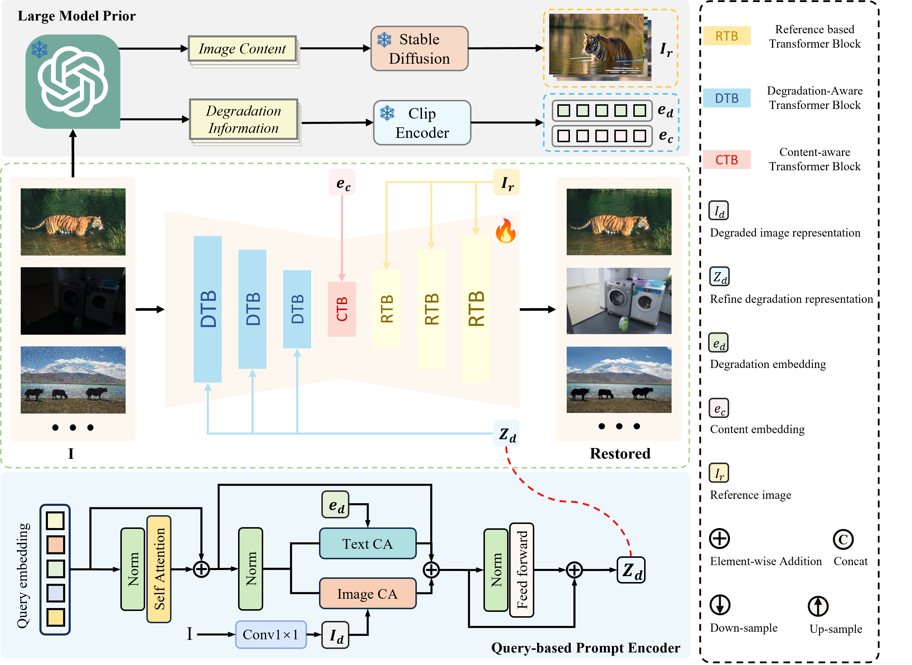
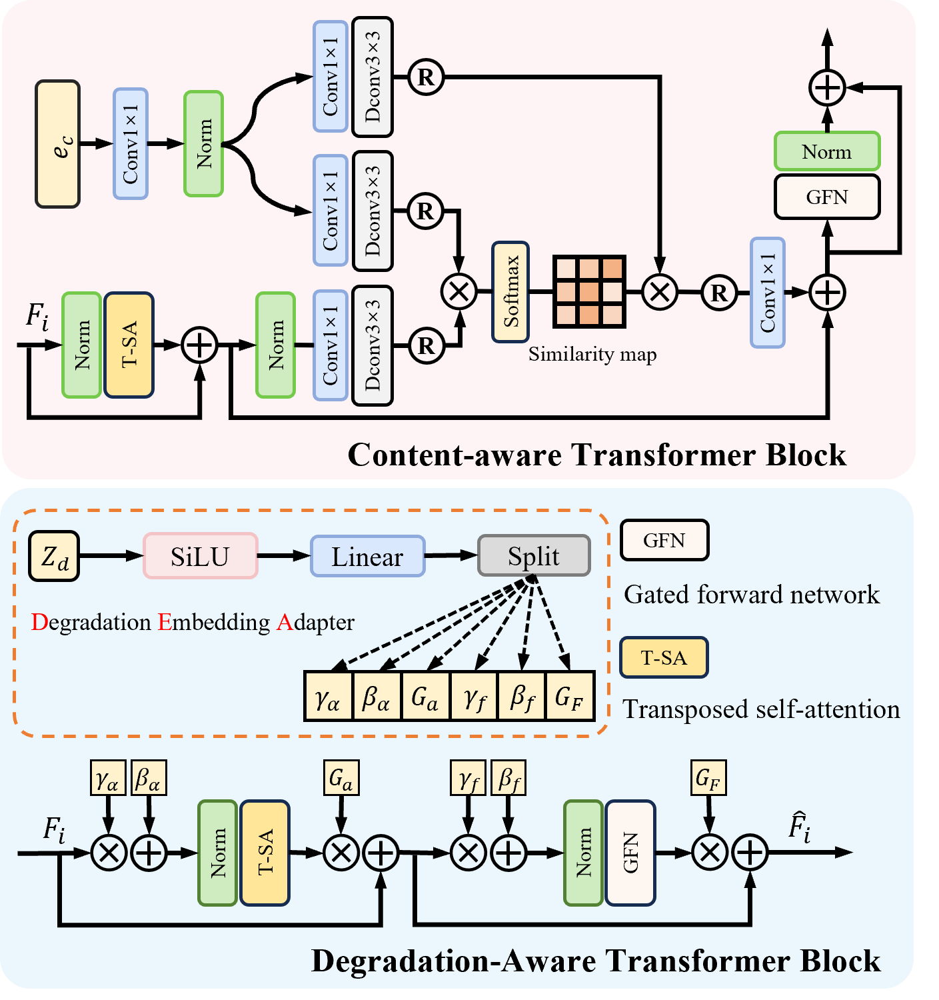
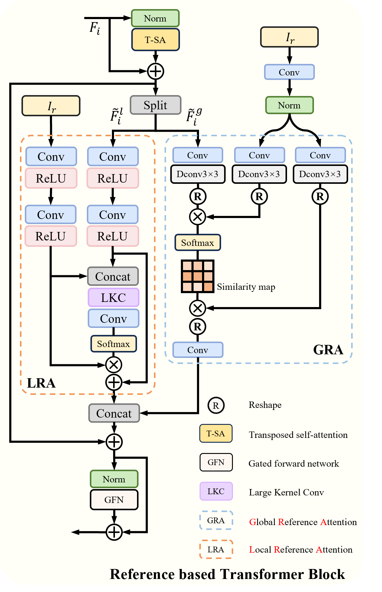
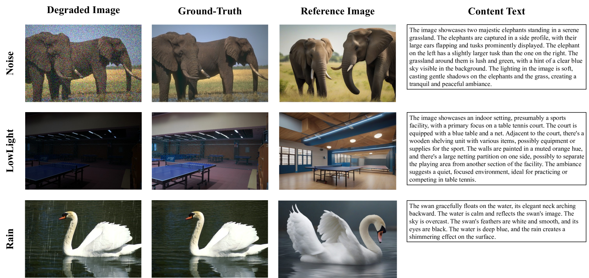
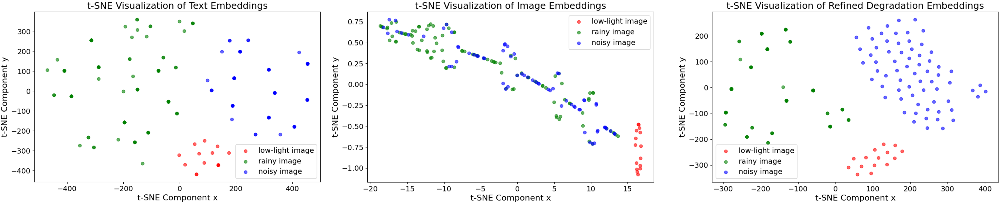
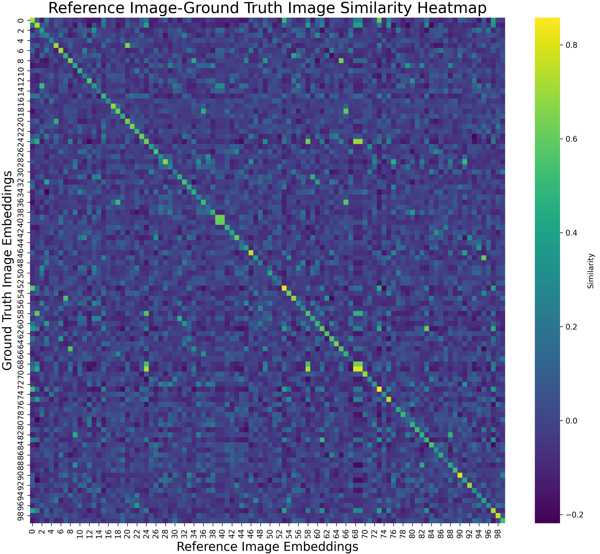

# 无需训练，大模型先验助力多合一图像恢复

发布时间：2024年07月18日

`LLM应用` `图像处理` `计算机视觉`

> Training-Free Large Model Priors for Multiple-in-One Image Restoration

# 摘要

> 图像恢复的目标是从退化的图像中重建出清晰的原始图像。尽管现有方法在特定退化类型上取得了成功，但它们需要专门的模型，这在动态退化场景中限制了其实际应用。为此，我们引入了大型模型驱动的图像恢复框架（LMDIR），它利用多模态语言模型（MMLMs）和预训练扩散模型的通用先验，实现了一种多合一的图像恢复方法。LMDIR结合了三种关键先验：全局退化知识、场景感知的上下文描述以及由MMLM引导的扩散模型生成的高质量参考图像。我们的架构设计包括基于查询的提示编码器、注入全局退化知识的变换器块、结合场景描述的变换器块以及结合细粒度图像先验的变换器块，支持单阶段训练，能够处理多种退化情况，并支持自动和用户引导的恢复。实验结果显示，我们的方法在多个评估基准上超越了现有技术。

> Image restoration aims to reconstruct the latent clear images from their degraded versions. Despite the notable achievement, existing methods predominantly focus on handling specific degradation types and thus require specialized models, impeding real-world applications in dynamic degradation scenarios. To address this issue, we propose Large Model Driven Image Restoration framework (LMDIR), a novel multiple-in-one image restoration paradigm that leverages the generic priors from large multi-modal language models (MMLMs) and the pretrained diffusion models. In detail, LMDIR integrates three key prior knowledges: 1) global degradation knowledge from MMLMs, 2) scene-aware contextual descriptions generated by MMLMs, and 3) fine-grained high-quality reference images synthesized by diffusion models guided by MMLM descriptions. Standing on above priors, our architecture comprises a query-based prompt encoder, degradation-aware transformer block injecting global degradation knowledge, content-aware transformer block incorporating scene description, and reference-based transformer block incorporating fine-grained image priors. This design facilitates single-stage training paradigm to address various degradations while supporting both automatic and user-guided restoration. Extensive experiments demonstrate that our designed method outperforms state-of-the-art competitors on multiple evaluation benchmarks.

[Arxiv](https://arxiv.org/abs/2407.13181)