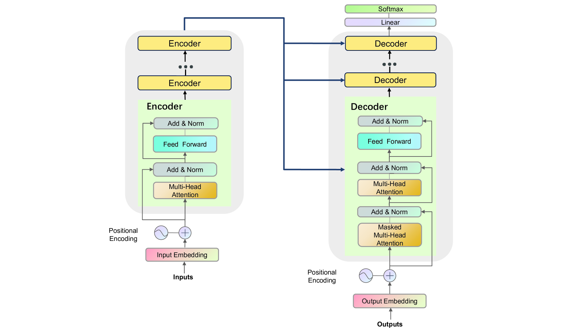
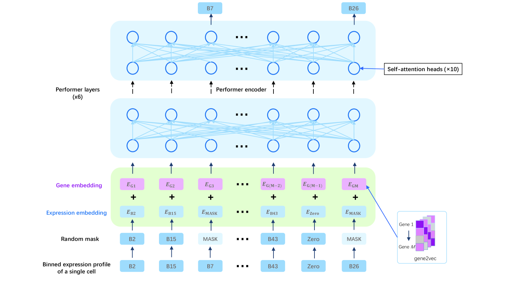
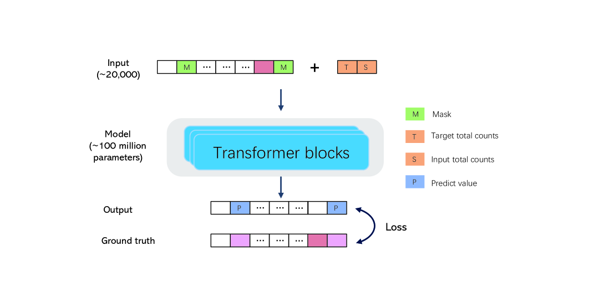
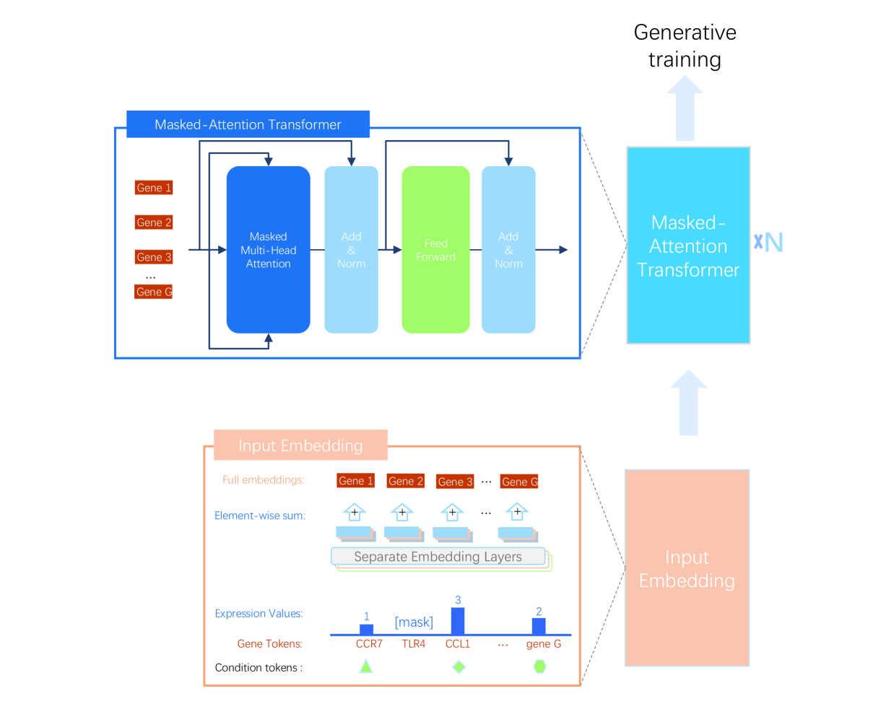
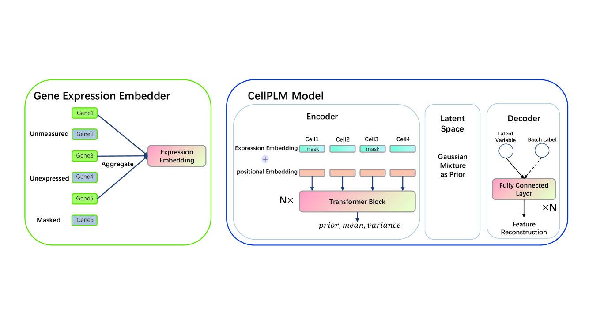
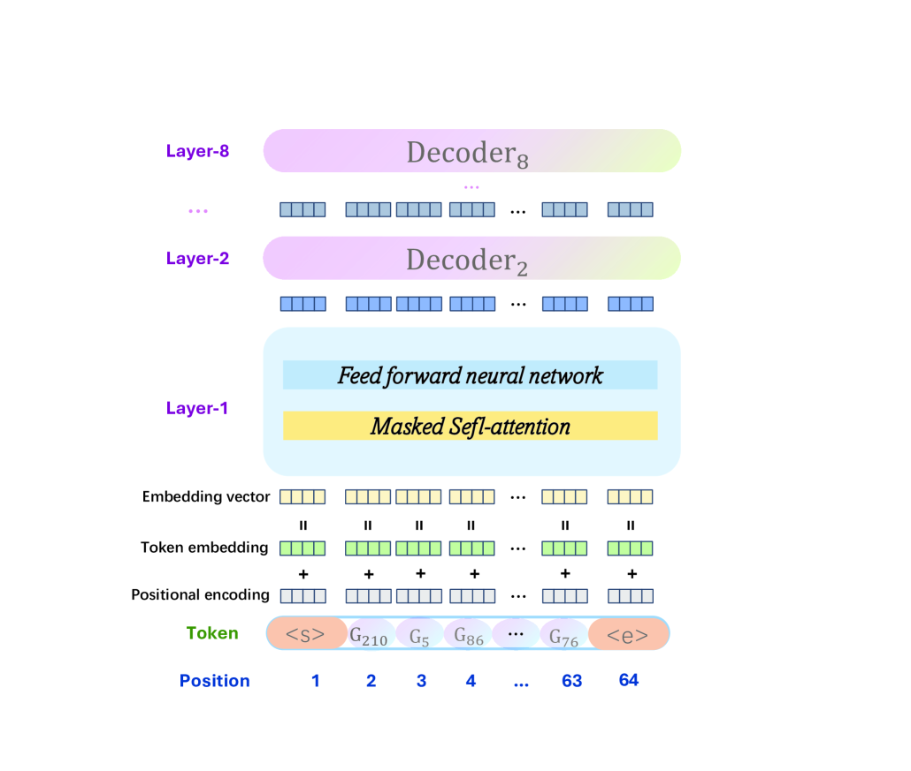

# 基于Transformer的单细胞语言模型研究综述

发布时间：2024年07月18日

`LLM应用` `生物技术`

> Transformer-based Single-Cell Language Model: A Survey

# 摘要

> Transformer 以其卓越的并行处理能力和灵活的注意力机制，在自然语言处理领域取得了显著成就。如今，越来越多的研究开始利用 Transformer 模型处理单细胞数据。本文综述了基于 Transformer 的单细胞语言模型及其应用，详细介绍了 Transformer 的结构与原理，并回顾了相关的大型语言模型。我们还探讨了这些模型在批次校正、细胞聚类、类型注释、基因网络推断及响应分析等下游任务中的应用与挑战，并展望了未来的研究方向。希望这篇综述能为关注单细胞语言模型的研究者提供有价值的参考。

> The transformers have achieved significant accomplishments in the natural language processing as its outstanding parallel processing capabilities and highly flexible attention mechanism. In addition, increasing studies based on transformers have been proposed to model single-cell data. In this review, we attempt to systematically summarize the single-cell language models and applications based on transformers. First, we provide a detailed introduction about the structure and principles of transformers. Then, we review the single-cell language models and large language models for single-cell data analysis. Moreover, we explore the datasets and applications of single-cell language models in downstream tasks such as batch correction, cell clustering, cell type annotation, gene regulatory network inference and perturbation response. Further, we discuss the challenges of single-cell language models and provide promising research directions. We hope this review will serve as an up-to-date reference for researchers interested in the direction of single-cell language models.

[Arxiv](https://arxiv.org/abs/2407.13205)