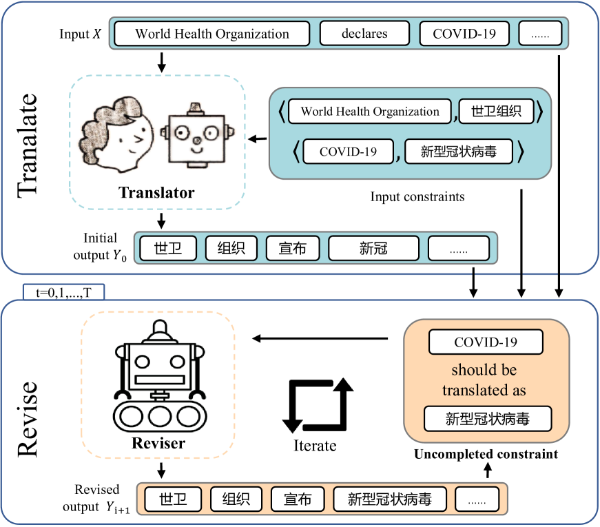

# 翻译与修订：增强大型语言模型在约束翻译任务中的能力

发布时间：2024年07月18日

`LLM应用` `机器翻译` `语言模型`

> Translate-and-Revise: Boosting Large Language Models for Constrained Translation

# 摘要

> 在机器翻译系统中施加约束颇具挑战，因其未受训于利用约束生成充分流畅的翻译。本文中，我们借助大型语言模型（LLM）的适应性，通过将翻译指令与约束作为提示，实现受限翻译。尽管如此，LLM有时无法确保翻译质量，甚至忽视既定约束，部分源于其对预测的过度自信。为解决此问题，我们引入修订环节，激励LLM依据未满足的约束调整输出。经四个涵盖多领域词汇与结构约束的任务测试，我们的方法在基于约束的翻译准确性上较标准LLM提升15%，并大幅超越当前神经机器翻译（NMT）的顶尖技术。

> Imposing constraints on machine translation systems presents a challenging issue because these systems are not trained to make use of constraints in generating adequate, fluent translations. In this paper, we leverage the capabilities of large language models (LLMs) for constrained translation, given that LLMs can easily adapt to this task by taking translation instructions and constraints as prompts. However, LLMs cannot always guarantee the adequacy of translation, and, in some cases, ignore the given constraints. This is in part because LLMs might be overly confident in their predictions, overriding the influence of the constraints. To overcome this overiding behaviour, we propose to add a revision process that encourages LLMs to correct the outputs by prompting them about the constraints that have not yet been met. We evaluate our approach on four constrained translation tasks, encompassing both lexical and structural constraints in multiple constraint domains. Experiments show 15\% improvement in constraint-based translation accuracy over standard LLMs and the approach also significantly outperforms neural machine translation (NMT) state-of-the-art methods.

[Arxiv](https://arxiv.org/abs/2407.13164)