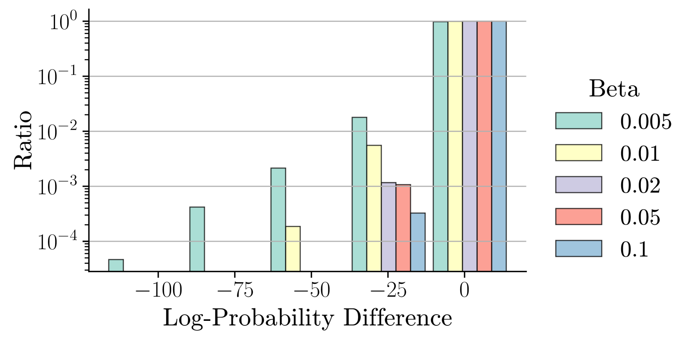
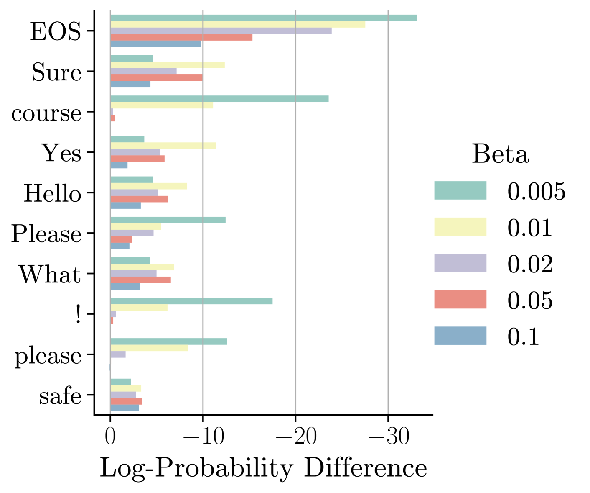
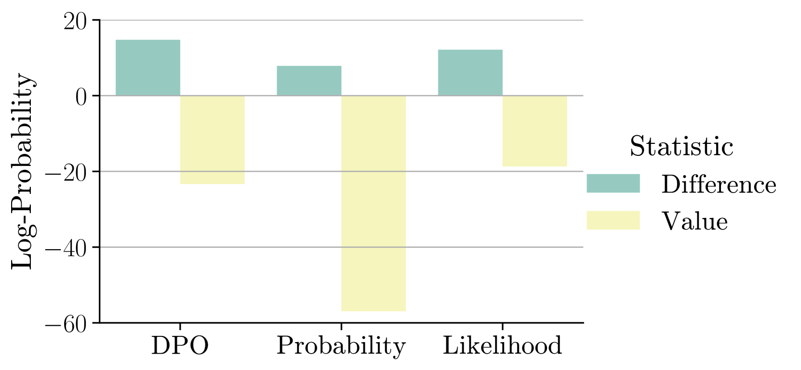

# 探究直接偏好优化中的参考策略

发布时间：2024年07月18日

`LLM理论` `人工智能` `软件开发`

> Understanding Reference Policies in Direct Preference Optimization

# 摘要

> 直接偏好优化（DPO）在大型语言模型（LLM）的指令微调中应用广泛。本研究深入探讨了DPO依赖参考模型或策略的特性，这些策略通常是待微调的模型，对DPO效果有上限影响。我们探讨了KL散度约束的最佳强度，发现DPO对此敏感；通过理论与实证比较，证明了DPO在指令微调中的必要性及其优势；并发现更强的参考策略能提升性能，但前提是与微调模型相似。这些发现揭示了参考策略在DPO中的复杂作用，为实践提供指导，并指出了未来研究的方向。

> Direct Preference Optimization (DPO) has become a widely used training method for the instruction fine-tuning of large language models (LLMs). In this work, we explore an under-investigated aspect of DPO - its dependency on the reference model or policy. Such reference policies, typically instantiated as the model to be further fine-tuned, are important since they can impose an upper limit on DPO's effectiveness. Therefore, we address three related research questions in this work. First, we explore the optimal strength of the KL-divergence constraint in DPO, which penalizes deviations from the reference policy, and find that DPO is sensitive to this strength. Next, we examine the necessity of reference policies for instruction fine-tuning by providing both theoretical and empirical comparisons between DPO and related learning objectives, demonstrating DPO's superiority. Additionally, we investigate whether DPO benefits from stronger reference policies, finding that a stronger reference policy can lead to improved performance, but only when it is similar to the model being fine-tuned. Our findings highlight the confounding role of reference policies in DPO and offer insights for best practices, while also identifying open research questions for future studies.

[Arxiv](https://arxiv.org/abs/2407.13709)