# 借助 LLM，我们探究对话后续查询与用户满意度间的关联。

发布时间：2024年07月18日

`LLM应用` `搜索引擎` `用户体验`

> Using LLMs to Investigate Correlations of Conversational Follow-up Queries with User Satisfaction

# 摘要

> 借助大型语言模型（LLMs），对话式搜索引擎通过多轮自然对话，改变了用户从网络获取信息的方式。用户的自然对话中蕴含着丰富的、隐含的搜索意图和对搜索结果的评估，这些信息有助于理解用户与系统的互动体验。然而，关于用户为何及如何提出后续问题以延续与对话式搜索引擎的对话，以及这些后续问题如何反映用户满意度，这一领域仍有待深入探索。通过对Naver Cue：这一商业对话式搜索引擎的实验室用户评估中的250轮对话进行定性分析，我们提出了一种包含18种用户后续查询模式的分类法，涵盖两个主要维度：用户继续对话的动机和后续查询的行为。与现有文献相比，我们揭示了后续查询背后的一组新动机和行为，包括请求主观意见或对引擎的响应提供自然语言反馈。为了高效分析对话搜索日志，我们构建了一个基于LLM的分类器，准确率达73%。利用该分类器，我们分析了从Cue：的实际使用日志中收集的2,061个对话元组，并考察了我们的分类法中的对话模式与用户满意度之间的关联。初步发现显示，一些不满的信号，如澄清查询、排除条件和替代条件，通过后续查询得以体现。我们设想，我们的方法有望通过提供满意度信号并为现实用户模拟提供依据，推动对话搜索体验的自动化评估。

> With large language models (LLMs), conversational search engines shift how users retrieve information from the web by enabling natural conversations to express their search intents over multiple turns. Users' natural conversation embodies rich but implicit signals of users' search intents and evaluation of search results to understand user experience with the system. However, it is underexplored how and why users ask follow-up queries to continue conversations with conversational search engines and how the follow-up queries signal users' satisfaction. From qualitative analysis of 250 conversational turns from an in-lab user evaluation of Naver Cue:, a commercial conversational search engine, we propose a taxonomy of 18 users' follow-up query patterns from conversational search, comprising two major axes: (1) users' motivations behind continuing conversations (N = 7) and (2) actions of follow-up queries (N = 11). Compared to the existing literature on query reformulations, we uncovered a new set of motivations and actions behind follow-up queries, including asking for subjective opinions or providing natural language feedback on the engine's responses. To analyze conversational search logs with our taxonomy in a scalable and efficient manner, we built an LLM-powered classifier (73% accuracy). With our classifier, we analyzed 2,061 conversational tuples collected from real-world usage logs of Cue: and examined how the conversation patterns from our taxonomy correlates with satisfaction. Our initial findings suggest some signals of dissatisfactions, such as Clarifying Queries, Excluding Condition, and Substituting Condition with follow-up queries. We envision our approach could contribute to automated evaluation of conversation search experience by providing satisfaction signals and grounds for realistic user simulations.

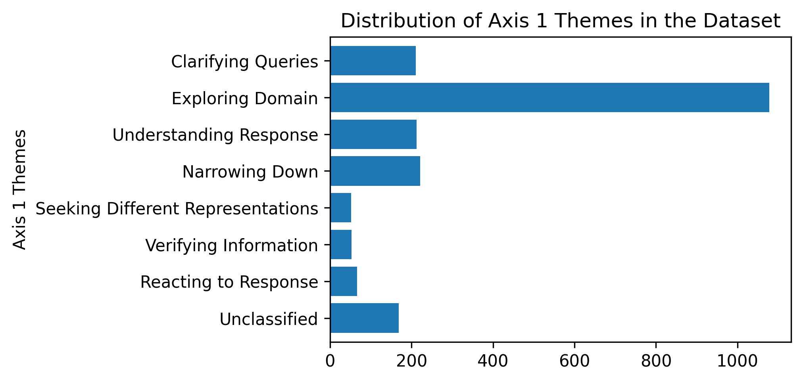

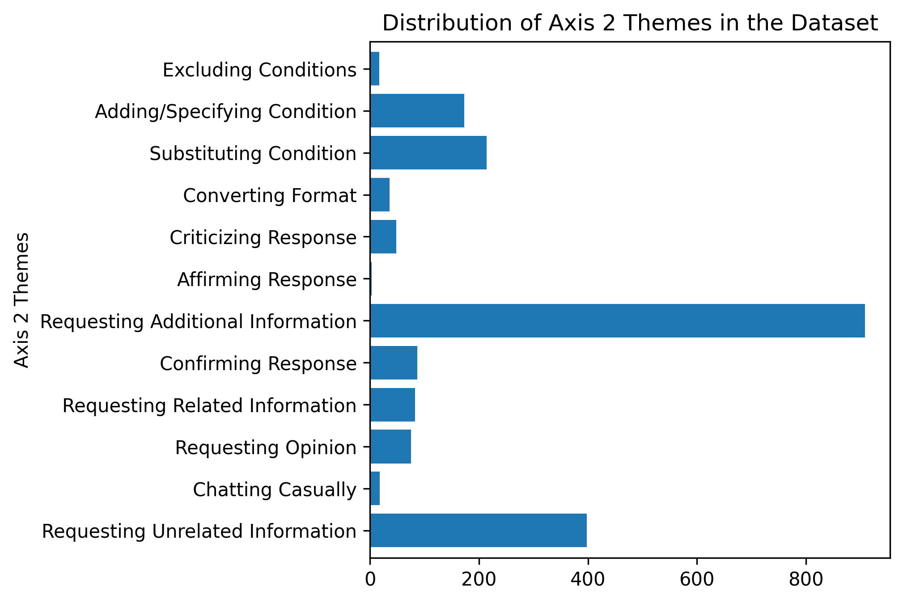

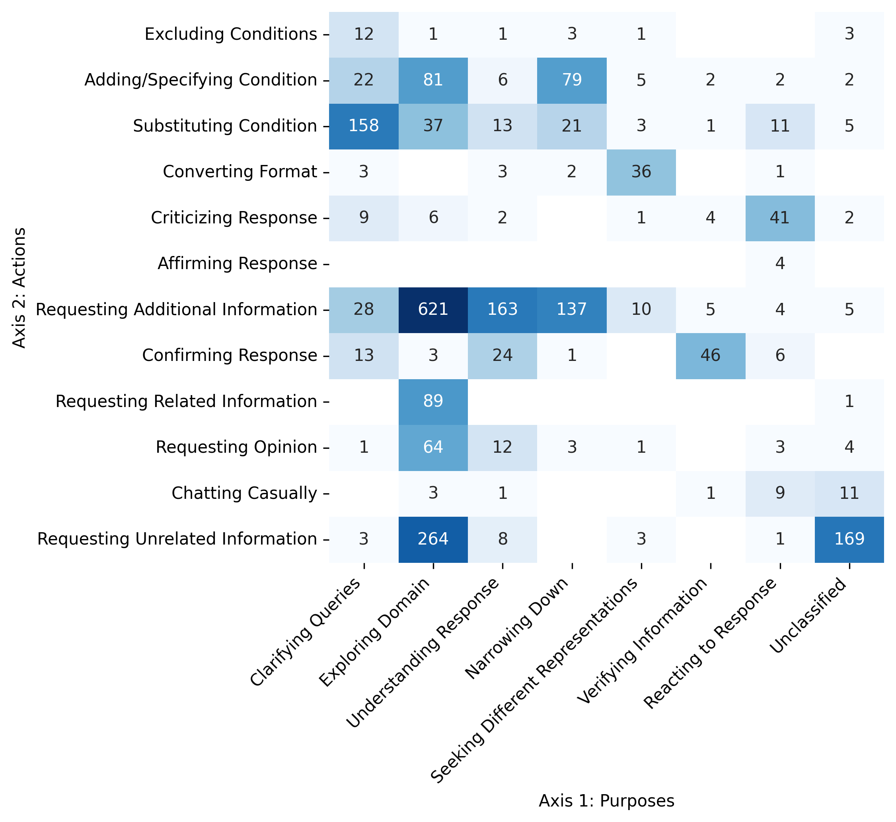

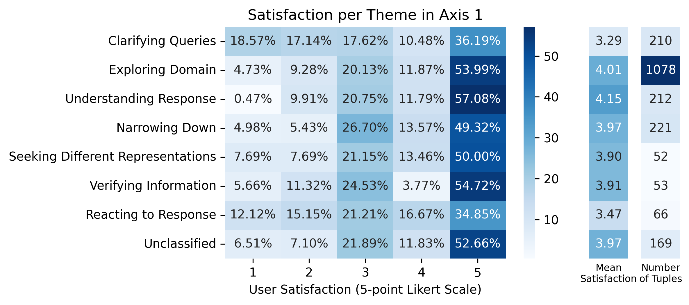

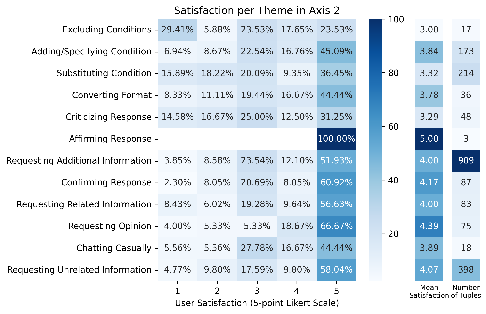

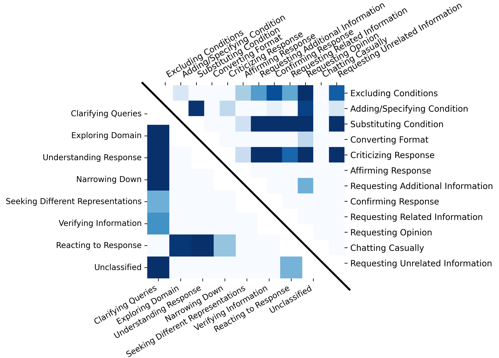

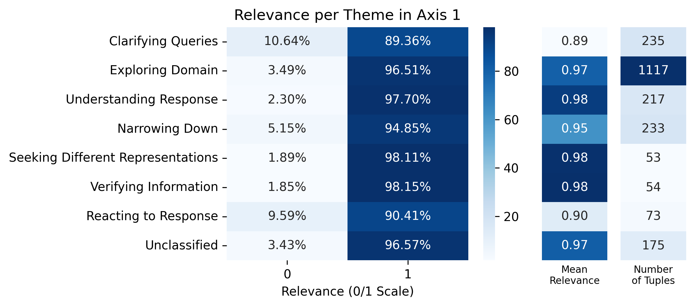

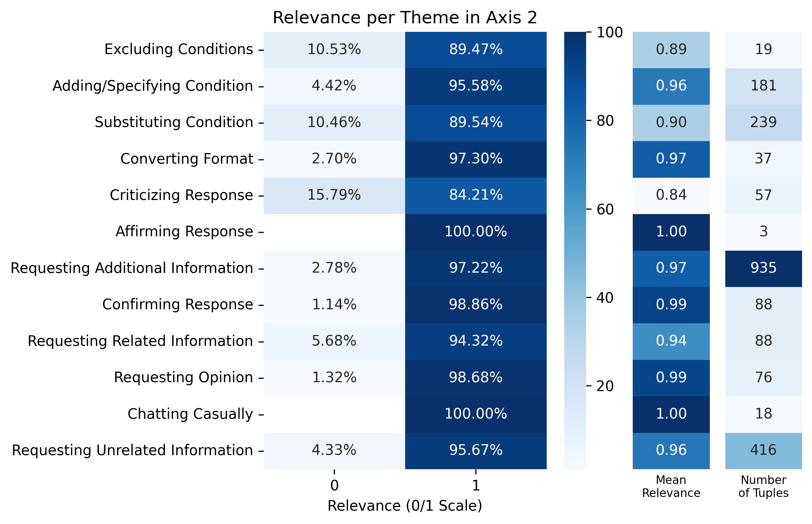

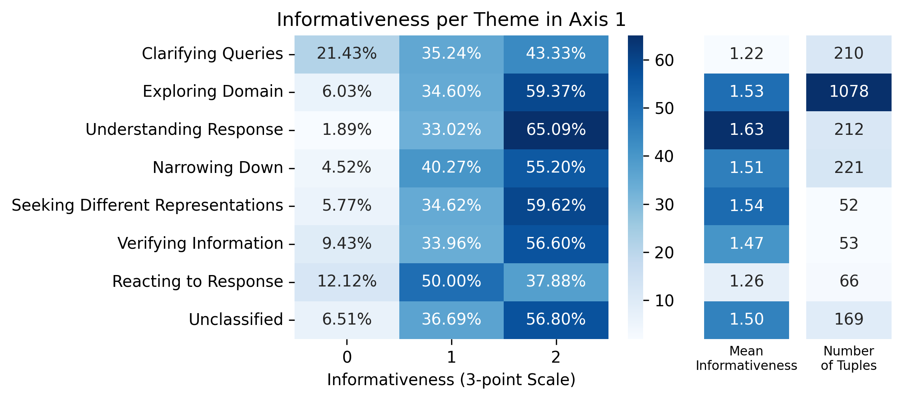

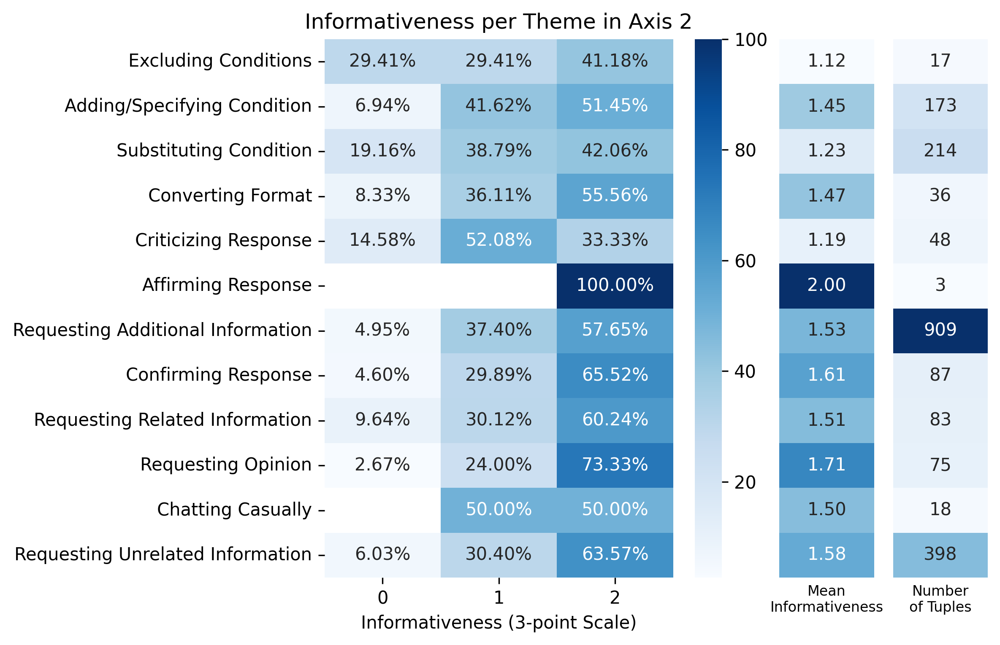

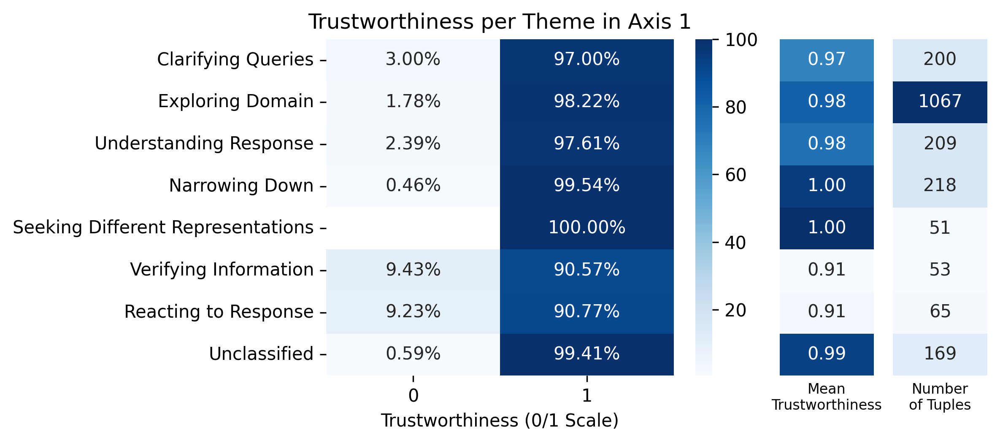

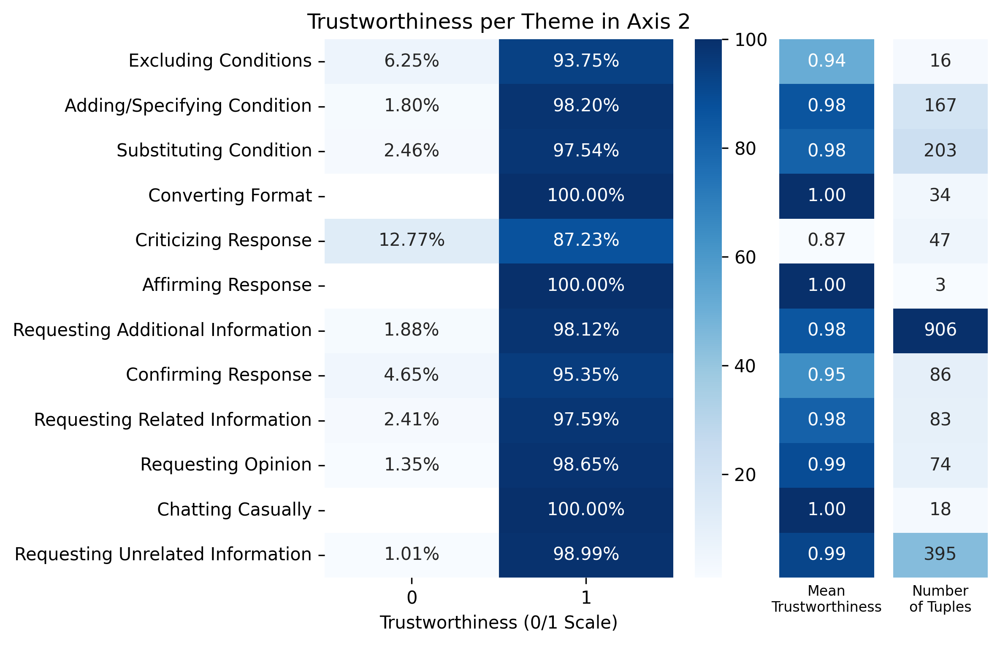

[Arxiv](https://arxiv.org/abs/2407.13166)