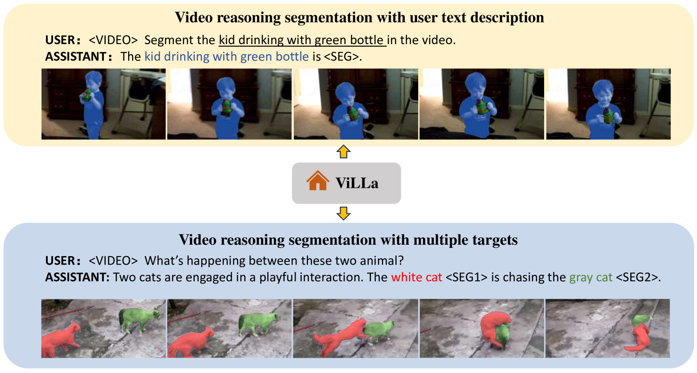
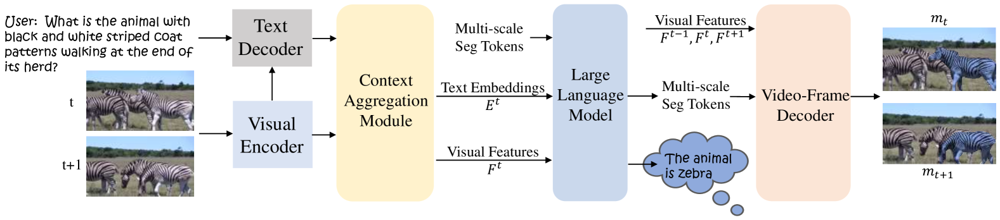
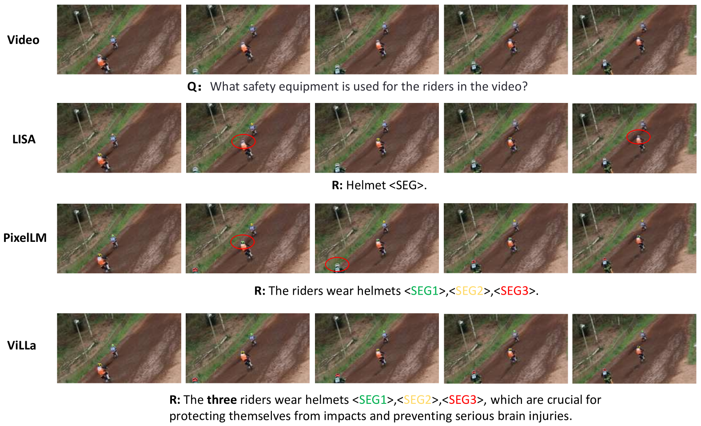
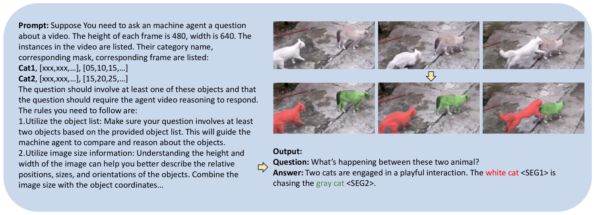
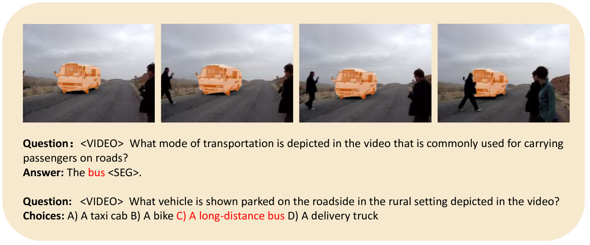
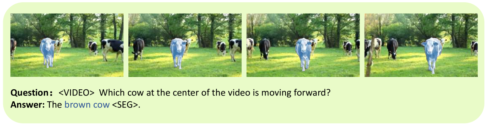

# ViLLa：结合大型语言模型实现视频推理分割

发布时间：2024年07月18日

`LLM应用` `视频处理` `人工智能`

> ViLLa: Video Reasoning Segmentation with Large Language Model

# 摘要

> 尽管视频感知技术近年有显著进展，但仍依赖显式文本或预设类别来识别目标。这些模型无法通过文本主动理解用户意图。为弥合图像与视频间的差距，我们提出新的视频分割任务——视频推理分割，旨在根据复杂文本查询输出分割轨迹。为推动此领域研究，我们构建了推理视频分割基准。我们还提出ViLLa模型，结合多模态LLM的语言生成能力，同时保留检测、分割和跟踪功能。通过时间感知上下文聚合模块和视频帧解码器，ViLLa能处理复杂推理和视频分割。实验显示，我们的方法有效提升了多模态LLM的视频推理分割能力。相关代码和数据集将在GitHub上提供。

> Although video perception models have made remarkable advancements in recent years, they still heavily rely on explicit text descriptions or pre-defined categories to identify target instances before executing video perception tasks. These models, however, fail to proactively comprehend and reason the user's intentions via textual input. Even though previous works attempt to investigate solutions to incorporate reasoning with image segmentation, they fail to reason with videos due to the video's complexity in object motion. To bridge the gap between image and video, in this work, we propose a new video segmentation task - video reasoning segmentation. The task is designed to output tracklets of segmentation masks given a complex input text query. What's more, to promote research in this unexplored area, we construct a reasoning video segmentation benchmark. Finally, we present ViLLa: Video reasoning segmentation with a Large Language Model, which incorporates the language generation capabilities of multimodal Large Language Models (LLMs) while retaining the capabilities of detecting, segmenting, and tracking multiple instances. We use a temporal-aware context aggregation module to incorporate contextual visual cues to text embeddings and propose a video-frame decoder to build temporal correlations across segmentation tokens. Remarkably, our ViLLa demonstrates capability in handling complex reasoning and referring video segmentation. Also, our model shows impressive ability in different temporal understanding benchmarks. Both quantitative and qualitative experiments show our method effectively unlocks new video reasoning segmentation capabilities for multimodal LLMs. The code and dataset will be available at https://github.com/rkzheng99/ViLLa.

[Arxiv](https://arxiv.org/abs/2407.14500)