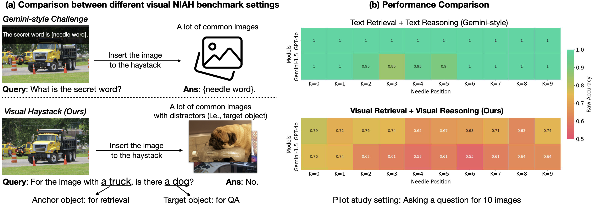
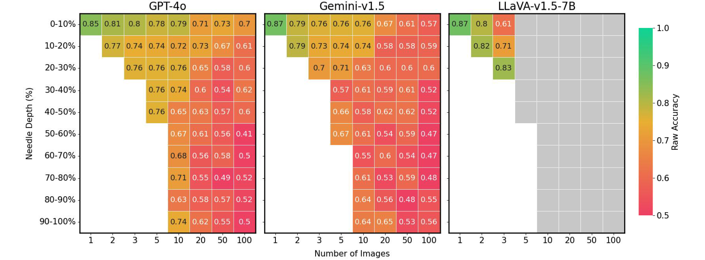
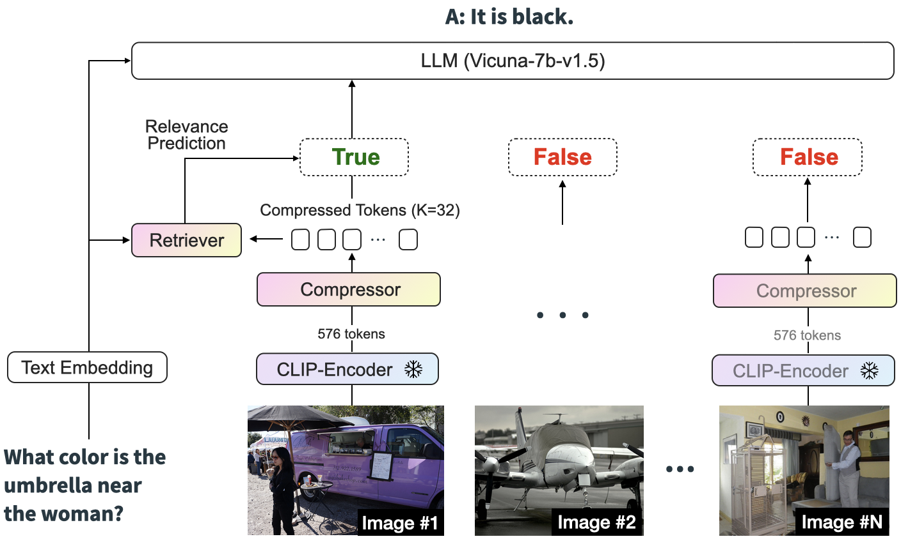
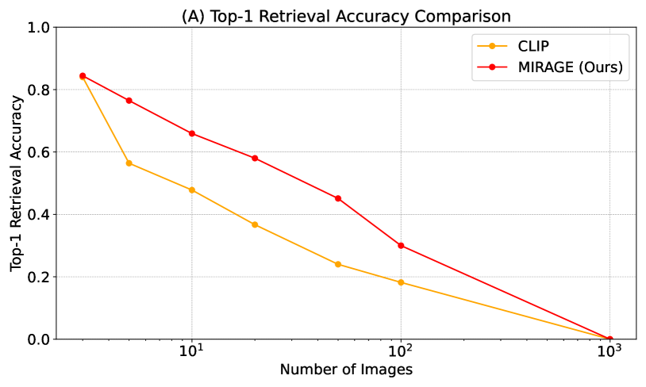
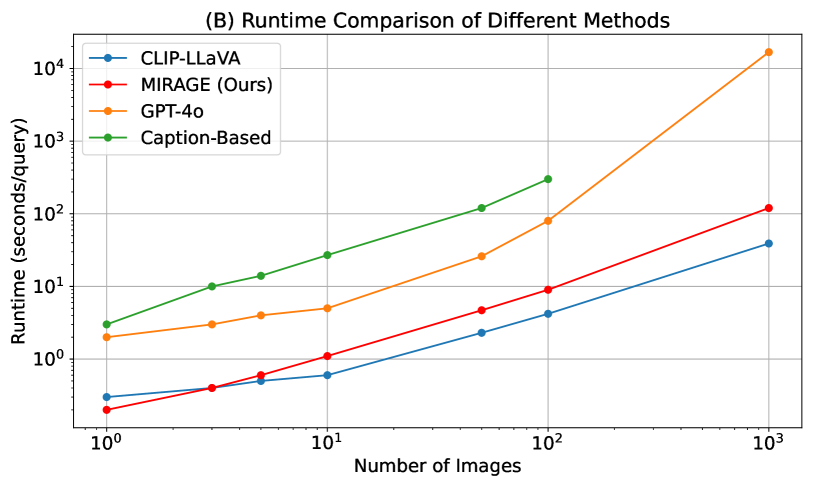
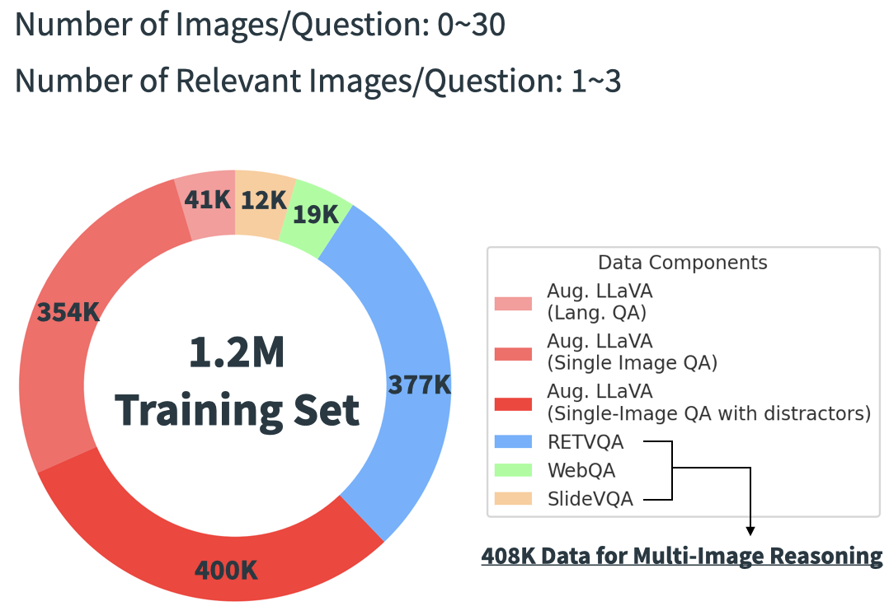

# 探索视觉干草堆：解答图像集合中的难题

发布时间：2024年07月18日

`RAG` `计算机视觉` `人工智能`

> Visual Haystacks: Answering Harder Questions About Sets of Images

# 摘要

> 大型多模态模型 (LMMs) 在单图像视觉问答领域取得了显著进展，但面对跨越大量图像集合的查询时，这些模型面临重大挑战。本文探讨了多图像视觉问答 (MIQA) 任务，并提出了一种新的公共基准 "视觉干草堆 (VHs)"，专门设计用于评估 LMMs 在无关图像集合上的视觉检索和推理能力。我们引入了 MIRAGE（多图像检索增强生成），这是一种专为 LMMs 设计的新型检索/问答框架，针对 MIQA 的挑战，在效率和准确性上显著优于基线方法。我们的评估显示，MIRAGE 在 VHs 基准上超越了闭源 GPT-4o 模型高达 11%，并且在效率上提供了高达 3.4 倍的改进，优于以文本为中心的多阶段方法。

> Recent advancements in Large Multimodal Models (LMMs) have made significant progress in the field of single-image visual question answering. However, these models face substantial challenges when tasked with queries that span extensive collections of images, similar to real-world scenarios like searching through large photo albums, finding specific information across the internet, or monitoring environmental changes through satellite imagery. This paper explores the task of Multi-Image Visual Question Answering (MIQA): given a large set of images and a natural language query, the task is to generate a relevant and grounded response. We propose a new public benchmark, dubbed "Visual Haystacks (VHs)," specifically designed to evaluate LMMs' capabilities in visual retrieval and reasoning over sets of unrelated images, where we perform comprehensive evaluations demonstrating that even robust closed-source models struggle significantly. Towards addressing these shortcomings, we introduce MIRAGE (Multi-Image Retrieval Augmented Generation), a novel retrieval/QA framework tailored for LMMs that confronts the challenges of MIQA with marked efficiency and accuracy improvements over baseline methods. Our evaluation shows that MIRAGE surpasses closed-source GPT-4o models by up to 11% on the VHs benchmark and offers up to 3.4x improvements in efficiency over text-focused multi-stage approaches.

[Arxiv](https://arxiv.org/abs/2407.13766)