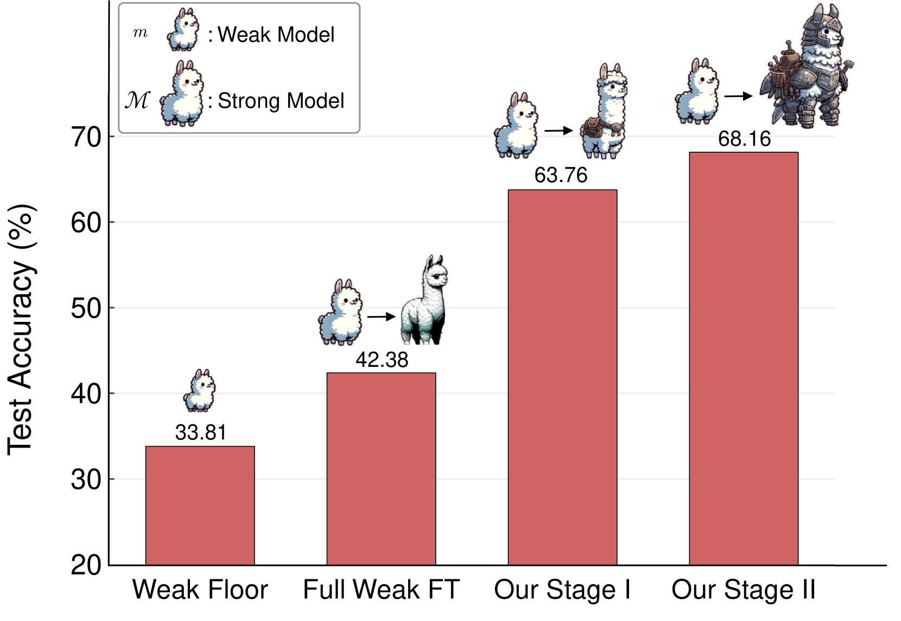
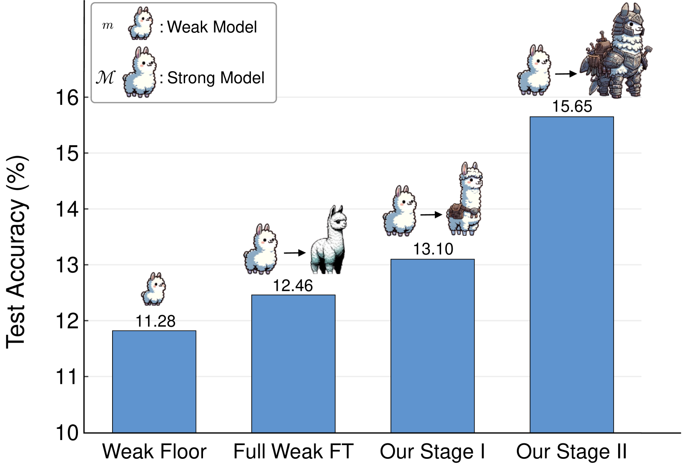
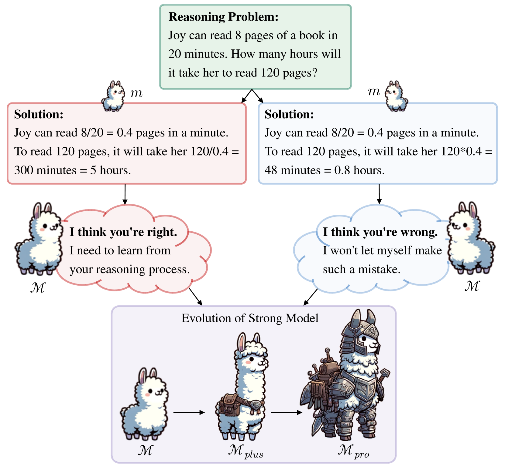
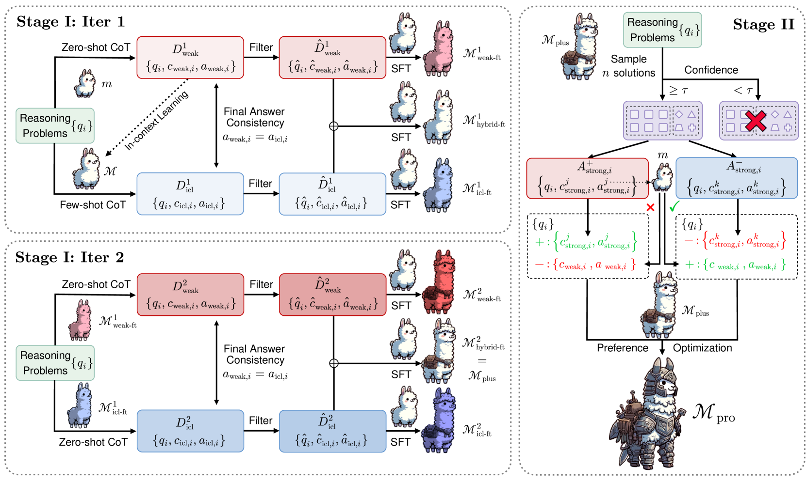
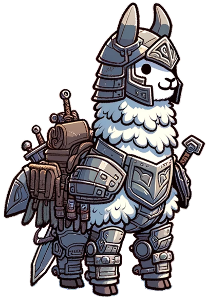
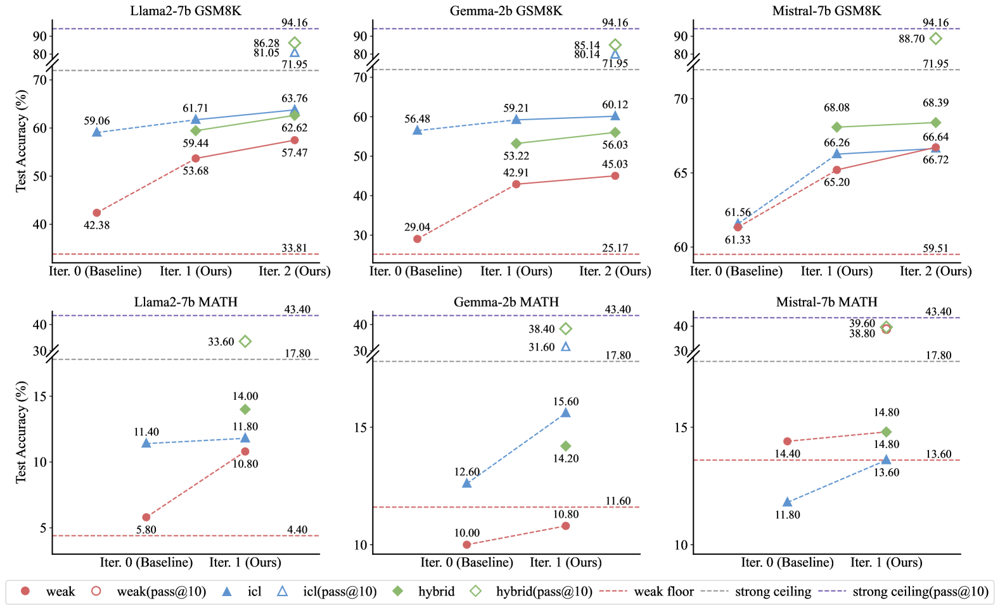
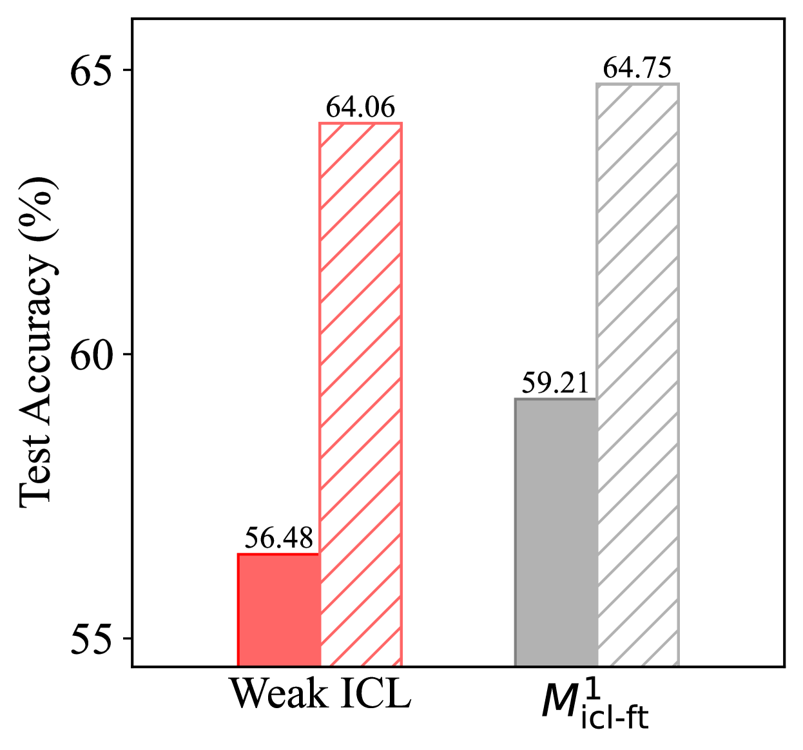
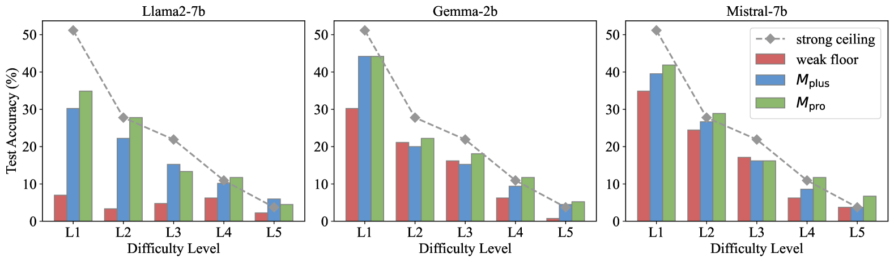
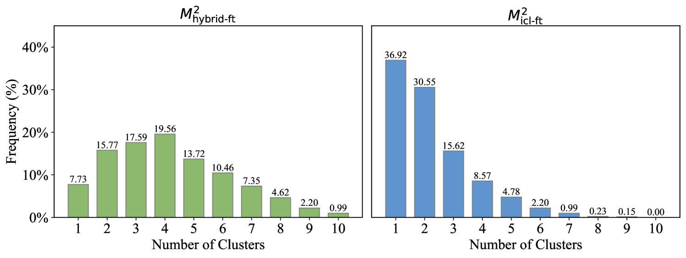

# 从弱至强推理

发布时间：2024年07月18日

`LLM应用` `人工智能`

> Weak-to-Strong Reasoning

# 摘要

> 随着大型语言模型 (LLM) 超越人类能力，为其提供全面准确的监督变得愈发困难。弱到强学习策略，即借助较弱模型激发更强模型的潜能，在此背景下显得尤为重要。尽管如此，该策略在复杂推理任务中的效果尚未得到充分检验。此外，在弱到强模式下处理推理任务时，如何避免盲目复制弱监督者的错误，目前仍缺乏有效方法。本文提出了一种渐进式学习框架，允许强大模型自主优化训练数据，无需依赖更高级模型或人工标注。该框架首先在精选的高质量小数据集上进行监督微调，随后通过模型自身识别的对比样本进行偏好优化。实验证明，该方法显著提升了 Llama2-70b 的推理能力，并在前瞻性实验中验证了其有效性。这一研究为提升 AI 推理能力开辟了新的道路。相关代码和资源已公开在 \url{https://github.com/GAIR-NLP/weak-to-strong-reasoning}。

> When large language models (LLMs) exceed human-level capabilities, it becomes increasingly challenging to provide full-scale and accurate supervisions for these models. Weak-to-strong learning, which leverages a less capable model to unlock the latent abilities of a stronger model, proves valuable in this context. Yet, the efficacy of this approach for complex reasoning tasks is still untested. Furthermore, tackling reasoning tasks under the weak-to-strong setting currently lacks efficient methods to avoid blindly imitating the weak supervisor including its errors. In this paper, we introduce a progressive learning framework that enables the strong model to autonomously refine its training data, without requiring input from either a more advanced model or human-annotated data. This framework begins with supervised fine-tuning on a selective small but high-quality dataset, followed by preference optimization on contrastive samples identified by the strong model itself. Extensive experiments on the GSM8K and MATH datasets demonstrate that our method significantly enhances the reasoning capabilities of Llama2-70b using three separate weak models. This method is further validated in a forward-looking experimental setup, where Llama3-8b-instruct effectively supervises Llama3-70b on the highly challenging OlympicArena dataset. This work paves the way for a more scalable and sophisticated strategy to enhance AI reasoning powers. All relevant code and resources are available in \url{https://github.com/GAIR-NLP/weak-to-strong-reasoning}.

[Arxiv](https://arxiv.org/abs/2407.13647)