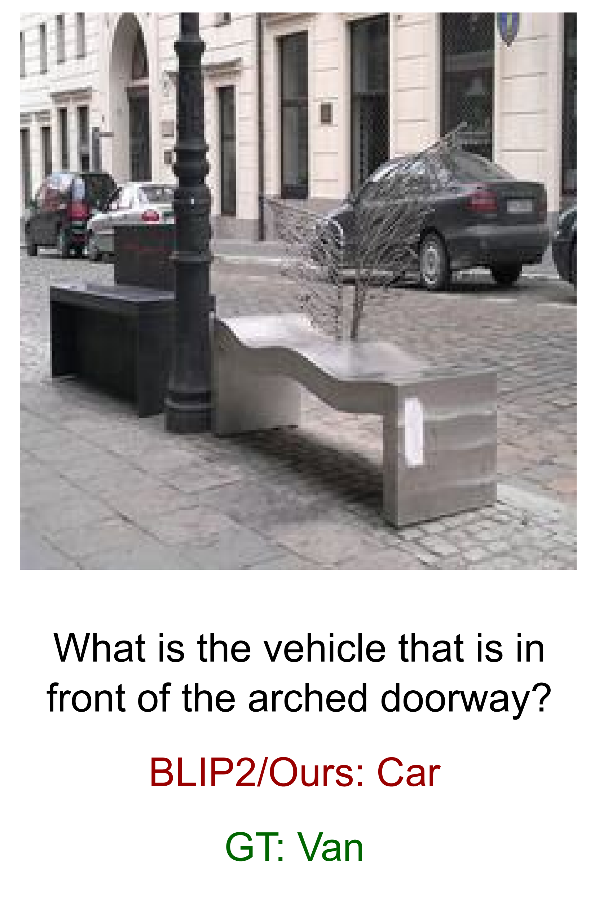

# X-Former：整合对比与重建学习，助力多语言大型语言模型 (MLLMs)

发布时间：2024年07月18日

`LLM应用` `计算机视觉` `人工智能`

> X-Former: Unifying Contrastive and Reconstruction Learning for MLLMs

# 摘要

> 多模态大型语言模型 (MLLMs) 的最新进展，通过整合视觉感知能力到大型语言模型 (LLMs) 中，彻底革新了视觉-语言理解领域。当前的主流趋势是利用从视觉-语言对比学习 (CL) 中衍生的视觉编码器，这些编码器擅长捕捉整体表示，但在捕捉细节局部模式方面存在挑战。在本研究中，我们通过结合通过掩蔽图像建模 (MIM) 获得的高频和详细视觉表示与由 CL 捕捉的语义丰富的低频表示，来增强 MLLMs 的视觉表示。为此，我们引入了 X-Former，一个轻量级的变换器模块，通过创新的交互机制，有效利用 CL 和 MIM 的互补优势。X-Former 首先从两个冻结的视觉编码器（基于 CL 的 CLIP-ViT 和基于 MIM 的 MAE-ViT）中引导视觉-语言表示学习和多模态生成学习。随后，它从冻结的 LLM 中引导视觉到语言的生成学习，确保 X-Former 的视觉特征能被 LLM 解释。广泛的评估显示，X-Former 在 GQA 数据集中涉及结构和语义类别的视觉推理任务中表现卓越，并在细粒度视觉感知基准上进一步证实了其在视觉理解方面的领先能力。

> Recent advancements in Multimodal Large Language Models (MLLMs) have revolutionized the field of vision-language understanding by integrating visual perception capabilities into Large Language Models (LLMs). The prevailing trend in this field involves the utilization of a vision encoder derived from vision-language contrastive learning (CL), showing expertise in capturing overall representations while facing difficulties in capturing detailed local patterns. In this work, we focus on enhancing the visual representations for MLLMs by combining high-frequency and detailed visual representations, obtained through masked image modeling (MIM), with semantically-enriched low-frequency representations captured by CL. To achieve this goal, we introduce X-Former which is a lightweight transformer module designed to exploit the complementary strengths of CL and MIM through an innovative interaction mechanism. Specifically, X-Former first bootstraps vision-language representation learning and multimodal-to-multimodal generative learning from two frozen vision encoders, i.e., CLIP-ViT (CL-based) and MAE-ViT (MIM-based). It further bootstraps vision-to-language generative learning from a frozen LLM to ensure visual features from X-Former can be interpreted by the LLM. To demonstrate the effectiveness of our approach, we assess its performance on tasks demanding detailed visual understanding. Extensive evaluations indicate that X-Former excels in visual reasoning tasks involving both structural and semantic categories in the GQA dataset. Assessment on fine-grained visual perception benchmark further confirms its superior capabilities in visual understanding.

[Arxiv](https://arxiv.org/abs/2407.13851)