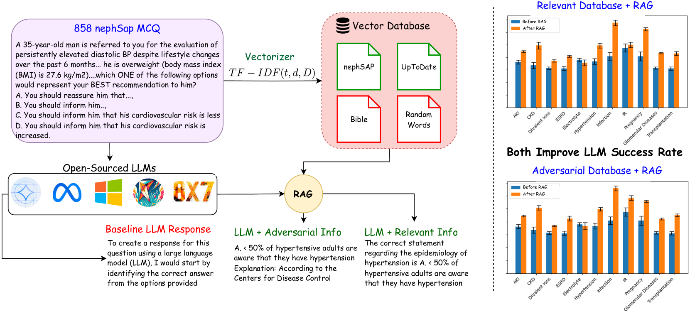
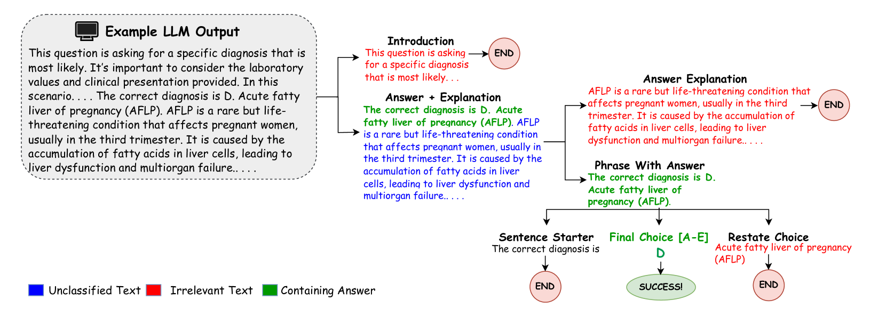
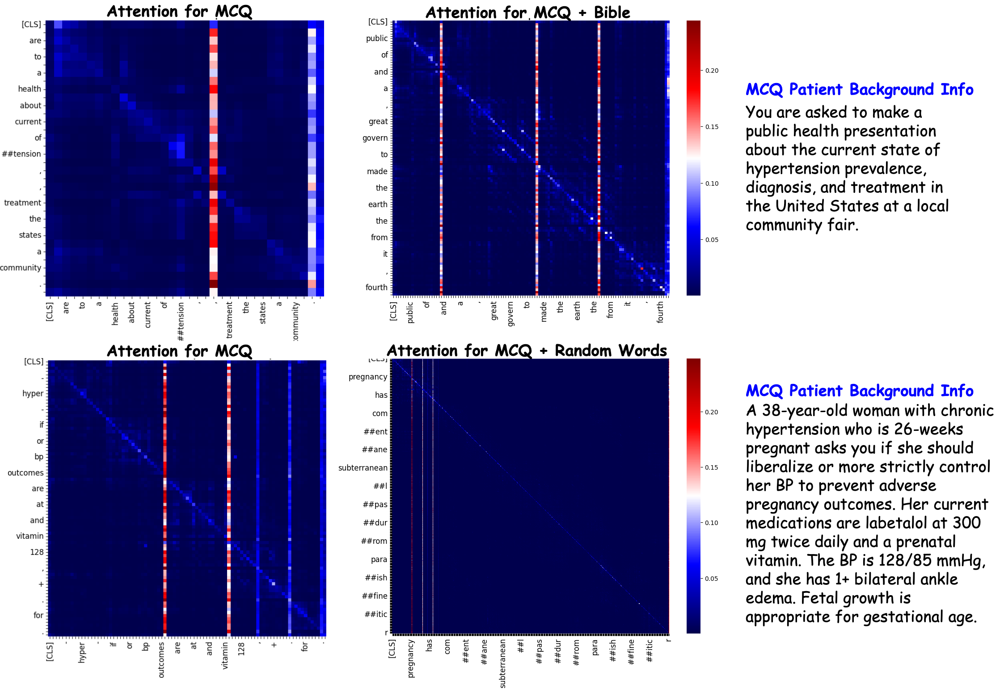

# 通过引入对抗性数据库，基于检索的大型语言模型的检索成功率得到了显著提升。

发布时间：2024年07月19日

`RAG` `人工智能`

> Adversarial Databases Improve Success in Retrieval-based Large Language Models

# 摘要

> 开源LLMs在微调聊天机器人方面潜力巨大，其推理能力超越了众多基准。检索增强生成（RAG）技术通过利用外部知识库，提升了模型在未训练任务上的表现。研究表明，RAG结合相关背景信息能更有效地完成任务。业内曾假设，对抗性信息会削弱RAG的效果，甚至产生负面影响。为此，我们在肾病学领域测试了多个开源LLMs的RAG效果，包括Llama 3、Phi-3等，并首次探索了对抗性信息的影响。结果显示，尽管相关信息提升了模型表现，但圣经文本和随机单词也意外地增强了部分模型的多项选择题解答能力。这表明，对抗性信息在特定情况下也能提升RAG的效能。

> Open-source LLMs have shown great potential as fine-tuned chatbots, and demonstrate robust abilities in reasoning and surpass many existing benchmarks. Retrieval-Augmented Generation (RAG) is a technique for improving the performance of LLMs on tasks that the models weren't explicitly trained on, by leveraging external knowledge databases. Numerous studies have demonstrated the effectiveness of RAG to more successfully accomplish downstream tasks when using vector datasets that consist of relevant background information. It has been implicitly assumed by those in the field that if adversarial background information is utilized in this context, that the success of using a RAG-based approach would be nonexistent or even negatively impact the results. To address this assumption, we tested several open-source LLMs on the ability of RAG to improve their success in answering multiple-choice questions (MCQ) in the medical subspecialty field of Nephrology. Unlike previous studies, we examined the effect of RAG in utilizing both relevant and adversarial background databases. We set up several open-source LLMs, including Llama 3, Phi-3, Mixtral 8x7b, Zephyr$β$, and Gemma 7B Instruct, in a zero-shot RAG pipeline. As adversarial sources of information, text from the Bible and a Random Words generated database were used for comparison. Our data show that most of the open-source LLMs improve their multiple-choice test-taking success as expected when incorporating relevant information vector databases. Surprisingly however, adversarial Bible text significantly improved the success of many LLMs and even random word text improved test taking ability of some of the models. In summary, our results demonstrate for the first time the countertintuitive ability of adversarial information datasets to improve the RAG-based LLM success.

[Arxiv](https://arxiv.org/abs/2407.14609)