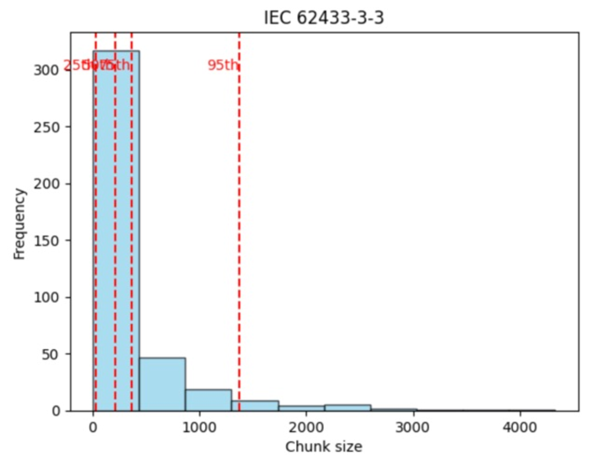

# AuditNet：一款基于对话式 AI 的安全助手演示

发布时间：2024年07月19日

`LLM应用` `合规性` `人工智能`

> AuditNet: A Conversational AI-based Security Assistant [DEMO]

# 摘要

> 在信息爆炸的时代，各行业专家需在海量文档和不断变化的标准中导航。确保合规性是一项关键任务，涉及复杂的标准、法规和合同义务。我们设计了一个灵活的对话AI助手框架，可在多个领域（如网络、法律、教育、环境、政府政策）实时辅助合规检查。借助大型语言模型的检索增强技术，该框架自动处理信息审查、索引和检索，简化合规验证流程。这不仅减轻了人工负担，还提升了准确性和效率，助力专业人士维持高标准并确保法规遵守。我们还推出了AuditNet，首个专为物联网安全专家打造的对话AI助手，提供即时安全标准和法规访问。

> In the age of information overload, professionals across various fields face the challenge of navigating vast amounts of documentation and ever-evolving standards. Ensuring compliance with standards, regulations, and contractual obligations is a critical yet complex task across various professional fields. We propose a versatile conversational AI assistant framework designed to facilitate compliance checking on the go, in diverse domains, including but not limited to network infrastructure, legal contracts, educational standards, environmental regulations, and government policies. By leveraging retrieval-augmented generation using large language models, our framework automates the review, indexing, and retrieval of relevant, context-aware information, streamlining the process of verifying adherence to established guidelines and requirements. This AI assistant not only reduces the manual effort involved in compliance checks but also enhances accuracy and efficiency, supporting professionals in maintaining high standards of practice and ensuring regulatory compliance in their respective fields. We propose and demonstrate AuditNet, the first conversational AI security assistant designed to assist IoT network security experts by providing instant access to security standards, policies, and regulations.

[Arxiv](https://arxiv.org/abs/2407.14116)