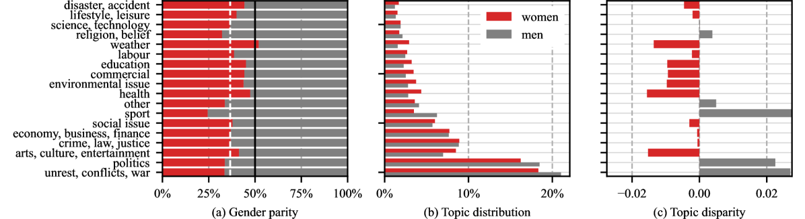

# 广播新闻主题的自动分类技术，应用于性别偏见分析，旨在揭示新闻报道中的性别表现偏差。

发布时间：2024年07月19日

`LLM应用` `性别研究`

> Automatic Classification of News Subjects in Broadcast News: Application to a Gender Bias Representation Analysis

# 摘要

> 本文提出一个计算框架，旨在揭示法国电视与广播新闻话题中的性别分布偏差。我们转录了2023年播出的11.7k小时内容，涵盖21个法国频道。通过大型语言模型（LLM）的少样本对话模式，对这些转录内容进行话题分类。基于LLM的注释，我们探索了微调小型分类模型以降低计算成本的方法。为评估模型性能，我们构建并注释了包含804个对话的数据集，并免费供研究使用。研究发现，女性在体育、政治和冲突等话题中的代表性不足，而在天气、广告和健康等话题中发言时间更多。此外，私人和公共服务频道在代表性上存在差异。

> This paper introduces a computational framework designed to delineate gender distribution biases in topics covered by French TV and radio news. We transcribe a dataset of 11.7k hours, broadcasted in 2023 on 21 French channels. A Large Language Model (LLM) is used in few-shot conversation mode to obtain a topic classification on those transcriptions. Using the generated LLM annotations, we explore the finetuning of a specialized smaller classification model, to reduce the computational cost. To evaluate the performances of these models, we construct and annotate a dataset of 804 dialogues. This dataset is made available free of charge for research purposes. We show that women are notably underrepresented in subjects such as sports, politics and conflicts. Conversely, on topics such as weather, commercials and health, women have more speaking time than their overall average across all subjects. We also observe representations differences between private and public service channels.

[Arxiv](https://arxiv.org/abs/2407.14180)