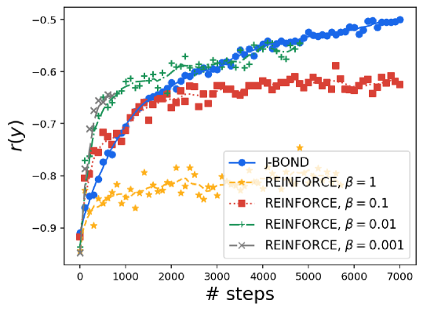
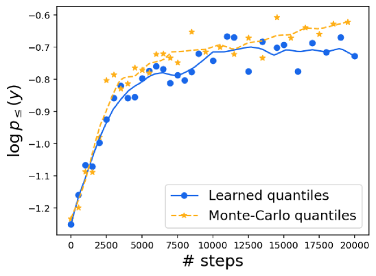
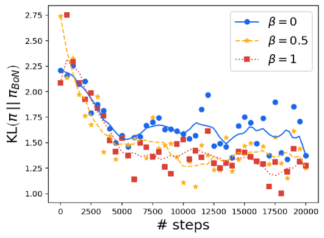

# BOND：对齐 LLMs 与最佳 N 选一蒸馏

发布时间：2024年07月19日

`LLM理论` `人工智能`

> BOND: Aligning LLMs with Best-of-N Distillation

# 摘要

> 从人类反馈中进行强化学习（RLHF）是大型语言模型质量和安全的关键。本文提出了一种名为Best-of-N蒸馏（BOND）的新算法，旨在模拟Best-of-N采样的高效性，同时避免其高计算成本。BOND通过匹配生成分布，使策略更接近Best-of-N分布，并利用Jeffreys散度平衡模式覆盖和寻求行为。实验证明，BOND在抽象摘要和Gemma模型上表现出色，通过与Gemma策略对齐，显著提升了多个基准的性能，超越了其他RLHF算法。

> Reinforcement learning from human feedback (RLHF) is a key driver of quality and safety in state-of-the-art large language models. Yet, a surprisingly simple and strong inference-time strategy is Best-of-N sampling that selects the best generation among N candidates. In this paper, we propose Best-of-N Distillation (BOND), a novel RLHF algorithm that seeks to emulate Best-of-N but without its significant computational overhead at inference time. Specifically, BOND is a distribution matching algorithm that forces the distribution of generations from the policy to get closer to the Best-of-N distribution. We use the Jeffreys divergence (a linear combination of forward and backward KL) to balance between mode-covering and mode-seeking behavior, and derive an iterative formulation that utilizes a moving anchor for efficiency. We demonstrate the effectiveness of our approach and several design choices through experiments on abstractive summarization and Gemma models. Aligning Gemma policies with BOND outperforms other RLHF algorithms by improving results on several benchmarks.

[Arxiv](https://arxiv.org/abs/2407.14622)