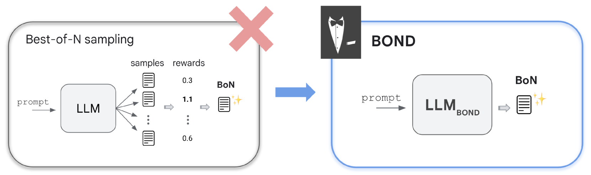

# BOND：实现 LLMs 与最佳 N 选一蒸馏的精准对齐

发布时间：2024年07月19日

`LLM应用` `人工智能`

> BOND: Aligning LLMs with Best-of-N Distillation

# 摘要

> 强化学习从人类反馈（RLHF）是大型语言模型质量和安全的核心推动力。尽管如此，一个简单而有效的推理策略是Best-of-N采样，即从N个候选中挑选最佳生成。本文介绍的Best-of-N蒸馏（BOND）算法，旨在模仿Best-of-N的高效，同时避免其推理时的巨大计算负担。BOND通过分布匹配，使策略生成的分布趋近于Best-of-N分布，并利用Jeffreys散度来平衡覆盖与寻求模式，提出了一种高效的迭代方法。实验证明，BOND在抽象摘要和Gemma模型上的表现优于其他RLHF算法，显著提升了多个基准的性能。

> Reinforcement learning from human feedback (RLHF) is a key driver of quality and safety in state-of-the-art large language models. Yet, a surprisingly simple and strong inference-time strategy is Best-of-N sampling that selects the best generation among N candidates. In this paper, we propose Best-of-N Distillation (BOND), a novel RLHF algorithm that seeks to emulate Best-of-N but without its significant computational overhead at inference time. Specifically, BOND is a distribution matching algorithm that forces the distribution of generations from the policy to get closer to the Best-of-N distribution. We use the Jeffreys divergence (a linear combination of forward and backward KL) to balance between mode-covering and mode-seeking behavior, and derive an iterative formulation that utilizes a moving anchor for efficiency. We demonstrate the effectiveness of our approach and several design choices through experiments on abstractive summarization and Gemma models. Aligning Gemma policies with BOND outperforms other RLHF algorithms by improving results on several benchmarks.

[Arxiv](https://arxiv.org/abs/2407.14622)