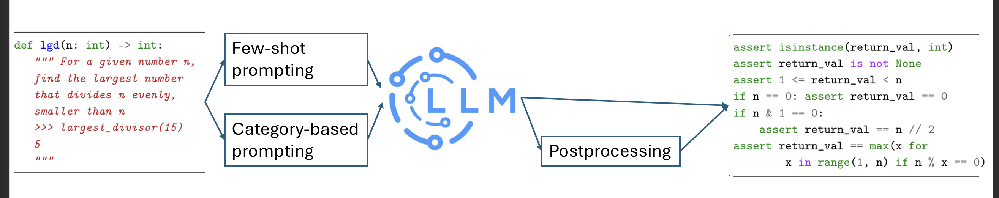
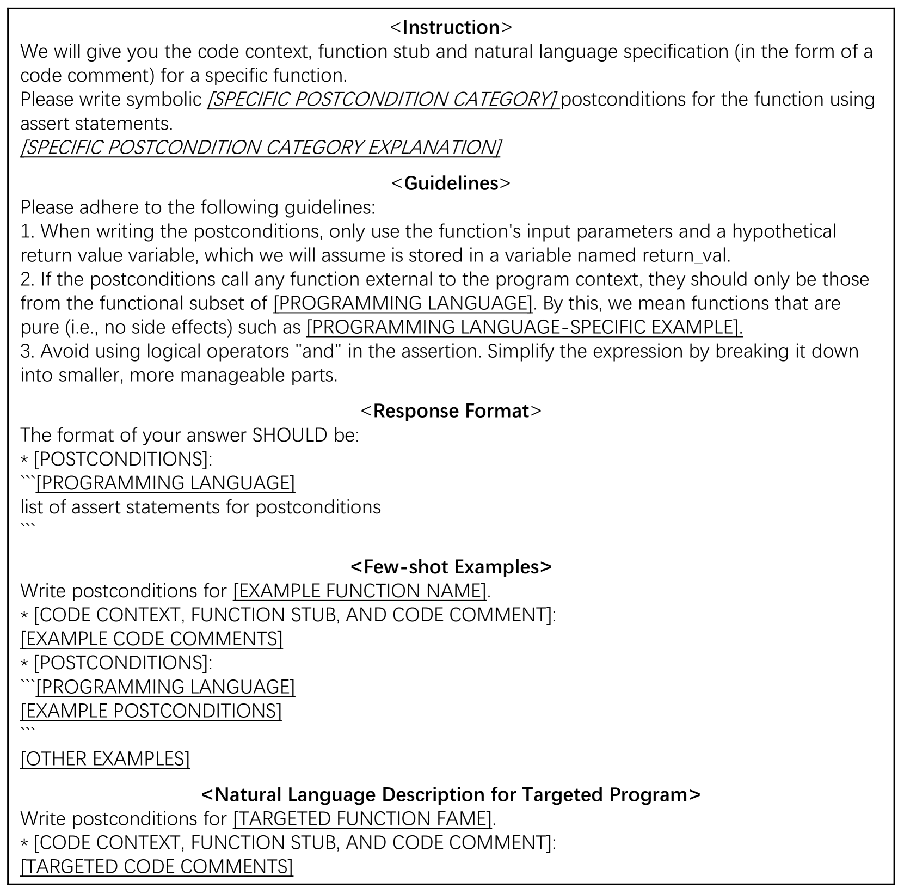

# 不仅限于代码生成，我们通过后置条件来评估代码大型语言模型的成熟度。

发布时间：2024年07月19日

`LLM应用` `软件开发` `人工智能`

> Beyond Code Generation: Assessing Code LLM Maturity with Postconditions

# 摘要

> 当前的代码 LLM 基准，如 EvalPlus，主要聚焦于代码生成，即通过自然语言描述问题，要求 LLM 编写解决方案。然而，这些基准未能全面评估代码 LLM 的各项能力。为此，我们提出了一种基于后置条件生成问题的成熟度模型，旨在更全面地评估代码 LLM 的能力。后置条件生成问题不仅要求 LLM 理解代码的语义和自然语言，还要求其能生成明确的编程语言后置条件，这一任务因其多样性和复杂性，非常适合用于评估代码 LLM 的成熟度。我们据此扩展了 EvalPlus 数据集，并评估了多个开源模型，结果显示了提升代码 LLM 性能的必要方向。详细代码请访问：https://github.com/MatureModel/PostcondGen

> Most existing code Large Language Model (LLM) benchmarks, e.g., EvalPlus, focus on the code generation tasks. Namely, they contain a natural language description of a problem and ask the LLM to write code to solve the problem. We argue that they do not capture all capabilities needed to assess the quality of a code LLM. In this paper, we propose a code LLM maturity model, based on the postcondition generation problem, to access a more complete set of code LLM capabilities. We choose the postcondition generation problem as it requires the code LLM to understand the code including semantics, natural language, and also have the capability to generate unambiguous postconditions in programming languages (i.e., the generation capablity). Moreover, postconditions have various types, requiring different levels of these capabilities, making it suitable to evaluate the maturity of the code LLM. Based on our designed maturity model, we augment the EvalPlus dataset to a postcondition testing benchmark, and evaluated several open-sourced models. Our results highlight the necessary improvements needed for better LLMs for code. Code: https://github.com/MatureModel/PostcondGen

[Arxiv](https://arxiv.org/abs/2407.14118)