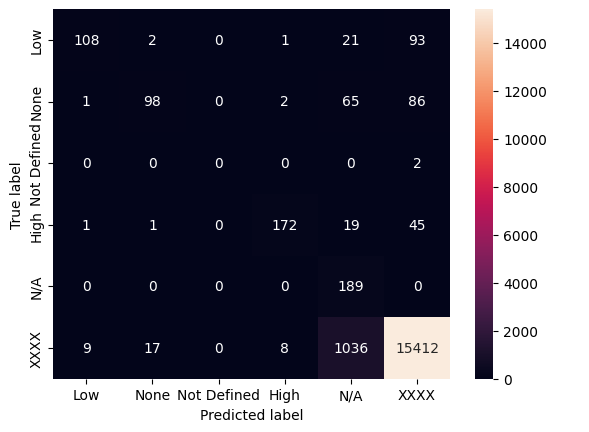

# CVE-LLM：借助大型语言模型，实现医疗设备行业的自动漏洞评估

发布时间：2024年07月19日

`LLM应用` `网络安全`

> CVE-LLM : Automatic vulnerability evaluation in medical device industry using large language models

# 摘要

> 医疗保健行业正面临前所未有的网络安全攻击，影响广泛。每月新发现的数千漏洞，急需自动化评估以快速应对。生成AI技术已革新多行业，提供高效自动化方案。本文利用大型语言模型（LLM），通过学习历史漏洞评估，自动检测医疗设备漏洞。此方法针对单一制造商，综合考虑设备安全现状与控制。主要贡献有三：详述工业环境下的漏洞语言模型训练最佳实践；全面评估语言模型在漏洞检测中的效能；提出创新的人在环框架，加速漏洞评估流程。

> The healthcare industry is currently experiencing an unprecedented wave of cybersecurity attacks, impacting millions of individuals. With the discovery of thousands of vulnerabilities each month, there is a pressing need to drive the automation of vulnerability assessment processes for medical devices, facilitating rapid mitigation efforts. Generative AI systems have revolutionized various industries, offering unparalleled opportunities for automation and increased efficiency. This paper presents a solution leveraging Large Language Models (LLMs) to learn from historical evaluations of vulnerabilities for the automatic assessment of vulnerabilities in the medical devices industry. This approach is applied within the portfolio of a single manufacturer, taking into account device characteristics, including existing security posture and controls. The primary contributions of this paper are threefold. Firstly, it provides a detailed examination of the best practices for training a vulnerability Language Model (LM) in an industrial context. Secondly, it presents a comprehensive comparison and insightful analysis of the effectiveness of Language Models in vulnerability assessment. Finally, it proposes a new human-in-the-loop framework to expedite vulnerability evaluation processes.

[Arxiv](https://arxiv.org/abs/2407.14640)