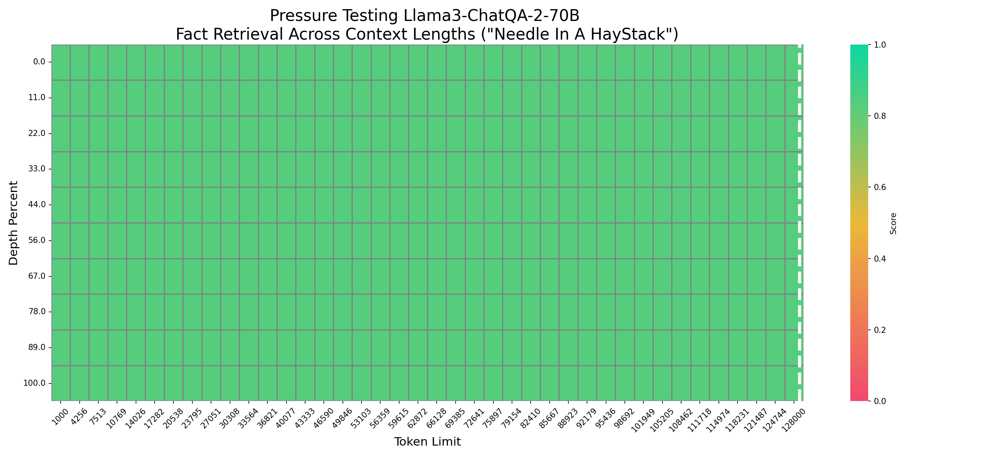

# ChatQA 2：跨越长上下文与RAG能力，连接专有LLM的桥梁

发布时间：2024年07月19日

`RAG` `人工智能`

> ChatQA 2: Bridging the Gap to Proprietary LLMs in Long Context and RAG Capabilities

# 摘要

> 我们推出的 ChatQA 2 模型，基于 Llama3，旨在提升开放访问 LLM 在长上下文理解和检索增强生成（RAG）方面的能力，使其与顶尖专有模型如 GPT-4-Turbo 相媲美。通过扩展 Llama3-70B-base 的上下文窗口至 128K 令牌，并实施三阶段指令调优，我们显著提升了模型处理大量信息的能力。实验显示，Llama3-ChatQA-2-70B 在长上下文理解任务上与 GPT-4-Turbo-2024-0409 不相上下，并在 RAG 测试中表现更佳。此外，我们发现先进的长上下文检索技术能有效解决 RAG 中的上下文碎片问题，进一步提升性能。我们还深入比较了 RAG 与长上下文解决方案的优劣，使用的是当前最先进的长上下文 LLM。

> In this work, we introduce ChatQA 2, a Llama3-based model designed to bridge the gap between open-access LLMs and leading proprietary models (e.g., GPT-4-Turbo) in long-context understanding and retrieval-augmented generation (RAG) capabilities. These two capabilities are essential for LLMs to process large volumes of information that cannot fit into a single prompt and are complementary to each other, depending on the downstream tasks and computational budgets. We present a detailed continued training recipe to extend the context window of Llama3-70B-base from 8K to 128K tokens, along with a three-stage instruction tuning process to enhance the model's instruction-following, RAG performance, and long-context understanding capabilities. Our results demonstrate that the Llama3-ChatQA-2-70B model achieves accuracy comparable to GPT-4-Turbo-2024-0409 on many long-context understanding tasks and surpasses it on the RAG benchmark. Interestingly, we find that the state-of-the-art long-context retriever can alleviate the top-k context fragmentation issue in RAG, further improving RAG-based results for long-context understanding tasks. We also provide extensive comparisons between RAG and long-context solutions using state-of-the-art long-context LLMs.

[Arxiv](https://arxiv.org/abs/2407.14482)