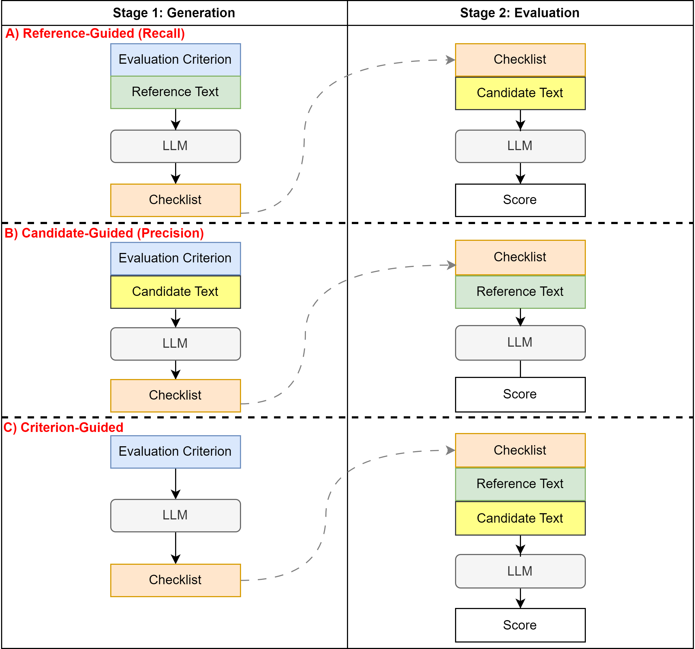

# Check-Eval：采用清单式方法，精准评估文本质量

发布时间：2024年07月19日

`LLM应用`

> Check-Eval: A Checklist-based Approach for Evaluating Text Quality

# 摘要

> 评估 LLM 生成的文本质量一直是个难题，尤其是在需要创意和微妙的任务中。为此，我们推出了 Check-Eval，一个利用 LLM 进行文本质量评估的创新框架，采用清单式方法。Check-Eval 既适用于无参考评估，也适用于有参考评估，提供了一种结构化且易于理解的评估方式。该框架分为清单生成和清单评估两大步骤。我们在葡萄牙法律语义文本相似性和 SummEval 两个数据集上验证了 Check-Eval，结果显示其与人类判断的相关性优于现有指标，如 G-Eval 和 GPTScore，显示出其在自然语言生成任务中作为更可靠评估工具的潜力。实验代码已公开，详见 https://anonymous.4open.science/r/check-eval-0DB4。

> Evaluating the quality of text generated by large language models (LLMs) remains a significant challenge. Traditional metrics often fail to align well with human judgments, particularly in tasks requiring creativity and nuance. In this paper, we propose Check-Eval, a novel evaluation framework leveraging LLMs to assess the quality of generated text through a checklist-based approach. Check-Eval can be employed as both a reference-free and reference-dependent evaluation method, providing a structured and interpretable assessment of text quality. The framework consists of two main stages: checklist generation and checklist evaluation. We validate Check-Eval on two benchmark datasets: Portuguese Legal Semantic Textual Similarity and SummEval. Our results demonstrate that Check-Eval achieves higher correlations with human judgments compared to existing metrics, such as G-Eval and GPTScore, underscoring its potential as a more reliable and effective evaluation framework for natural language generation tasks. The code for our experiments is available at https://anonymous.4open.science/r/check-eval-0DB4.

[Arxiv](https://arxiv.org/abs/2407.14467)