# 利用剪枝与知识蒸馏技术，打造精简型语言模型

发布时间：2024年07月19日

`LLM应用` `人工智能` `开源社区`

> Compact Language Models via Pruning and Knowledge Distillation

# 摘要

> 本文探讨了通过剪枝现有大型语言模型（LLM）并利用少量原始训练数据进行再训练，作为全面再训练的替代方案的可行性。我们提出了一套结合多种剪枝技术和知识蒸馏的LLM压缩最佳实践，通过详尽的实验探索得出。利用这些方法，我们成功将Nemotron-4系列LLM压缩至原有大小的四分之一，且在多项语言建模任务中表现优异。与从头开始训练相比，我们的方法显著降低了训练成本，提升了模型性能，甚至超越了现有文献中的先进压缩技术。此外，我们已在Huggingface开源了Minitron模型及其相关资源，供社区进一步研究和应用。

> Large language models (LLMs) targeting different deployment scales and sizes are currently produced by training each variant from scratch; this is extremely compute-intensive. In this paper, we investigate if pruning an existing LLM and then re-training it with a fraction (<3%) of the original training data can be a suitable alternative to repeated, full retraining. To this end, we develop a set of practical and effective compression best practices for LLMs that combine depth, width, attention and MLP pruning with knowledge distillation-based retraining; we arrive at these best practices through a detailed empirical exploration of pruning strategies for each axis, methods to combine axes, distillation strategies, and search techniques for arriving at optimal compressed architectures. We use this guide to compress the Nemotron-4 family of LLMs by a factor of 2-4x, and compare their performance to similarly-sized models on a variety of language modeling tasks. Deriving 8B and 4B models from an already pretrained 15B model using our approach requires up to 40x fewer training tokens per model compared to training from scratch; this results in compute cost savings of 1.8x for training the full model family (15B, 8B, and 4B). Minitron models exhibit up to a 16% improvement in MMLU scores compared to training from scratch, perform comparably to other community models such as Mistral 7B, Gemma 7B and Llama-3 8B, and outperform state-of-the-art compression techniques from the literature. We have open-sourced Minitron model weights on Huggingface, with corresponding supplementary material including example code available on GitHub.

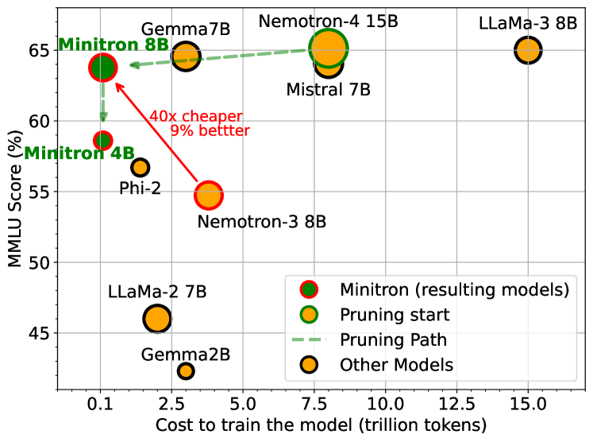

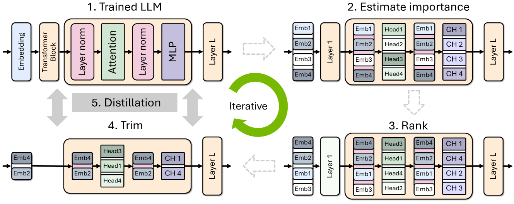

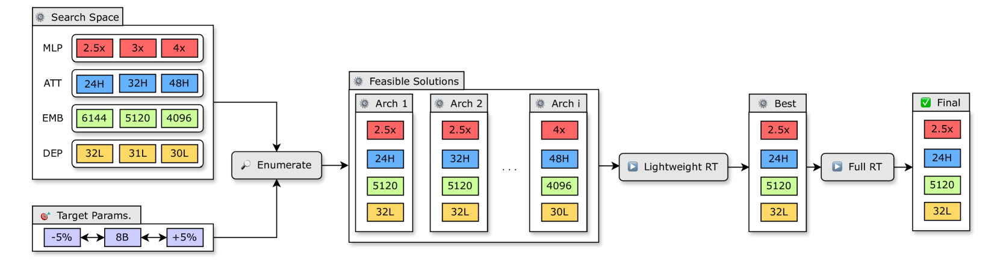

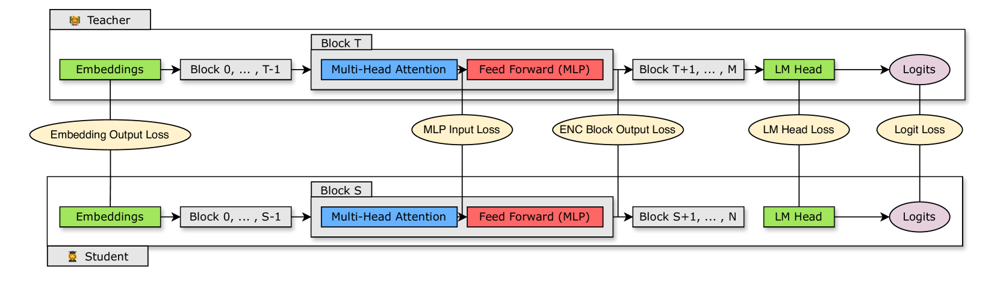

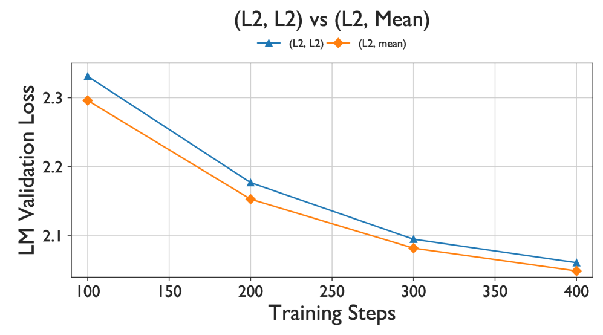

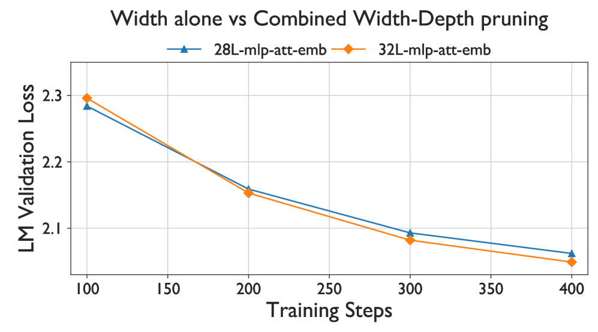

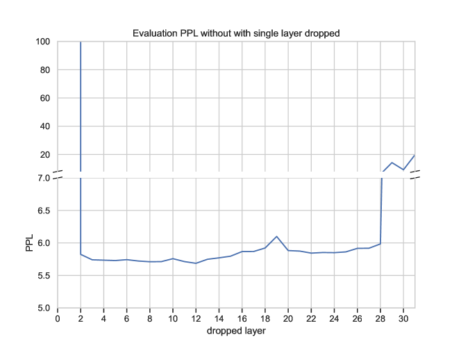

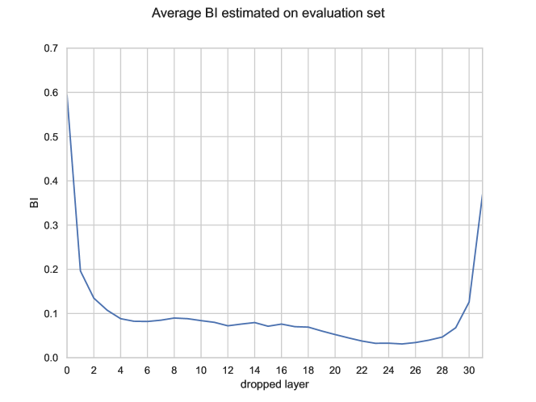

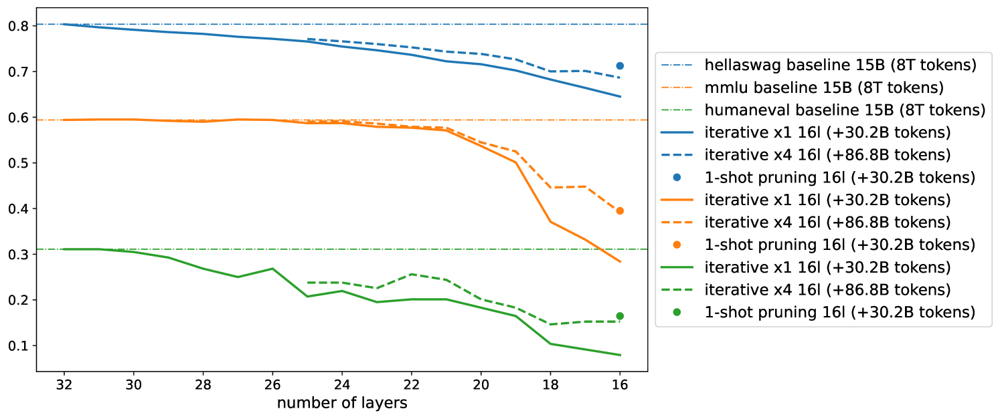

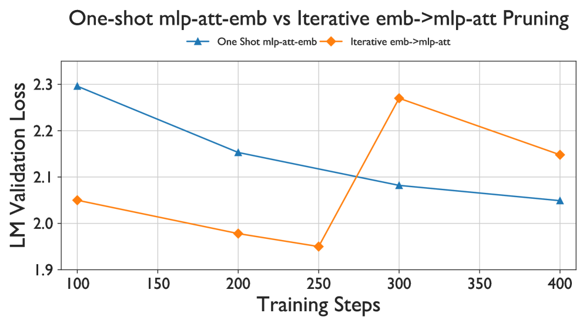

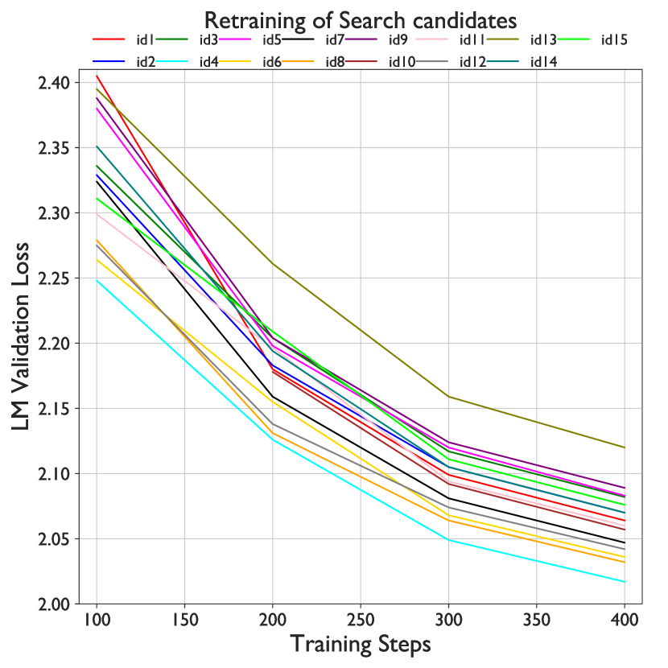

[Arxiv](https://arxiv.org/abs/2407.14679)