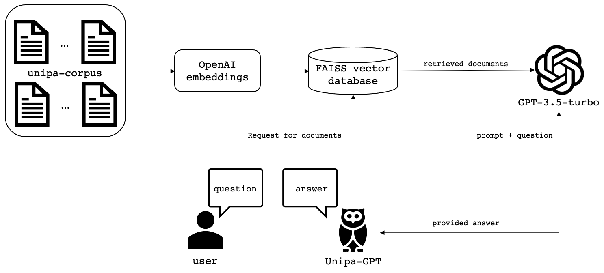
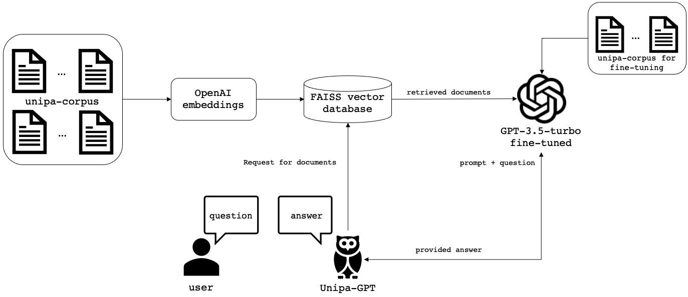
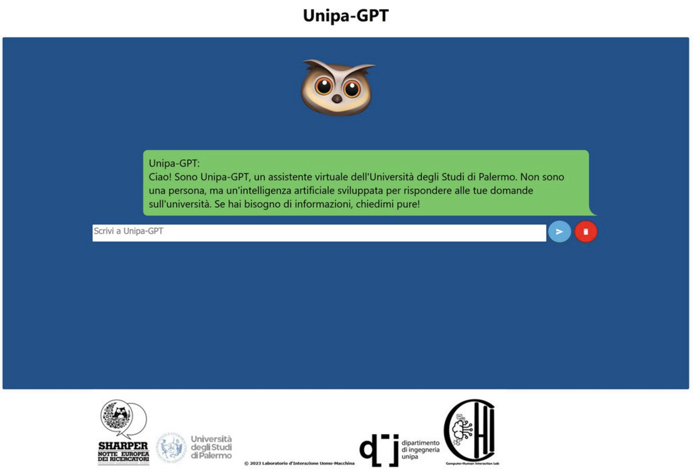
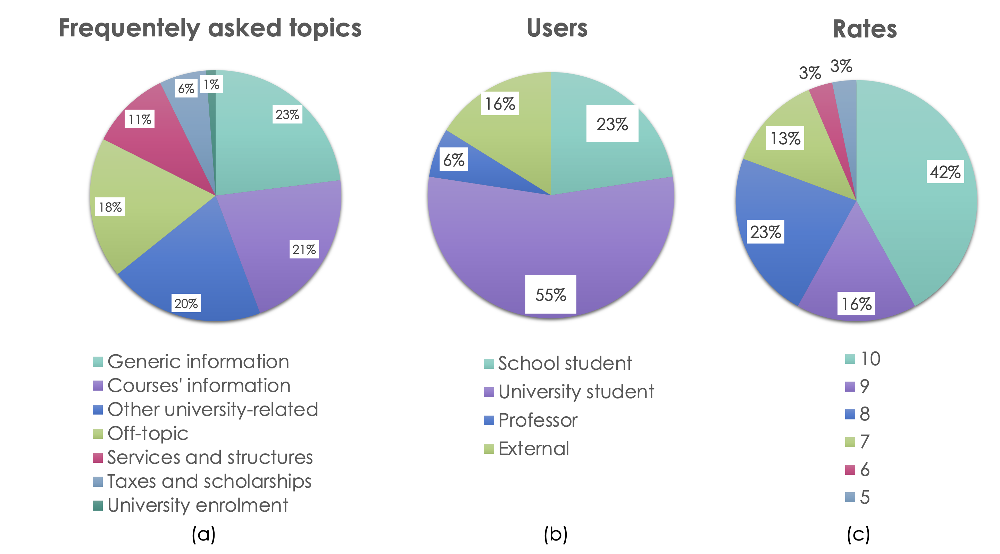
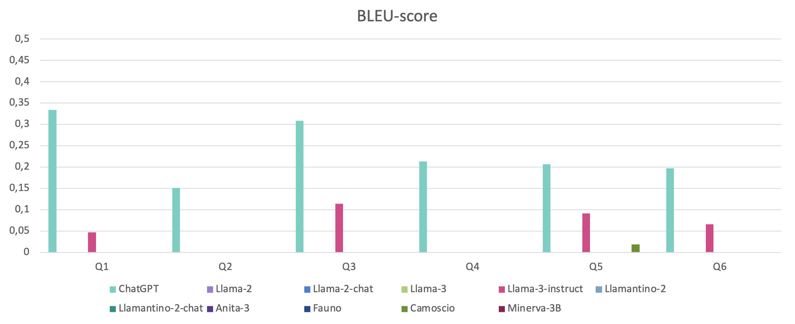
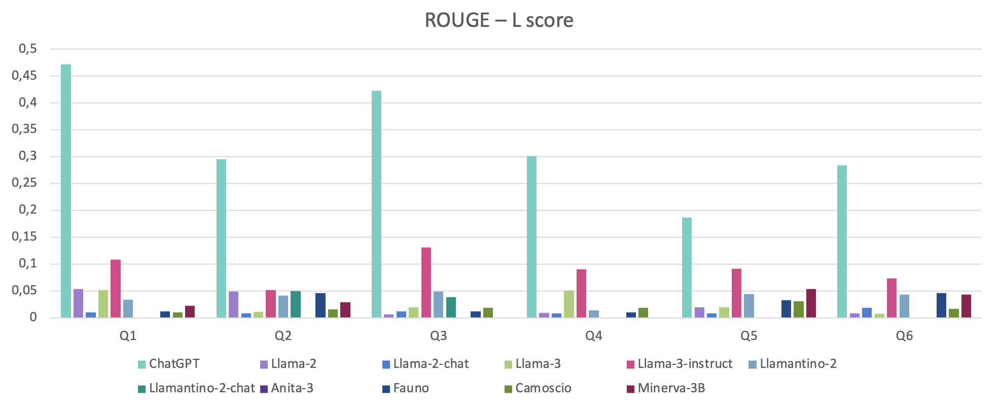
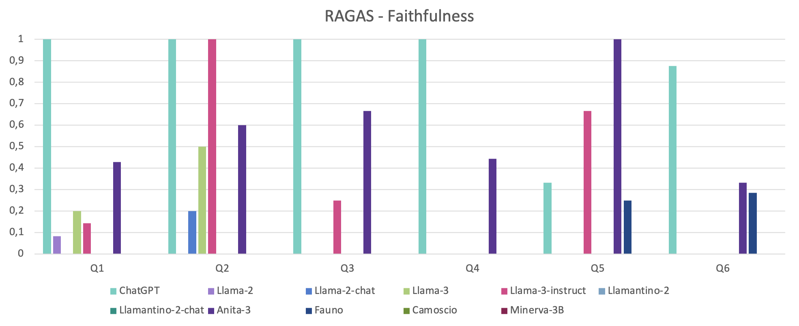
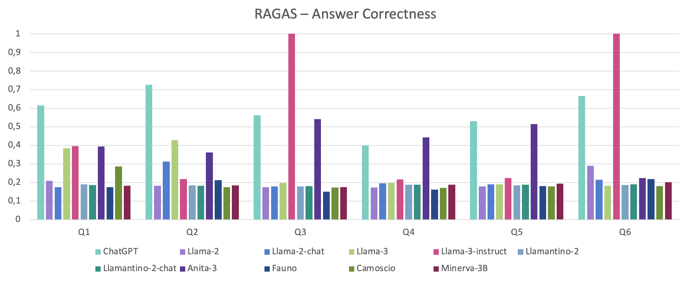

# 本研究聚焦于如何针对信息检索优化 Chat-GPT，通过 Unipa-GPT 案例深入探讨。

发布时间：2024年07月19日

`RAG` `人工智能`

> Conditioning Chat-GPT for information retrieval: the Unipa-GPT case study

# 摘要

> 本文详细介绍了Unipa-GPT的设计与训练，这是一个专为帕勒莫大学学生选择学位课程而开发的聊天机器人，基于gpt-3.5-turbo大型语言模型。该机器人曾在欧洲研究人员之夜（SHARPER之夜）亮相。我们通过结合检索增强生成（RAG）和微调技术来构建系统。文中不仅展示了Unipa-GPT的完整架构，还对比了RAG与微调系统的性能，并进行了简要分析。同时，文章还展示了与其他大型语言模型的对比结果以及在SHARPER之夜的实验表现。

> This paper illustrates the architecture and training of Unipa-GPT, a chatbot relying on a Large Language Model, developed for assisting students in choosing a bachelor/master degree course at the University of Palermo. Unipa-GPT relies on gpt-3.5-turbo, it was presented in the context of the European Researchers' Night (SHARPER night). In our experiments we adopted both the Retrieval Augmented Generation (RAG) approach and fine-tuning to develop the system. The whole architecture of Unipa-GPT is presented, both the RAG and the fine-tuned systems are compared, and a brief discussion on their performance is reported. Further comparison with other Large Language Models and the experimental results during the SHARPER night are illustrated.

[Arxiv](https://arxiv.org/abs/2407.14246)