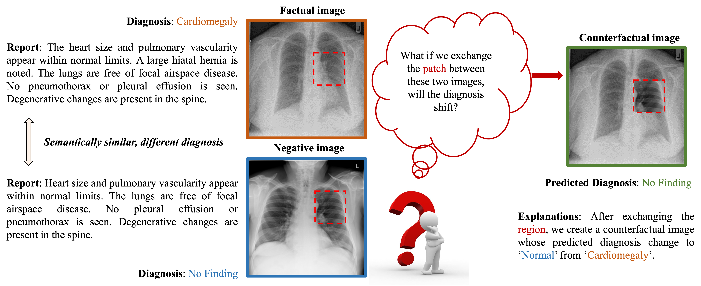
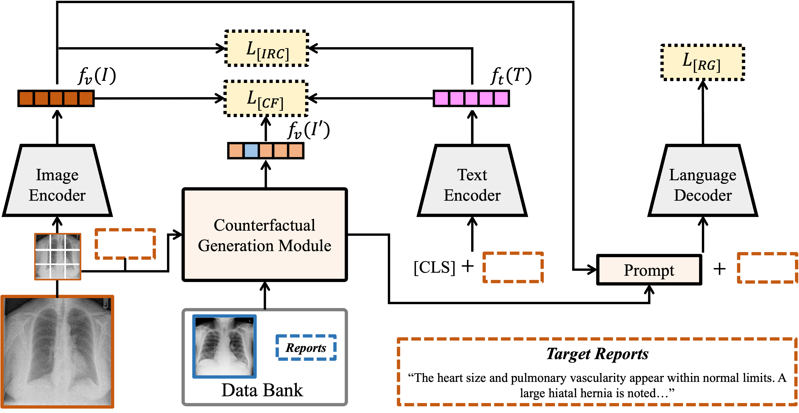
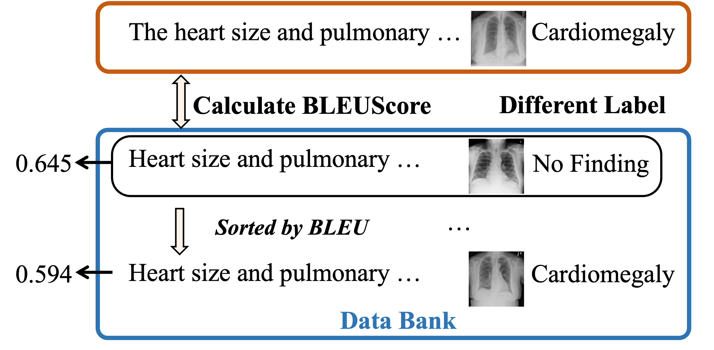
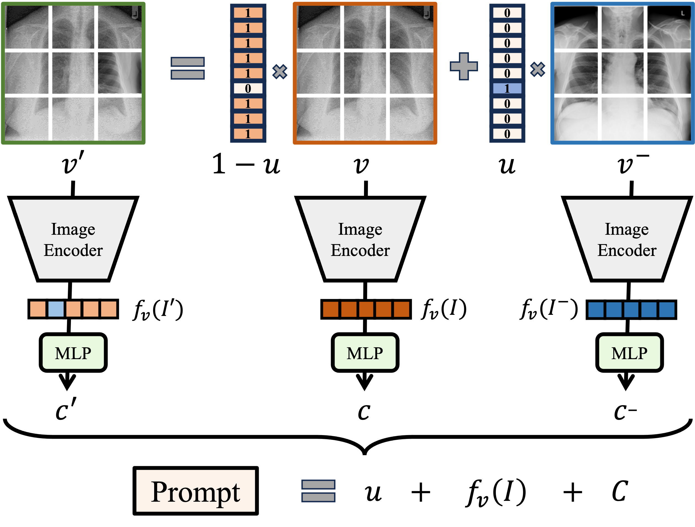
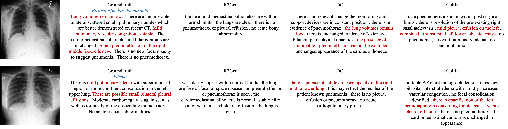
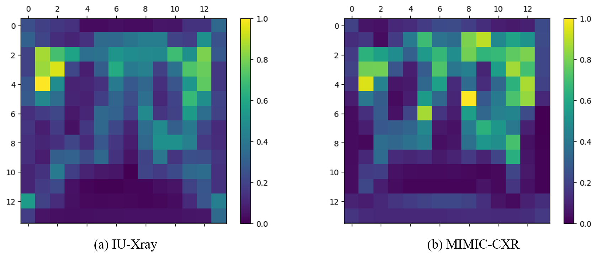

# 结合反事实解释的对比学习在放射学报告生成中的应用

发布时间：2024年07月19日

`LLM应用` `放射学`

> Contrastive Learning with Counterfactual Explanations for Radiology Report Generation

# 摘要

> 由于解剖学内容的普遍性，放射学图像与其报告高度相似，这种固有偏差可能导致自动报告生成模型学习到纠缠和虚假的表示，进而产生误诊报告。为此，我们提出了一种基于反事实解释的新框架（CoFE），用于放射学报告生成。通过利用反事实解释这一强大工具，CoFE能够通过对比事实与反事实图像的表示，学习到非虚假的视觉表示。具体而言，我们通过在正负样本间交换补丁，直至预测诊断发生变化，从而生成反事实图像。此外，CoFE采用可学习提示，高效微调预训练大型语言模型，封装事实与反事实内容，提供更具泛化性的提示表示。在两个基准上的广泛实验显示，CoFE利用反事实解释，能够生成语义连贯且事实完整的报告，并在语言生成和临床效能指标上表现优异。

> Due to the common content of anatomy, radiology images with their corresponding reports exhibit high similarity. Such inherent data bias can predispose automatic report generation models to learn entangled and spurious representations resulting in misdiagnostic reports. To tackle these, we propose a novel \textbf{Co}unter\textbf{F}actual \textbf{E}xplanations-based framework (CoFE) for radiology report generation. Counterfactual explanations serve as a potent tool for understanding how decisions made by algorithms can be changed by asking ``what if'' scenarios. By leveraging this concept, CoFE can learn non-spurious visual representations by contrasting the representations between factual and counterfactual images. Specifically, we derive counterfactual images by swapping a patch between positive and negative samples until a predicted diagnosis shift occurs. Here, positive and negative samples are the most semantically similar but have different diagnosis labels. Additionally, CoFE employs a learnable prompt to efficiently fine-tune the pre-trained large language model, encapsulating both factual and counterfactual content to provide a more generalizable prompt representation. Extensive experiments on two benchmarks demonstrate that leveraging the counterfactual explanations enables CoFE to generate semantically coherent and factually complete reports and outperform in terms of language generation and clinical efficacy metrics.

[Arxiv](https://arxiv.org/abs/2407.14474)