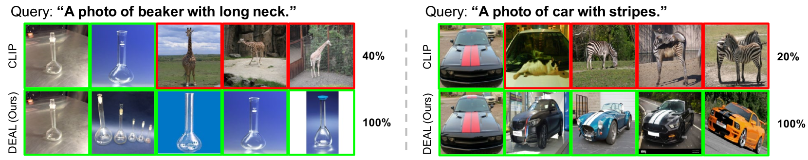

# DEAL：为视觉语言模型解耦并定位概念级解释

发布时间：2024年07月19日

`LLM应用` `计算机视觉` `人工智能`

> DEAL: Disentangle and Localize Concept-level Explanations for VLMs

# 摘要

> 大型预训练视觉-语言模型 (VLMs) 已成为众多模型和任务的基石。然而，我们的研究发现，这些模型在识别细粒度概念方面存在局限，其解释往往混淆且定位不准。为此，我们提出了无需人工标注的 DisEntAngle 和 Localize (DEAL) 方法，旨在提升概念级解释的清晰度和准确性。通过广泛的实验和分析，我们证实了该方法能有效增强模型解释的区分度和定位能力，并意外地发现，这还能减少模型对错误关联的依赖，从而提升预测精度。

> Large pre-trained Vision-Language Models (VLMs) have become ubiquitous foundational components of other models and downstream tasks. Although powerful, our empirical results reveal that such models might not be able to identify fine-grained concepts. Specifically, the explanations of VLMs with respect to fine-grained concepts are entangled and mislocalized. To address this issue, we propose to DisEntAngle and Localize (DEAL) the concept-level explanations for VLMs without human annotations. The key idea is encouraging the concept-level explanations to be distinct while maintaining consistency with category-level explanations. We conduct extensive experiments and ablation studies on a wide range of benchmark datasets and vision-language models. Our empirical results demonstrate that the proposed method significantly improves the concept-level explanations of the model in terms of disentanglability and localizability. Surprisingly, the improved explainability alleviates the model's reliance on spurious correlations, which further benefits the prediction accuracy.

[Arxiv](https://arxiv.org/abs/2407.14412)