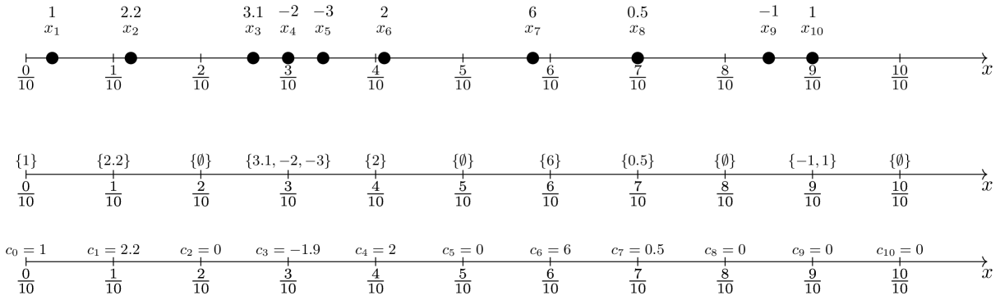

# 交叉注意力的差分隐私，具备可证明的保障

发布时间：2024年07月19日

`LLM理论` `人工智能` `隐私保护`

> Differential Privacy of Cross-Attention with Provable Guarantee

# 摘要

> 交叉注意力模块在人工智能领域应用广泛，如RAG、系统提示等。然而，其键值矩阵可能泄露敏感信息，对隐私构成威胁。为此，我们创新性地设计了一种差分隐私数据结构，以理论保障其安全性。该结构在内存、初始化和查询时间上均表现高效，并能确保用户查询的隐私性，即便面对恶意攻击也表现稳健。这一突破性成果有望推动大型生成模型中隐私保护算法的发展。

> Cross-attention has become a fundamental module nowadays in many important artificial intelligence applications, e.g., retrieval-augmented generation (RAG), system prompt, guided stable diffusion, and many so on. Ensuring cross-attention privacy is crucial and urgently needed because its key and value matrices may contain sensitive information about companies and their users, many of which profit solely from their system prompts or RAG data. In this work, we design a novel differential privacy (DP) data structure to address the privacy security of cross-attention with a theoretical guarantee. In detail, let $n$ be the input token length of system prompt/RAG data, $d$ be the feature dimension, $0 < α\le 1$ be the relative error parameter, $R$ be the maximum value of the query and key matrices, $R_w$ be the maximum value of the value matrix, and $r,s,ε_s$ be parameters of polynomial kernel methods. Then, our data structure requires $\widetilde{O}(ndr^2)$ memory consumption with $\widetilde{O}(nr^2)$ initialization time complexity and $\widetilde{O}(α^{-1} r^2)$ query time complexity for a single token query. In addition, our data structure can guarantee that the user query is $(ε, δ)$-DP with $\widetilde{O}(n^{-1} ε^{-1} α^{-1/2} R^{2s} R_w r^2)$ additive error and $n^{-1} (α+ ε_s)$ relative error between our output and the true answer. Furthermore, our result is robust to adaptive queries in which users can intentionally attack the cross-attention system. To our knowledge, this is the first work to provide DP for cross-attention. We believe it can inspire more privacy algorithm design in large generative models (LGMs).

[Arxiv](https://arxiv.org/abs/2407.14717)