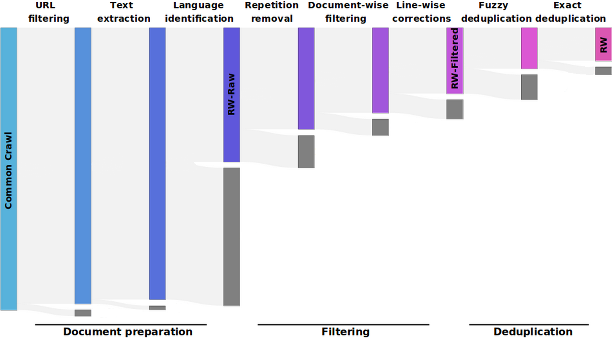

# 医学领域中，领域特定预训练语言模型的比较研究

发布时间：2024年07月19日

`LLM应用` `人工智能`

> Domain-Specific Pretraining of Language Models: A Comparative Study in the Medical Field

# 摘要

> LLM 在单一领域的特定任务中应用广泛，这些任务更侧重于领域知识而非通用知识。尽管如 GPT-4 和 Claude-3-opus 这样的先进模型能胜任，但它们的庞大体积使其难以本地运行，这在处理敏感数据时尤为棘手。本文探讨了领域特定和混合领域预训练，认为这些方法可能比通用预训练更高效。我们将深入医疗领域的预训练研究，并对比专门与通用语言模型的性能。

> There are many cases where LLMs are used for specific tasks in a single domain. These usually require less general, but more domain-specific knowledge. Highly capable, general-purpose state-of-the-art language models like GPT-4 or Claude-3-opus can often be used for such tasks, but they are very large and cannot be run locally, even if they were not proprietary. This can be a problem when working with sensitive data. This paper focuses on domain-specific and mixed-domain pretraining as potentially more efficient methods than general pretraining for specialized language models. We will take a look at work related to domain-specific pretraining, specifically in the medical area, and compare benchmark results of specialized language models to general-purpose language models.

[Arxiv](https://arxiv.org/abs/2407.14076)